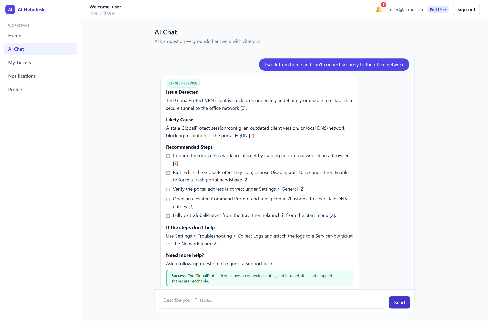
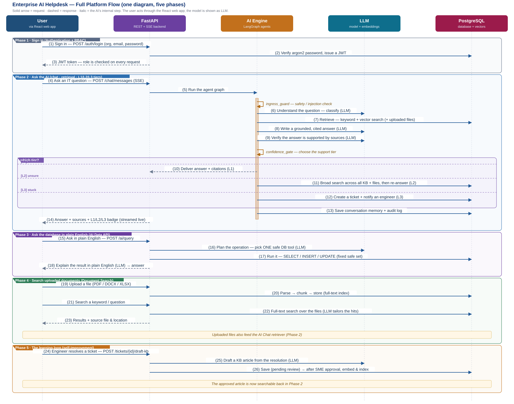
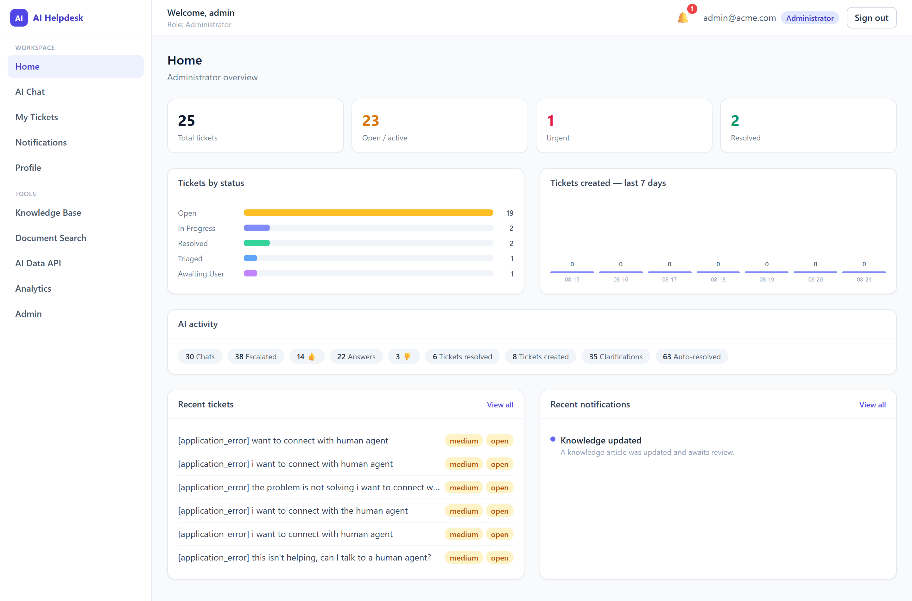
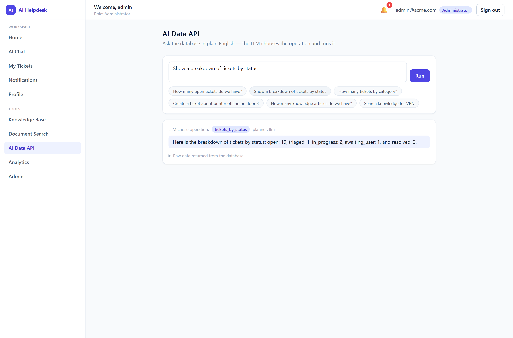
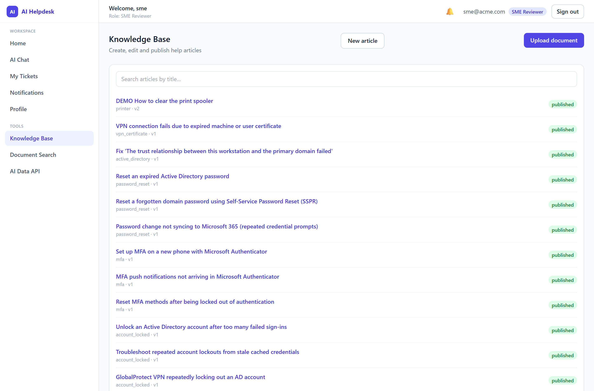
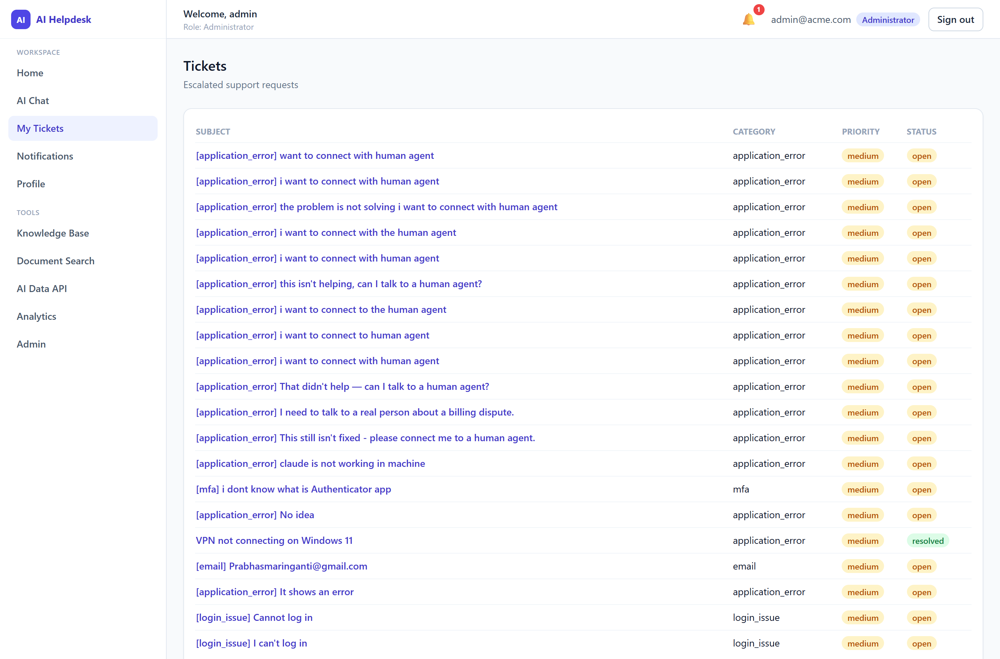

# Multi-Agent AI Helpdesk

**Live Demo:** [https://multi-agent-ai-helpdesk.vercel.app](https://multi-agent-ai-helpdesk.vercel.app)

An IT helpdesk where the AI actually does the work. An employee asks a question in plain
English; a multi-agent pipeline retrieves the answer from a knowledge base, verifies it
against the sources, and either answers, digs deeper, or hands off to a human. When a human
resolves a ticket, the system drafts a new knowledge article from that fix — so the next
person gets an instant answer.


<p align="center">
  
</p>

<p align="center">
  <sub>The question never says <b>“VPN”</b> — retrieval matched on meaning, the answer cites its sources, and the badge shows which support tier handled it.</sub>
</p>

---

## Why I built this

Most "AI chatbot" demos are a single call to a model wrapped in a text box. I wanted to find
out what it takes to make one trustworthy enough that a support team would actually put it in
front of employees — which turns out to be mostly everything *around* the model:

- **Grounding.** Answers come from retrieved knowledge-base passages, with citations. A
  separate verification step checks the draft answer is actually supported by those sources
  before the user ever sees it.
- **Knowing when to give up.** The interesting failure mode isn't a wrong answer, it's a
  *confident* wrong answer. There's an explicit confidence gate that decides between
  answering, searching wider, and escalating to a person.
- **Getting better over time.** A helpdesk that answers the same question forever is a
  search engine. This one turns every human resolution into a reviewed knowledge article.

It mirrors the L1 / L2 / L3 model a real support desk uses, because that structure already
encodes when a machine should stop guessing.

## How it works

<p align="center">
  
</p>

Every chat turn runs through a [LangGraph](https://langchain-ai.github.io/langgraph/) state
graph of 14 nodes. The short version:

```
ingress_guard → memory(load) → intent_classifier → query_planner → rag_retriever
   → retrieval_gate → solution_synthesizer → grounding_verifier → confidence_gate
      ├── L1  deliver the grounded answer
      ├── L2  l2_resolver — search the whole KB + uploaded files, answer again
      └── L3  ticket_creator → human_handoff
   → responder → memory(persist)
```

**Retrieval is hybrid.** A sparse pass (PostgreSQL full-text search over `tsvector`) runs
alongside a dense pass (vector similarity), and the two ranked lists are merged with
Reciprocal Rank Fusion before reranking. That combination is why a question worded nothing
like the article still finds it — *"I can't connect securely from home"* retrieves the VPN
runbook without sharing a single keyword with it.

**Vectors live in PostgreSQL.** For a knowledge base of this size, exact cosine similarity
over a `JSONB` column is instant and needs no extra service. A ChromaDB backend is wired in
behind the same interface (`VECTOR_STORE_BACKEND=chromadb`) for when scale justifies it.

## Features

| | |
|---|---|
| **AI chat** | Grounded answers with citations, streamed token-by-token over SSE |
| **L1 / L2 / L3 tiers** | Self-serve → assisted resolution → human handoff, with the tier shown on every answer |
| **Hallucination guard** | A verification pass checks entailment against sources; a confidence gate can veto the answer |
| **Natural-language database queries** | Ask *"how many open tickets?"* or *"create a ticket for a broken printer"* — the model picks one of 10 fixed, safe operations and explains the result |
| **Document search** | Upload PDF / DOCX / XLSX (pick the sheet) or index a web page, then search it; results also feed the chat |
| **Self-improving knowledge base** | Resolved tickets are drafted into articles, reviewed by an SME, then embedded and searchable |
| **Ticketing** | Escalation, assignment queues, status events, user ↔ engineer threads, AI-drafted replies |
| **Auth & RBAC** | JWT access/refresh tokens, Argon2 password hashing, 20 granular permissions across 4 roles |
| **Multi-tenancy** | Every table is scoped by `org_id`; login is per organization |
| **Graceful degradation** | If the model is unavailable, answers fall back to serving the matching source verbatim rather than erroring |

## What it looks like

<table>
<tr>
<td width="50%"></td>
<td width="50%"></td>
</tr>
<tr>
<td><b>Admin dashboard</b> — ticket KPIs, status breakdown, a seven-day trend, and counters for how much the AI resolved versus escalated.</td>
<td><b>Plain-English database queries</b> — the model chose the <code>tickets_by_status</code> operation, ran it, and explained the rows. The raw result stays one click away.</td>
</tr>
<tr>
<td></td>
<td></td>
</tr>
<tr>
<td><b>Knowledge base</b> — the articles answers are grounded in. SMEs create, edit, review and publish here; publishing re-embeds the article so it's immediately searchable.</td>
<td><b>Tickets</b> — what the AI escalated, with category, priority and status. Engineers reply in a thread and can ask the AI to draft that reply.</td>
</tr>
</table>

## Quick start

**Requirements:** Python 3.12+, Node 18+, and PostgreSQL 16 (or Docker).

```bash
git clone https://github.com/PrabhasMGit/multi-agent-ai-helpdesk.git
cd multi-agent-ai-helpdesk
cp .env.example backend/.env      # then add your model API key
python start.py
```

`start.py` is pure standard library — no virtualenv needed just to launch it. It finds or
starts PostgreSQL, creates the schema, seeds demo data, then brings up the API and the UI:

| | |
|---|---|
| UI | http://localhost:5280 |
| API | http://127.0.0.1:8000 |
| API docs (Swagger) | http://127.0.0.1:8000/docs |
| Health | http://127.0.0.1:8000/health |

```bash
python start.py --stop          # stop everything
python start.py --no-frontend   # API only
python start.py --seed-only     # just (re)create schema + demo data
python start.py --docker        # bring the database up with docker compose
python scripts/verify.py        # end-to-end health check, PASS/FAIL per component
```

The seed creates one demo user per role in org `acme`:
`user@` (end user), `engineer@`, `sme@`, `admin@` — all `@acme.com`.

> **The seeded password is `ChangeMe123!` and it is published here on purpose — it is demo
> scaffolding only.** Change it, and set a real `SECRET_KEY`, before this touches a network
> anyone else can reach. The config layer refuses to start with the development secret when
> `APP_ENV=production`.

### Without a model API key

Set `LLM_PROVIDER=fake` and `EMBEDDING_PROVIDER=fake`. Everything runs deterministically —
useful for tests and for exploring the flow offline. Redis and ChromaDB are optional too:
rate limiting fails open and dense retrieval is skipped, with sparse full-text search still
serving results.

## Try these

Once it's running, sign in as `user@acme.com` and ask:

| Ask this | What should happen |
|---|---|
| *"I work from home and can't connect securely to the office network"* | Grounded VPN answer with sources — note you never said "VPN" (**L1**) |
| *"my laptop is slow and outlook keeps asking for my password and teams won't load"* | Too vague to ground cleanly, so the wider search kicks in (**L2**) |
| *"that didn't help, can I talk to a human agent?"* | Creates a real ticket and hands off (**L3**) |
| *"How do I connect to the AWS console?"* | Not in the knowledge base — answers, but labels itself as general guidance |

Then as `admin@acme.com`, open **AI Data API** and try *"how many open tickets?"* followed by
*"create a ticket for a broken office printer"* — the second one really does insert a row.

## Project structure

```
backend/
  app/
    api/           HTTP layer — routers, auth dependencies, DI wiring
    agents/        the LangGraph engine: state, graph, routing, 14 nodes
    services/      business logic (chat, tickets, KB drafting, data API, docs)
    rag/           chunking, parsers, sparse/dense retrieval, RRF fusion, rerank
    providers/     LLM + embedding adapters (Gemini, OpenAI, Anthropic, fake)
    repositories/  the only layer that touches the database
    models/        SQLAlchemy models — 40 tables
    registries/    data-driven config: categories, prompts, thresholds, tools
    core/          settings, security, RBAC, middleware, exceptions
  tests/unit/      62 tests
  scripts/         seeding, provider checks, reindexing, admin bootstrap
frontend/src/
  modules/         feature folders (chat, tickets, kb, docsearch, ai-data, …)
  shared/          API client, types, UI primitives, stores
  layout/          shell, sidebar, topbar
docs/              architecture, code walkthrough, flow diagrams
scripts/           verify.py, db_browser.py
```

## Tech stack

**Backend** — FastAPI, async SQLAlchemy 2 + asyncpg, Pydantic v2, LangGraph, Alembic,
PyJWT + Argon2, Redis and Celery for optional background work.

**Frontend** — React 18, TypeScript, Vite, Tailwind CSS, TanStack Query, React Router,
Zustand.

**Data** — PostgreSQL 16, using `tsvector` full-text search and a `JSONB` vector index.

**Models** — provider-agnostic by design. Google Gemini is the default; OpenAI and Anthropic
adapters ship alongside it, plus a `fake` provider for tests. Switching is one environment
variable, and a fallback chain can try a second provider when the first is rate-limited.

## Testing

```bash
cd backend
pip install -r requirements.txt -r requirements-dev.txt
pytest -q                      # 62 unit tests
ruff check . && mypy app       # lint + types
```

```bash
cd frontend
npm ci && npm run build        # type-check + production build
```

Tests use the `fake` provider, so they need no API key and no network.

## Documentation

- **[docs/ARCHITECTURE.md](docs/ARCHITECTURE.md)** — the full design: layered architecture,
  the agent graph, per-table schema specs, security model, and the design decisions with the
  alternatives I considered.
- **[docs/CODE_WALKTHROUGH.md](docs/CODE_WALKTHROUGH.md)** — a file-by-file tour of the
  codebase, close to line-by-line where the logic matters.
- **[docs/Project_Flow_Diagram.svg](docs/Project_Flow_Diagram.svg)** — the end-to-end
  sequence flow.
- **[docs/Persona_Flow_Diagram.svg](docs/Persona_Flow_Diagram.svg)** — the same system from
  the perspective of the people using it.

## Honest limitations

- **Free model tiers are the real constraint.** On a free API tier the daily request cap is
  low enough that heavy testing exhausts it. The system degrades to serving matching
  knowledge-base passages rather than failing, but for real use you want a paid tier.
- **The natural-language database API is deliberately not open-ended text-to-SQL.** The model
  chooses from 10 fixed operations. That trades flexibility for the guarantee that a
  generated string can never reach the database.
- **Tests cover the backend only.** 62 unit tests, no frontend tests and no end-to-end suite
  yet — that's the most obvious gap.
- **Single-node by design.** The vector index is exact brute force. Correct and fast for
  thousands of chunks; you'd swap in a real vector database beyond that.
- **Not production-hardened.** No SSO, no secret manager, no cost or usage dashboards.

## Roadmap

- [ ] Frontend component tests and an end-to-end suite
- [ ] SSO / OIDC instead of local password auth
- [ ] An offline evaluation harness so retrieval and answer quality can be tracked over time
- [ ] Optional pgvector backend for larger knowledge bases
- [ ] Email and chat intake channels, not just the web UI

## License

[MIT](LICENSE) — use it for whatever you like.
