# Enterprise Multi-Agent AI Helpdesk Platform
## Production Architecture Specification

> **Status:** Architecture / design only — no implementation code. Awaiting approval before implementation.
> **Stack:** React + Vite + Tailwind + React Query · FastAPI + Python · PostgreSQL + SQLAlchemy · JWT · ChromaDB · LangGraph · Gemini (provider-abstracted) · Docker

---

## Table of Contents
- 1. High-Level System Architecture
- 2. End-to-End User Flow
- 3. Multi-Agent Workflow
- 4. Folder Structure
- 5. Backend Architecture
- 6. Frontend Architecture
- 7. Database Modules
- 8. AI Modules
- 9. API Modules
- 10. Security Architecture
- 11. Deployment Architecture
- 12. Sequence Diagram
- 13. Data Flow Diagram
- 14. Design Decisions
- 15. Scalability Strategy
- 16. Future Enhancements
- 17. Risks and Mitigations
- 18. Assumptions
- Appendix A. Canonical Foundation Spec (design source of truth)

---

## 1. High-Level System Architecture

The Enterprise Multi-Agent AI Helpdesk Platform is a layered, modular system in which a React SPA talks to a FastAPI backend across a reverse-proxy edge, the backend delegates every conversational turn to a LangGraph orchestrator, and the orchestrator fans out to a RAG subsystem (ChromaDB + Postgres FTS), a PostgreSQL system-of-record, a swappable LLM provider, and an out-of-band worker tier that runs the feedback-learning and notification pipelines. Each of the twenty required capabilities has a single, unambiguous home in this topology.

### 1.1 Component / layered diagram

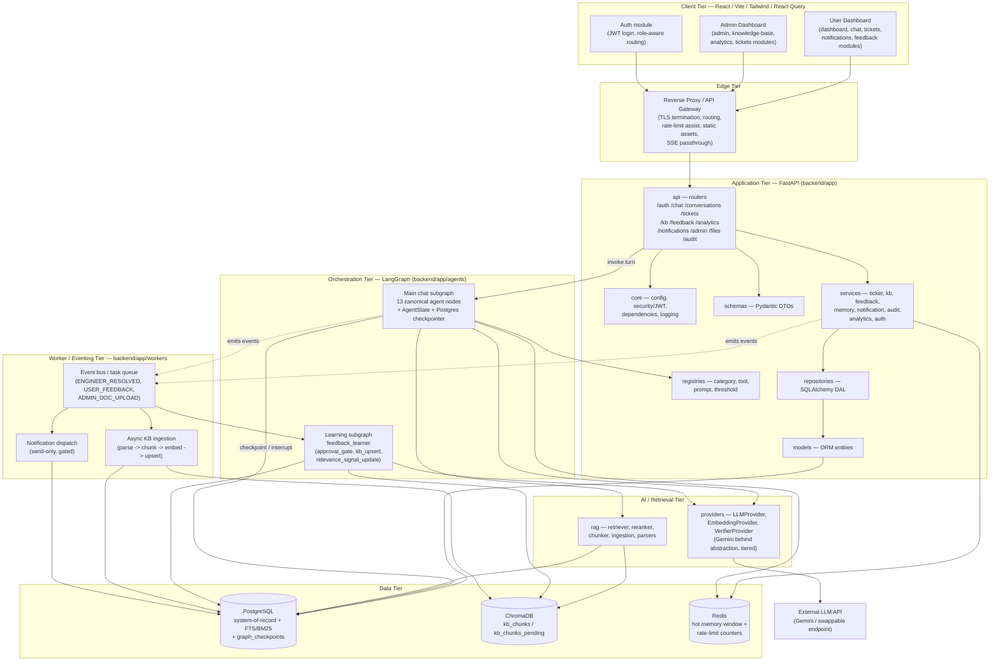

### 1.2 Layer-by-layer description

**Client Tier (React + Vite + Tailwind + React Query).** A single SPA compiled by Vite, styled with Tailwind, with all server state mediated by React Query (caching, retries, optimistic updates, invalidation). It is partitioned into the canonical frontend modules under `frontend/src/modules/`: `auth` (JWT login, token refresh, role-aware route guards), `chat` (streaming AI Chat surface consuming SSE), `dashboard` (end-user home), `admin` (Admin Dashboard for engineers/SMEs/admins), `tickets` (Ticket Management views for both users and engineers), `knowledge-base` (File Upload + PDF/Word ingestion UI, article review), `analytics` (Analytics dashboards), `notifications` (Notifications center), and `feedback` (thumbs/reopen affordances). Cross-cutting infra lives in `shared/ui`, `shared/api` (the React Query client and typed fetchers), `shared/hooks`, and `shared/store`. **Authentication** and role-aware presentation live here at the UI level; **User Dashboard** and **Admin Dashboard** are the two top-level composition roots.

**Edge Tier (reverse proxy / API gateway).** Terminates TLS, serves the built static SPA, and reverse-proxies `/api/v1/*` to FastAPI. Critically it passes through streaming responses (Server-Sent Events) unbuffered so the single `responder` egress node can stream tokens to the `chat` module. It provides coarse network-level rate-limit assist that complements the per-identity rate limiting performed deterministically inside `ingress_guard`.

**Application Tier (FastAPI, `backend/app/`).** The HTTP contract lives in `api` routers exposing the canonical prefixes under `/api/v1`: `/auth`, `/chat`, `/conversations`, `/tickets`, `/kb`, `/feedback`, `/analytics`, `/notifications`, `/admin`, `/files`, `/audit`. `core` holds configuration, the JWT security layer, FastAPI dependencies, and structured logging — this is where **Authentication (JWT)** is enforced and where role claims are injected into `user_context` (never trusted from message content). `schemas` defines Pydantic request/response DTOs; `services` implements orchestration-free application logic (ticket, kb, feedback, memory, notification, audit, analytics, auth) and is the home of **Ticket Management**, **Notifications**, **Audit Logs**, **Analytics**, **Knowledge Base**, and **Feedback Learning** service surfaces; `repositories` is the SQLAlchemy data-access layer; `models` are the ORM entities; `registries` exposes the data-driven category/tool/prompt/threshold seams that make the platform extensible without code changes. The API layer is deliberately thin over the conversational core: `/chat` validates, authenticates, resolves identity, then hands the turn to the LangGraph orchestrator.

**Orchestration Tier (LangGraph, `backend/app/agents/`).** The **Multi-Agent Workflow** — the heart of the platform — is a compiled LangGraph with thirteen canonical agent nodes sharing one versioned `AgentState` and checkpointed per-thread by the Postgres LangGraph checkpointer (`graph_checkpoints` table). This tier owns **AI Chat** orchestration, **Conversation Memory** (via `add_messages` + `MemoryManager`), **Human Handoff** (via `interrupt()` + durable checkpoint), and the routing that ties **RAG**, **Semantic Search**, ticketing, and escalation together. A separate event-triggered `feedback_learner` learning subgraph runs out-of-band and never blocks a chat turn.

**AI / Retrieval Tier.** `providers` holds the **abstract LLM provider** (`LLMProvider`, `EmbeddingProvider`, `VerifierProvider` protocols) with Gemini behind them and model tiering (`small`/`large`) so the LLM is swappable via configuration. `rag` implements **RAG**: the hybrid retriever, cross-encoder reranker, chunker, ingestion pipeline, and PDF/Word document parsers. **Semantic Search** and **Vector Database** access route through here into ChromaDB; sparse/BM25 search routes into PostgreSQL FTS; the two are fused by reciprocal-rank fusion.

**Data Tier.** **PostgreSQL** is the system-of-record for all twenty-four canonical entities, additionally backing sparse full-text retrieval and hosting `graph_checkpoints` for LangGraph durability. **ChromaDB** is the **Vector Database**, holding the `kb_chunks` (published) and `kb_chunks_pending` (staging) collections; per-category isolation is by `retrieval_namespace` metadata rather than separate collections. Redis caches the hot conversation window and rate-limit / answer-cache counters.

**Worker / Eventing Tier (`backend/app/workers`).** An event bus / task queue decouples slow or side-effectful work from the request path. Three converging event types (`ENGINEER_RESOLVED_EVENT`, `USER_FEEDBACK_EVENT`, `ADMIN_DOC_UPLOAD_EVENT`) drive the `feedback_learner` subgraph and the **PDF/Word Knowledge Ingestion** pipeline; a **Notifications** dispatcher performs gated, send-only delivery to engineer queues. **File Upload** payloads land via `/files`, are persisted (`files`, `ticket_attachments`), and — for KB content — are handed to async ingestion. This tier is where **Feedback Learning** and continuous KB improvement physically execute.

**Capability-to-home matrix (summary).**

| Capability | Primary home |
|---|---|
| Authentication | `core` (JWT) + frontend `auth`; `users`, `roles`, `user_sessions` |
| User Dashboard / Admin Dashboard | frontend `dashboard` / `admin`; served via edge |
| AI Chat | frontend `chat` + `/chat` router + LangGraph orchestrator |
| Multi-Agent Workflow | `agents` (LangGraph 13-node graph) |
| RAG / Semantic Search | `rag` + `providers` + ChromaDB + Postgres FTS |
| Vector Database | ChromaDB (`kb_chunks`, `kb_chunks_pending`) |
| PostgreSQL | Data tier; all ORM entities + FTS + checkpointer |
| Conversation Memory | `MemoryManager` + `add_messages` + `conversation_summaries`, `memory_facts`, `graph_checkpoints` (+ Redis hot window) |
| Ticket Management | `services.ticket` + `tickets`, `ticket_events`, `ticket_attachments` |
| Human Handoff | `human_handoff` node + `interrupt()` + `notifications` |
| Knowledge Base | `services.kb` + `rag` ingestion + `kb_documents`, `kb_chunks`, `kb_approvals` |
| Feedback Learning | `feedback_learner` subgraph + `feedback`, `relevance_signals` |
| Analytics | `services.analytics` + `analytics_events` + frontend `analytics` |
| Notifications | `services.notification` + workers + `notifications` |
| Audit Logs | `services.audit` + `audit_logs` (append-only) |
| File Upload | `/files` + `files`, `ticket_attachments` |
| PDF/Word Ingestion | `rag` parsers + `kb_ingestion_jobs` + workers |
| Docker Deployment | `infra` (docker-compose topology) |

---

## 2. End-to-End User Flow

This section walks every primary path a request can take. All paths share a common front matter: the user authenticates through the `auth` module (JWT issued by `/auth`, role claims placed into `user_context` by `core`), opens the `chat` surface, and submits a message. The `/chat/messages` router (canonical path `POST /chat/messages`, with cancellation via `/chat/messages/{trace_id}/cancel`; "/chat" elsewhere is shorthand for `/chat/messages`) authenticates, resolves identity from the JWT, loads or creates a `conversations` row, and invokes the LangGraph orchestrator with the existing `thread_id` (so the Postgres checkpointer can resume any parked run).

### 2.1 Path (a) — AI auto-resolves from the Knowledge Base

1. **User** types "I can't connect to the VPN, it says authentication failed" and sends.
2. **System — `ingress_guard`** (no LLM): normalizes text, redacts PII, screens for injection/jailbreak, applies per-identity rate limiting, loads memory, computes `query_hash`, and checks the answer cache. No control intent, no cache hit → continues.
3. **System — `memory_manager` (load)** hydrates `messages`, `conversation_summary`, `memory_facts`, `recent_turns` into `AgentState`.
4. **System — `intent_classifier`** (small-tier LLM) maps the query to `category="VPN Problems"` from `category_registry`, produces `intent`, `required_slots`, `sensitivity_level`, and a high `intent_confidence`; not out of scope, no critical missing slots → `query_planner`.
5. **System — `query_planner`** coreference-resolves to a standalone query, generates multi-query + HyDE variants, and derives `retrieval_filters` (org/tenant, ACL, `doc_status=published`, `retrieval_namespace`).
6. **System — `rag_retriever`** runs hybrid dense (ChromaDB `kb_chunks`) + sparse (Postgres FTS) retrieval, fuses by RRF, cross-encoder reranks, dedupes, and attaches provenance to each `RetrievedChunk`.
7. **System — `retrieval_gate`** (no LLM): `max_relevance_score >= threshold(category, sensitivity)` and at least one fresh non-expired supporting doc → **sufficient** → `solution_synthesizer`.
8. **System — `solution_synthesizer`** (large-tier LLM) drafts a grounded, cited answer strictly from candidates, emitting `claims[]` and `citations`; streaming begins internally.
9. **System — `grounding_verifier`** independently checks entailment (NLI), citation validity, and answer relevance; all pass.
10. **System — `confidence_gate`** (no LLM) fuses signals, finds no contradictions, `final_confidence >= deliver_threshold` and `grounding_score >= grounding_min` → **deliver**.
11. **System — `responder`** (single egress) streams the final cited answer to the **user's** chat pane, writes the answer cache keyed on `query_hash`, attaches a **feedback** affordance (thumbs up/down / reopen), and emits `analytics_events` + `audit_logs`.
12. **System — `memory_manager` (persist)** updates summary/facts; graph ends.
13. **User sees:** a conversational answer with citations to KB articles and a feedback control. **Engineer sees:** nothing — no ticket was created.

### 2.2 Path (b) — AI must collect missing info, then answers

1. **User** asks "My software install keeps failing."
2. Steps 2–4 as above, but **`intent_classifier`** (or later **`retrieval_gate`**) determines critical slots are missing/unfilled (e.g., OS, application name, error code) — a resolvable gap.
3. **System — `info_collector`** (registry-driven slot-filling) composes a single batched clarification question set from `required_slots` and routes to `responder`.
4. **System — `responder`** streams the clarifying questions and the graph hits **INTERRUPT** (checkpointed; the run parks awaiting the next user turn).
5. **User sees:** "To help, which OS are you on, what's the app name, and what's the exact error text?" and replies with the details.
6. **System:** the reply resumes the same `thread_id` at `ingress_guard`; `info_collector` records `filled_slots`, and because slots are now filled and rounds are below max, control routes back to `rag_retriever` for a cheap re-attempt.
7. Retrieval → gate → synthesize → verify → gate proceed as in path (a); if now sufficient and grounded, **`confidence_gate` → deliver → `responder`** streams the resolved answer.
8. **Loop safety:** if clarification rounds reach `max` without resolution, `info_collector` routes to `ticket_creator` (transition into path (c)). **User sees:** either the final answer or a smooth transition into ticket creation; **engineer** only becomes involved if escalation occurs.

### 2.3 Path (c) — No reliable answer → ticket → human handoff → engineer resolves → resolution ingested back into KB

1. **User** asks a novel or high-sensitivity question (e.g., a Payment Issue) with no strong KB coverage.
2. The turn reaches a terminal escalation condition via any of the canonical routes: `retrieval_gate` **insufficient, not fixable**; `solution_synthesizer` **ABSTAIN** (short-circuit, skips verification); `confidence_gate` **escalate** (hard hallucination guard: any contradicted claim / invalid citation / irrelevant answer, or `final_confidence` below the category threshold, or exhausted retry budget); or `info_collector` **rounds ≥ max**. Payment/security categories carry stricter thresholds and lower retry budgets, so they escalate sooner.
3. **System — `ticket_creator`** assembles and persists an engineer-ready ticket in PostgreSQL (`tickets` + `ticket_events`), idempotent per thread: it stores `category`, `filled_slots`, the **redacted** transcript, the rejected retrieval candidates as engineer hints, `final_confidence`, a machine-readable `escalation_reason`, attachments (`ticket_attachments`), and an auto-classified `priority` / `assigned_queue` / `sla_due_at` from `category_registry`.
4. **System — `human_handoff`** summarizes context, sends a **gated, send-only notification** (`notifications`) to the registry-defined `handoff_queue`, sets the thread to `awaiting_human`, and calls LangGraph `interrupt()` so the Postgres checkpointer durably parks the run — no polling.
5. **User sees:** an honest "I've created ticket #… and routed it to a support engineer; you'll be notified" message (the system never fabricates a stopgap answer), plus the ticket visible in their `tickets` view with live status.
6. **Engineer sees:** the ticket in the Admin Dashboard `tickets` queue with the full structured context (redacted transcript, candidate hints, confidence, priority, SLA). The engineer works and resolves it, recording `engineer_resolution` and flipping `ticket_status`.
7. **System:** ticket resolution emits an `ENGINEER_RESOLVED_EVENT`. Two things happen: (i) the backend resumes the same `thread_id` via `Command(resume=...)` at `human_handoff`, letting `responder` deliver the engineer's resolution to the **user** and persist memory; (ii) the event enters the **learning subgraph** — `feedback_learner` drafts a canonical KB article from the resolution, routes it through `approval_gate`; a `sme_reviewer`/`admin` approves (`kb_approvals`), the draft is chunked, embedded, and upserted into live `kb_chunks` with a new `version`, provenance, and `last_verified_at`. The answer cache is invalidated so future identical queries short-circuit to the freshly learned answer.
8. **Net effect:** the next user with the same problem is auto-resolved via path (a) using the engineer's now-canonized knowledge — the platform continuously improves.

### 2.4 Path (d) — Admin ingests PDF/Word knowledge

1. **Admin/SME** opens the `knowledge-base` module and uploads one or more PDF/Word files via `/files` and `/kb`.
2. **System:** files are persisted (`files`), a `kb_documents` row and a `kb_ingestion_jobs` record are created, and an `ADMIN_DOC_UPLOAD_EVENT` is emitted to the worker tier (ingestion never blocks the request).
3. **System — async ingestion (`rag` parsers + `feedback_learner`):** parse PDF/Word → normalize → chunk → embed via `EmbeddingProvider`. New/pending chunks land in the **`kb_chunks_pending`** ChromaDB collection with `doc_status=pending_review`, kept out of live retrieval.
4. **System — `approval_gate`:** the document surfaces in the Admin Dashboard review queue. An **admin/SME sees** the parsed article and staged chunks for review.
5. **Admin/SME** approves (`kb_approvals`). On approval, `kb_upsert` promotes the chunks into the live `kb_chunks` collection with `doc_status=published`, a new `version`, provenance, and `last_verified_at`; every transition writes append-only `audit_logs`. The answer cache is invalidated where affected.
6. **Net effect:** the ingested knowledge is immediately retrievable in path (a) for all in-scope users of that org/tenant/namespace. If approval is withheld, the content remains staged and never reaches live retrieval.

---

## 3. Multi-Agent Workflow

The conversational core is a single compiled LangGraph. All coordination happens through one versioned shared-state object (`AgentState`); nodes never call each other directly and never hold provider handles. Routing is deterministic and score-driven at three decision points; the eight seed categories are rows in `category_registry`, never branches in node logic. The graph is guaranteed to terminate in exactly one of two ways — **deliver** a grounded, cited answer, or **hand off** to a human — and never emits an ungrounded auto-answer.

### 3.1 Canonical LangGraph — nodes and conditional edges

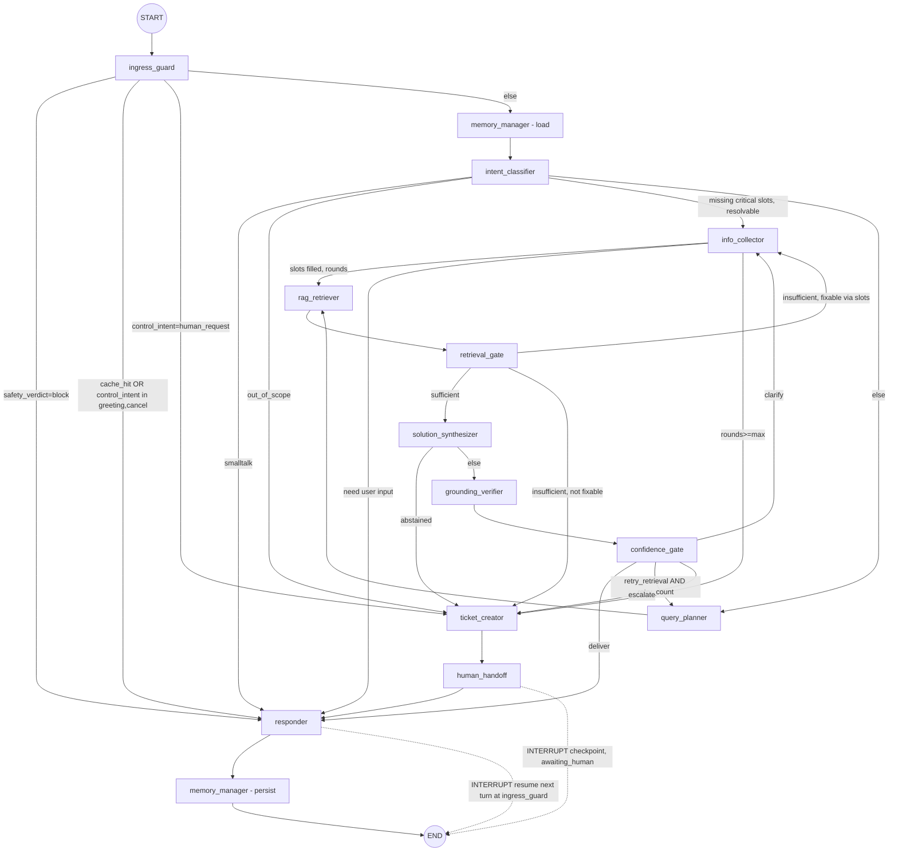

**Learning subgraph (async, event-triggered, out-of-band):**

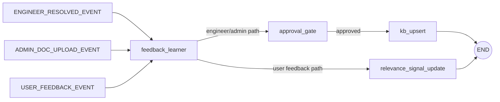

### 3.2 Agent roster — responsibilities, inputs, outputs, tools

| Node id | Responsibilities | Key State inputs | Key State outputs | Tools / providers |
|---|---|---|---|---|
| `ingress_guard` | Deterministic (no-LLM) entry: normalize, PII-redact, injection/jailbreak screen, rate-limit, load memory handle, compute `query_hash`, check answer cache, detect control intents (greeting/cancel/explicit-human). | `raw_user_message`, `user_context`, `auth_claims` | `normalized_query`, `redacted_query`, `query_hash`, `safety_verdict`, `injection_flag`, `cache_hit`, `cached_answer`, `control_intent` | Redactor, safety screen, rate limiter, answer-cache lookup (no LLM) |
| `memory_manager` | Load/persist conversation memory; rolling summarization; durable user facts. Runs at ingress and post-response; also a tool binding. | `thread_id`, `user_context`, `messages` | `messages`, `conversation_summary`, `memory_facts`, `recent_turns` | `LLMProvider.summarize` (small tier); Postgres (`conversation_summaries`, `memory_facts`); Redis hot window |
| `intent_classifier` | Small-tier LLM classify into registry-driven category taxonomy + intent + required-slot schema + confidence + sensitivity. | `redacted_query`, `conversation_summary`, `category_registry` | `candidate_categories`, `category`, `intent`, `sensitivity_level`, `required_slots`, `missing_slots`, `intent_confidence`, `is_out_of_scope`, `is_multi_intent` | `LLMProvider.classify` / `generate_structured` (small tier); `registries.category` |
| `query_planner` | Coreference-resolve to a standalone query; multi-query + HyDE expansion; derive retrieval filters & strategy. | `redacted_query`, `recent_turns`, `category`, `retrieval_namespace` | `standalone_query`, `query_variants`, `retrieval_filters` | `LLMProvider.generate` (small/large); `registries.prompt` |
| `rag_retriever` | Hybrid dense (ChromaDB) + sparse (Postgres FTS) retrieval with org/tenant + ACL + `doc_status=published` filters, RRF fusion, cross-encoder rerank, provenance. | `query_variants`, `retrieval_filters`, `retrieval_namespace` | `candidates` (`RetrievedChunk[]`), `max_relevance_score`, `score_gap`, `retrieval_coverage`, `citations` | `rag.retriever`, `rag.reranker`; `EmbeddingProvider.embed`; ChromaDB `kb_chunks`; Postgres FTS; `relevance_signals` |
| `retrieval_gate` | Reliability gate #1 (no LLM): is evidence strong & fresh enough to attempt an answer. | `max_relevance_score`, `candidates.last_verified_at`, `thresholds`, `sensitivity_level`, `missing_slots` | `retrieval_sufficient`, `retrieval_gate_reason` | `registries.threshold` (no LLM) |
| `solution_synthesizer` | Large-tier grounded, cited answer strictly from candidates; emits `claims[]`; may `ABSTAIN`; streaming. | `standalone_query`, `candidates`, `citations` | `draft_answer`, `claims`, `used_chunk_ids`, `self_reported_confidence`, `abstained` | `LLMProvider.generate` / `stream` (large tier); `registries.prompt` |
| `grounding_verifier` | Reliability gate #2: independent NLI/entailment claim-vs-source faithfulness + citation validity + answer relevance. | `claims`, `candidates`, `draft_answer`, `standalone_query` | `grounding_score`, `unsupported_claims`, `contradicted_claims`, `citation_valid`, `answer_relevant` | `VerifierProvider.check_entailment` / `validate_citations` / `score_relevance` |
| `confidence_gate` | Central deterministic router (no LLM): fuse all signals → `deliver \| clarify \| retry_retrieval \| escalate`; enforce retry/clarify budgets. | `intent_confidence`, `max_relevance_score`, `grounding_score`, `contradicted_claims`, `citation_valid`, `answer_relevant`, `sensitivity_level`, `retry_count`, `clarification_rounds`, `thresholds` | `final_confidence`, `decision`, `decision_rationale`, `safety_flags` | `registries.threshold` (no LLM) |
| `info_collector` | Registry-driven slot-filling clarification (batched questions, bounded loops); re-enters retrieval or forwards to ticket. | `required_slots`, `missing_slots`, `filled_slots`, `clarification_rounds` | `filled_slots`, `missing_slots`, `clarification_rounds`, clarification message | `registries.category` (intake fields); `LLMProvider.generate` (small tier) |
| `ticket_creator` | Assemble + persist structured, engineer-ready ticket in PostgreSQL; idempotent per thread. | `category`, `filled_slots`, redacted transcript, `candidates` (rejected as hints), `final_confidence`, `escalation_reason`, `attachment_manifest` | `ticket_id`, `ticket_status`, `priority`, `assigned_queue`, `sla_due_at`, `escalation_reason` | `services.ticket`; Postgres `tickets`, `ticket_events`, `ticket_attachments`; `registries.category` |
| `human_handoff` | Route to engineer queue, notify (gated send-only), set `awaiting_human`, `interrupt()` + checkpoint. | `ticket_id`, `assigned_queue`, conversation context | `handoff_status`, `status=awaiting_human` | `services.notification` (send-only); LangGraph `interrupt()`; Postgres checkpointer |
| `responder` | Single egress for every path: stream final message, write answer cache, attach feedback affordance, emit analytics + audit. | `decision`, `draft_answer`/`cached_answer`, `citations`, `ticket_id` | final streamed message, `feedback_handle`, `metrics` | SSE stream; answer-cache write; `services.analytics`, `services.audit` |
| `feedback_learner` | Event-triggered learning subgraph: engineer-resolution / user-feedback / admin-doc → draft → approval → chunk+embed+upsert KB; update relevance signals; invalidate cache. | `engineer_resolution`, `user_feedback`, uploaded doc, `kb_doc_id` | `kb_doc_id`, `kb_doc_status`, updated `relevance_signals` | `LLMProvider.generate`, `EmbeddingProvider.embed_batch`; `rag.chunker`/`ingestion`/parsers; ChromaDB `kb_chunks`/`kb_chunks_pending`; `services.kb`, `services.feedback`; `kb_approvals` |

### 3.3 The shared State object — `AgentState`

`AgentState` is a single versioned `TypedDict`, the ONLY inter-node coupling, checkpointed per-thread via the Postgres LangGraph checkpointer. Nodes read only the keys they depend on and write only their declared outputs; optional keys default to `None` so new agents splice in safely. Provider handles are injected via graph `config`, never stored in state (keeps state serializable). Reducers: `messages` and `audit_trail` use append reducers; scalar counters overwrite.

```
# Envelope
schema_version:int; thread_id:str; trace_id:str; turn_id:int; status:str
# Identity/context (from JWT via API layer, never from message body)
user_context:{user_id, role, org_id, tenant_id, locale}; auth_claims:dict
# Input / memory
raw_user_message:str; normalized_query:str; redacted_query:str; query_hash:str
standalone_query:str; query_variants:list[str]; retrieval_filters:dict
messages:Annotated[list, add_messages]; conversation_summary:str
memory_facts:list[dict]; recent_turns:list[dict]; attachment_manifest:list[dict]
# Safety
safety_verdict:enum; injection_flag:bool; cache_hit:bool; cached_answer:str|None
control_intent:enum{greeting,cancel,human_request,none}
# Intent
candidate_categories:list[{key,score}]; category:str; intent:str
sensitivity_level:enum; required_slots:list[str]; filled_slots:dict
missing_slots:list[str]; intent_confidence:float; is_out_of_scope:bool; is_multi_intent:bool
# Retrieval
retrieval_namespace:str; candidates:list[RetrievedChunk{chunk_id,doc_id,version,text,score,source_uri,last_verified_at}]
max_relevance_score:float; score_gap:float; retrieval_coverage:float
retrieval_sufficient:bool; retrieval_gate_reason:str; citations:list[dict]
# Answer
draft_answer:str; claims:list[Claim{text,cited_chunk_ids}]; used_chunk_ids:list[str]
self_reported_confidence:float; abstained:bool
# Grounding
grounding_score:float; unsupported_claims:list; contradicted_claims:list
citation_valid:bool; answer_relevant:bool
# Gate
final_confidence:float; decision:enum{deliver,clarify,retry_retrieval,escalate}
decision_rationale:str; safety_flags:list[str]
# Ticket / handoff
ticket_id:str|None; ticket_status:enum; priority:enum; assigned_queue:str
escalation_reason:str; handoff_status:enum; engineer_resolution:dict|None; sla_due_at:datetime|None
# Learning / feedback
user_feedback:dict|None; kb_doc_id:str|None; kb_doc_status:str; feedback_handle:str
# Control / observability
retry_count:int; clarification_rounds:int; thresholds:dict; metrics:dict
audit_trail:Annotated[list, append]; error:str|None
```

### 3.4 The confidence / grounding gate (three category-agnostic decision points)

**Decision point 1 — `retrieval_gate` (deterministic, no LLM).** `retrieval_sufficient = max_relevance_score >= threshold(category, sensitivity) AND at least one fresh non-expired supporting doc`. Sufficient → `solution_synthesizer`; fixable gap (resolvable via slots) → `info_collector`; else → `ticket_creator`. This is the first reliability gate: it prevents the LLM from being asked to answer on thin evidence.

**Decision point 2 — `synthesizer ABSTAIN` short-circuit.** If `solution_synthesizer` sets `abstained=true`, the graph skips grounding verification entirely and routes straight to `ticket_creator`. The model is explicitly allowed to decline rather than fabricate.

**Decision point 3 — `confidence_gate` (deterministic policy router, no LLM).** `final_confidence = f(intent_confidence, retrieval strength, grounding_score, contradiction flags, sensitivity_level)`. Rules evaluated in strict order:
- **(a) Hard hallucination guard:** any `contradicted_claims` OR `citation_valid=false` OR `answer_relevant=false` → **escalate**. This overrides high self-reported confidence — a fluent but ungrounded answer is never delivered.
- **(b) Deliver:** `final_confidence >= deliver_threshold(category) AND grounding_score >= grounding_min` → **deliver**.
- **(c) Clarify:** borderline AND `missing_slots` non-empty AND `clarification_rounds < max` → **clarify** (→ `info_collector`).
- **(d) Retry:** retryable-thin-retrieval AND `retry_count < retry_budget` → **retry_retrieval** (→ `query_planner`).
- **(e) Else → escalate.**

Payment/security categories carry stricter `deliver_threshold` and lower `retry_budget`, so they escalate to a human sooner. **Loop safety:** `retry_count` and `clarification_rounds` are bounded counters; exceeding either budget forces deterministic escalation, so the graph cannot loop indefinitely and always terminates in **deliver** or **handoff**.

### 3.5 How the cross-cutting subsystems are wired into the graph

**RAG.** `query_planner` → `rag_retriever` → `retrieval_gate` is the retrieval spine. `rag_retriever` performs hybrid dense (ChromaDB `kb_chunks`) + sparse (Postgres FTS) retrieval, RRF fusion, cross-encoder rerank, and dedup, enforcing the hard multi-tenant boundary (`org_id`/`tenant_id` + ACL + `doc_status=published`) and category scope (`retrieval_namespace`) purely via metadata filters. Every `RetrievedChunk` carries provenance (`doc_id, chunk_id, version, source_uri, last_verified_at`). Two sequential reliability gates (`retrieval_gate`, then `grounding_verifier` + `confidence_gate`) bracket `solution_synthesizer`, which must cite every claim and may ABSTAIN. `relevance_signals` from the feedback loop feed the reranker and `retrieval_gate`.

**Conversation memory.** Short-term memory is the `messages` channel under the `add_messages` reducer, durably checkpointed in `graph_checkpoints` by the Postgres checkpointer. `memory_manager` loads at `ingress_guard` (hydrating `conversation_summary`, `memory_facts`, `recent_turns`, optionally from a Redis hot window) and persists after `responder`, maintaining a rolling LLM summary (`conversation_summaries`) so token cost stays flat regardless of conversation length, plus durable per-user facts (`memory_facts`). The `query_hash` answer cache provides zero-LLM short-circuits at `ingress_guard` and is invalidated on any KB upsert or feedback demotion.

**Ticket creation.** Every escalation route (`retrieval_gate` not-fixable, synthesizer ABSTAIN, `confidence_gate` escalate, `info_collector` rounds ≥ max, `intent_classifier` out_of_scope, and `ingress_guard` explicit human_request) converges on `ticket_creator`, which persists an idempotent, engineer-ready ticket (category, `filled_slots`, redacted transcript, rejected candidates as hints, `final_confidence`, machine-readable `escalation_reason`, attachments, auto-classified `priority`/`assigned_queue`/`sla_due_at` from `category_registry`) into `tickets` + `ticket_events`.

**Human handoff.** `ticket_creator` → `human_handoff` summarizes context, sends a gated send-only notification to the registry-defined `handoff_queue`, sets the thread `awaiting_human`, and calls LangGraph `interrupt()` so the Postgres checkpointer durably parks the run with no polling. The engineer works the ticket in the Admin Dashboard; on resolution the backend resumes the same `thread_id` via `Command(resume=...)` at `human_handoff`, letting `responder` deliver the resolution. The system never fabricates a stopgap answer while parked.

**Feedback learning.** This runs as the separate event-triggered `feedback_learner` subgraph, never inline on a chat turn. Three converging triggers feed one pipeline: (1) `ENGINEER_RESOLVED_EVENT` → draft canonical KB article → `approval_gate` → `kb_upsert`; (2) `USER_FEEDBACK_EVENT` (thumbs/reopen) → `relevance_signal_update` (boost validated docs, quarantine down-voted) consumed by the reranker and `retrieval_gate`; (3) `ADMIN_DOC_UPLOAD_EVENT` → same `draft → approval_gate → chunk → embed → upsert` pipeline. New/pending docs stage in `kb_chunks_pending` (`doc_status=pending_review`) out of live retrieval; SME/admin approval (`kb_approvals`) flips them to `published` and upserts into live `kb_chunks` with a new version, provenance, and `last_verified_at`, then invalidates the answer cache. Every transition writes append-only `audit_logs`, closing the continuous-improvement loop back into path (a).

---

## 4. Folder Structure

The platform is a single monorepo with five canonical top-level folders: `backend`, `frontend`, `infra`, `docs`, `scripts`. Every backend package maps 1:1 to a canonical module (`api, core, agents, providers, rag, registries, services, repositories, models, schemas, db, workers`); every frontend feature folder maps 1:1 to a canonical frontend module (`auth, chat, dashboard, admin, tickets, knowledge-base, analytics, notifications, feedback` + `shared/*`).

```
helpdesk-platform/
├── backend/                              # FastAPI + LangGraph service (Python)
│   ├── app/
│   │   ├── main.py                       # ASGI app factory: mounts routers, middleware, lifespan (DB/Chroma/graph warmup)
│   │   ├── api/                          # ── ROUTERS layer (HTTP boundary only; no business logic)
│   │   │   ├── deps.py                   # shared FastAPI dependencies (current_user, db session, provider handles, rbac)
│   │   │   ├── errors.py                 # exception handlers → RFC7807 problem+json envelopes
│   │   │   └── v1/                        # all routes under /api/v1
│   │   │       ├── router.py             # aggregates & prefixes all v1 sub-routers
│   │   │       ├── auth.py               # /auth       login, refresh, logout, me
│   │   │       ├── chat.py               # /chat       turn submit + SSE streaming egress
│   │   │       ├── conversations.py      # /conversations  history, memory, resume
│   │   │       ├── tickets.py            # /tickets    CRUD, assign, resolve, events
│   │   │       ├── kb.py                 # /kb         documents, chunks, ingestion, approvals, semantic search
│   │   │       ├── feedback.py           # /feedback   thumbs, reopen, relevance signals
│   │   │       ├── analytics.py          # /analytics  dashboards, KPIs, event queries
│   │   │       ├── notifications.py      # /notifications  list, mark-read, preferences
│   │   │       ├── admin.py              # /admin      users, roles, category_registry, thresholds, config
│   │   │       ├── files.py              # /files      upload, download, virus-scan status (file handling owned by /files router + background workers + repositories.base; no separate file service)
│   │   │       └── audit.py              # /audit      append-only audit log queries (admin)
│   │   │
│   │   ├── core/                         # ── cross-cutting foundation (framework-agnostic)
│   │   │   ├── config.py                 # Pydantic Settings (env-driven, 12-factor; provider keys, DSNs, budgets)
│   │   │   ├── security.py               # JWT encode/decode, password hashing, token rotation
│   │   │   ├── rbac.py                   # role matrix (end_user, support_engineer, admin, sme_reviewer) + require_role guards
│   │   │   ├── logging.py                # structured JSON logging, trace_id/thread_id correlation
│   │   │   ├── middleware.py             # request-id, timing, tenant-context, rate-limit, error boundary
│   │   │   ├── exceptions.py             # domain exception hierarchy (AppError → NotFound/Forbidden/Conflict/…)
│   │   │   └── constants.py              # enums: decisions, statuses, sensitivity levels, event types
│   │   │
│   │   ├── agents/                       # ── LangGraph orchestrator package (the multi-agent brain)
│   │   │   ├── state.py                  # AgentState TypedDict (versioned single shared contract) + reducers
│   │   │   ├── graph.py                  # main chat subgraph assembly: nodes + canonical conditional edges
│   │   │   ├── learning_graph.py         # async feedback_learner subgraph (approval_gate/kb_upsert/relevance)
│   │   │   ├── checkpointer.py           # Postgres LangGraph checkpointer binding (graph_checkpoints)
│   │   │   ├── routing.py                # deterministic routers: retrieval_gate & confidence_gate decision fns
│   │   │   ├── config_schema.py          # graph `config` contract (injected provider handles, budgets, thresholds)
│   │   │   └── nodes/                    # one file per canonical agent node
│   │   │       ├── ingress_guard.py      # normalize/PII-redact/injection-screen/rate-limit/cache/control-intent
│   │   │       ├── memory_manager.py     # load/persist memory, rolling summary, durable facts (also tool binding)
│   │   │       ├── intent_classifier.py  # small-tier classify → category/intent/slots/confidence/sensitivity
│   │   │       ├── query_planner.py      # coref-resolve, multi-query + HyDE, retrieval filters
│   │   │       ├── rag_retriever.py      # hybrid dense+sparse, RRF fusion, cross-encoder rerank, provenance
│   │   │       ├── retrieval_gate.py     # reliability gate #1 (sufficiency)
│   │   │       ├── solution_synthesizer.py # large-tier grounded cited answer; claims[]; ABSTAIN; streaming
│   │   │       ├── grounding_verifier.py # reliability gate #2 (NLI entailment, citation/relevance validity)
│   │   │       ├── confidence_gate.py    # central router: deliver|clarify|retry_retrieval|escalate
│   │   │       ├── info_collector.py     # registry-driven batched slot-filling clarification
│   │   │       ├── ticket_creator.py     # assemble+persist engineer-ready ticket (idempotent per thread)
│   │   │       ├── human_handoff.py      # queue routing, gated notify, awaiting_human, interrupt()+checkpoint
│   │   │       └── responder.py          # single egress: stream, write cache, feedback affordance, analytics/audit
│   │   │
│   │   ├── providers/                    # ── LLM/Embedding/Verifier abstraction (Gemini swappable)
│   │   │   ├── base.py                   # LLMProvider / EmbeddingProvider / VerifierProvider Protocols
│   │   │   ├── registry.py               # provider factory: resolve tier→model from config
│   │   │   ├── gemini/                   # concrete Gemini adapters (LLM chat/stream/structured/classify/verify)
│   │   │   │   ├── llm.py
│   │   │   │   └── embeddings.py
│   │   │   ├── verifier/                 # NLI/entailment verifier (wraps LLM.verify or dedicated model)
│   │   │   │   └── nli_verifier.py
│   │   │   └── fakes/                    # deterministic test doubles for CI (no network)
│   │   │
│   │   ├── rag/                          # ── retrieval + ingestion pipeline
│   │   │   ├── retriever.py              # hybrid retrieval orchestration (dense+sparse)
│   │   │   ├── dense.py                  # ChromaDB kb_chunks query (namespace/org/acl/status filters)
│   │   │   ├── sparse.py                 # Postgres FTS/BM25 query
│   │   │   ├── fusion.py                 # reciprocal-rank fusion + near-duplicate dedupe
│   │   │   ├── reranker.py               # cross-encoder rerank + relevance_signals boosting/quarantine
│   │   │   ├── chunker.py                # semantic/structural chunking + overlap policy
│   │   │   ├── ingestion.py              # draft→chunk→embed→upsert pipeline (pending vs published)
│   │   │   ├── vectorstore.py            # ChromaDB client: kb_chunks + kb_chunks_pending collections
│   │   │   └── parsers/                  # PDF/Word/text extraction + normalization
│   │   │       ├── pdf_parser.py
│   │   │       ├── docx_parser.py
│   │   │       └── html_text_parser.py
│   │   │
│   │   ├── registries/                   # ── data-driven extensibility seams
│   │   │   ├── category_registry.py      # loads category_registry rows (namespace, slots, sla, queue, thresholds)
│   │   │   ├── tool_registry.py          # category→tool_bindings resolution
│   │   │   ├── prompt_registry.py        # versioned prompt templates per node/tier
│   │   │   └── threshold_registry.py     # deliver/grounding/retry thresholds by category+sensitivity
│   │   │
│   │   ├── services/                     # ── SERVICES layer (business logic; orchestrates repos + providers)
│   │   │   ├── auth_service.py
│   │   │   ├── ticket_service.py
│   │   │   ├── kb_service.py             # document lifecycle, approvals, semantic search facade
│   │   │   ├── feedback_service.py
│   │   │   ├── memory_service.py
│   │   │   ├── notification_service.py   # gated send-only dispatch
│   │   │   ├── audit_service.py          # append-only audit_logs writes
│   │   │   └── analytics_service.py      # analytics_events aggregation
│   │   │
│   │   ├── repositories/                 # ── REPOSITORIES layer (SQLAlchemy data access; no business rules)
│   │   │   ├── base.py                   # generic CRUD + tenant-scoped query helpers
│   │   │   ├── user_repo.py
│   │   │   ├── conversation_repo.py
│   │   │   ├── ticket_repo.py
│   │   │   ├── kb_repo.py
│   │   │   ├── feedback_repo.py
│   │   │   ├── memory_repo.py
│   │   │   ├── notification_repo.py
│   │   │   ├── audit_repo.py
│   │   │   └── analytics_repo.py
│   │   │
│   │   ├── models/                       # ── ORM entities (one canonical table per file/group)
│   │   │   ├── base.py                   # DeclarativeBase, TimestampMixin, TenantMixin, SoftDeleteMixin
│   │   │   ├── organization.py           # organizations, roles
│   │   │   ├── user.py                   # users, user_sessions
│   │   │   ├── conversation.py           # conversations, messages, conversation_summaries, memory_facts
│   │   │   ├── ticket.py                 # tickets, ticket_events, ticket_attachments
│   │   │   ├── knowledge.py              # kb_documents, kb_chunks, kb_ingestion_jobs, kb_approvals
│   │   │   ├── registry.py               # category_registry
│   │   │   ├── feedback.py               # feedback, relevance_signals
│   │   │   ├── ops.py                    # notifications, audit_logs, files, agent_runs, analytics_events
│   │   │   └── checkpoint.py             # graph_checkpoints (LangGraph checkpointer store)
│   │   │
│   │   ├── schemas/                      # ── Pydantic DTOs (request/response validation contracts)
│   │   │   ├── auth.py  chat.py  conversation.py  ticket.py  kb.py
│   │   │   ├── feedback.py  analytics.py  notification.py  admin.py  file.py  audit.py
│   │   │   └── common.py                 # pagination, problem-json, envelopes, enums
│   │   │
│   │   ├── db/                           # ── persistence bootstrap
│   │   │   ├── session.py                # async engine + sessionmaker + get_session dependency
│   │   │   ├── base.py                   # metadata import surface for Alembic autogenerate
│   │   │   └── migrations/               # Alembic env + versioned migration scripts
│   │   │       ├── env.py
│   │   │       └── versions/
│   │   │
│   │   └── workers/                      # ── async / event-triggered background tasks
│   │       ├── queue.py                  # task broker binding — Celery (Redis broker) + result backend
│   │       ├── learning_tasks.py         # triggers feedback_learner subgraph (resolve/feedback/upload)
│   │       ├── ingestion_tasks.py        # long-running PDF/Word parse→chunk→embed→upsert
│   │       ├── notification_tasks.py     # outbound notification dispatch (gated)
│   │       └── analytics_tasks.py        # rollups, SLA sweeps, cache-invalidation fan-out
│   │
│   ├── tests/                            # unit (nodes/routers), integration (graph), e2e
│   │   ├── unit/  integration/  e2e/  fixtures/
│   ├── alembic.ini
│   ├── pyproject.toml
│   ├── Dockerfile
│   └── .env.example
│
├── frontend/                             # React + Vite + Tailwind + React Query (SPA)
│   ├── index.html
│   ├── vite.config.ts
│   ├── tailwind.config.ts
│   ├── package.json
│   ├── Dockerfile                        # multi-stage build → nginx static serve
│   ├── nginx.conf
│   └── src/
│       ├── main.tsx                      # React root + providers (QueryClient, Router, Auth, Theme)
│       ├── App.tsx                       # top-level route tree + layout shell
│       ├── router/
│       │   ├── routes.tsx                # route table (public / protected / role-gated)
│       │   └── guards.tsx                # ProtectedRoute + RoleRoute wrappers
│       ├── modules/                      # ── one folder per canonical frontend module
│       │   ├── auth/                     # login, refresh, session context, useAuth
│       │   ├── chat/                     # streaming AI chat UI, message list, composer, citations
│       │   ├── dashboard/                # end-user dashboard: my tickets, recent chats, quick actions
│       │   ├── admin/                    # admin dashboard: users, roles, category_registry, thresholds
│       │   ├── tickets/                  # ticket list/detail, engineer queue, resolve flow
│       │   ├── knowledge-base/           # KB browse/search, doc upload, approval review UI
│       │   ├── analytics/                # KPI charts, funnels, deflection/escalation metrics
│       │   ├── notifications/            # bell, drawer, preferences
│       │   └── feedback/                 # thumbs/reopen affordances, relevance surfacing
│       └── shared/                       # ── cross-module infrastructure
│           ├── ui/                       # design-system primitives (Button, Table, Modal, Toast, …)
│           ├── api/                       # React Query client, axios instance, interceptors, query keys, SSE client
│           ├── hooks/                    # shared hooks (usePagination, useDebounce, useStream)
│           └── store/                    # global client state (auth, theme, ui) — Zustand/Context
│
├── infra/                                # Docker & deployment topology
│   ├── docker-compose.yml                # dev/prod service topology (see §7 topology)
│   ├── docker-compose.override.yml       # local dev overrides (hot reload, exposed ports)
│   ├── env/                              # per-environment .env templates
│   ├── nginx/                            # reverse proxy / gateway config
│   ├── postgres/                         # init SQL, tuning
│   ├── chroma/                           # ChromaDB persistence config
│   └── ci/                               # pipeline definitions, image build manifests
│
├── docs/                                 # architecture doc (this document), ADRs, runbooks, API guide
│   ├── architecture.md
│   ├── adr/
│   └── runbooks/
│
├── scripts/                              # operational + dev scripts
│   ├── seed_registry.py                  # seed category_registry (8 seed categories) + roles
│   ├── migrate.sh  bootstrap.sh  reindex_kb.sh  backup.sh
│
├── .gitignore
├── Makefile                              # dev entrypoints (up, migrate, seed, test, lint)
└── README.md
```

---

## 5. Backend Architecture

### 5.1 Layered design

The backend follows a strict **downward-only dependency** rule. Each layer may call the layer directly beneath it, never above. The LangGraph orchestrator (`agents`) is invoked by the `chat`/`conversations` routers via the `services` layer and reaches persistence exclusively through `repositories`; it never touches HTTP or the ORM session directly.

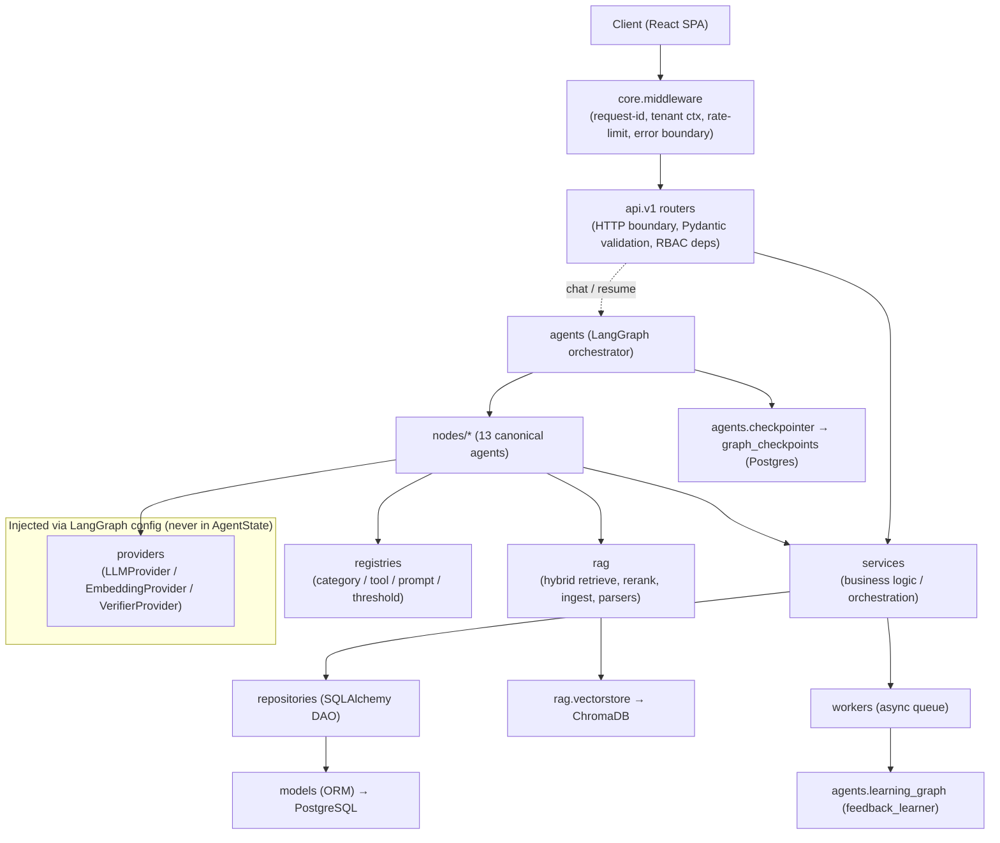

| Layer | Package(s) | Responsibility | May depend on |
|---|---|---|---|
| Edge / middleware | `core.middleware`, `api.deps`, `api.errors` | Request-id/trace correlation, tenant context extraction, rate limiting, global error boundary, auth resolution, DI wiring | `core` |
| Routers (HTTP boundary) | `api.v1.*` | Route binding, Pydantic request/response validation, RBAC guards, delegate to services/graph. No business logic. | `services`, `agents`, `schemas`, `core` |
| Orchestration | `agents` (`graph`, `nodes`, `routing`, `state`, `checkpointer`) | Multi-agent workflow, deterministic gates, checkpointed state | `providers`, `rag`, `registries`, `services` |
| Business logic | `services` | Use-case orchestration, transactions, invariants, gated side-effects (notify/audit) | `repositories`, `providers`, `rag`, `registries` |
| Data access | `repositories` | Tenant-scoped CRUD & queries; no business rules | `models`, `db` |
| Domain model | `models`, `schemas` | ORM entities (canonical tables) + Pydantic DTOs | `core` |
| Persistence bootstrap | `db` | Async engine/session, Alembic migrations | `models` |
| Async | `workers` | Event-triggered learning, ingestion, notifications, rollups | `services`, `agents.learning_graph` |
| Abstractions | `providers`, `registries` | Swappable LLM/embedding/verifier; data-driven config seams | `core` |

### 5.2 Dependency injection

FastAPI's dependency system is the single wiring mechanism, centralized in `api/deps.py`:

- `get_session()` — yields an async SQLAlchemy session (request-scoped, auto-commit/rollback).
- `get_current_user()` — decodes/validates JWT via `core.security`, loads the user, populates `user_context` (`user_id, role, org_id, tenant_id, locale`). Identity is **always** derived from the verified token, never from the message body.
- `require_role(*roles)` — RBAC guard factory (`end_user, support_engineer, admin, sme_reviewer`).
- `get_providers()` — resolves `LLMProvider`, `EmbeddingProvider`, `VerifierProvider` from `providers.registry` using `core.config`. These handles are passed into the graph via LangGraph **`config`**, never stored in `AgentState` (keeps state JSON-serializable for the Postgres checkpointer).
- Service getters (`get_ticket_service`, `get_kb_service`, …) compose repositories + providers.

### 5.3 Request lifecycle

**A. Synchronous chat turn (`POST /api/v1/chat/messages`, SSE response):** (throughout this document, `/chat` is shorthand for `/chat/messages`.)

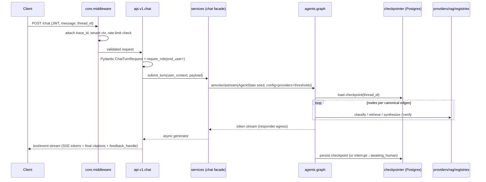

The graph terminates only in **deliver** (streamed answer) or **handoff** (ticket + `interrupt()`); it never emits an ungrounded auto-answer. On `info_collector → responder → INTERRUPT`, the turn ends awaiting the next user message, which resumes at `ingress_guard`. On `human_handoff → INTERRUPT`, the run is durably parked; engineer resolution later resumes the same `thread_id` via `Command(resume=…)`.

**B. Engineer resolution / feedback / admin upload (async):** the relevant router (`/tickets`, `/feedback`, `/kb`) validates, persists via services, then enqueues a `workers` task. The worker invokes the `agents.learning_graph` (`feedback_learner`) out-of-band: `draft → approval_gate → chunk → embed → kb_upsert` (or `relevance_signal_update`), writes `audit_logs`, and invalidates the answer cache. Chat latency is never affected.

### 5.4 Validation (Pydantic)

- **Inbound:** every route binds a `schemas.*` request model; FastAPI rejects malformed payloads with `422` before any logic runs. File uploads validated for MIME/size/extension in `/files` before scan.
- **Config:** `core.config.Settings` is a Pydantic `BaseSettings` validated at startup (fail-fast on missing DSNs/provider keys/budgets).
- **Internal contracts:** `LLMProvider.generate_structured(schema=…)` returns a validated `BaseModel`, so LLM outputs (intent classification, ticket assembly, KB draft) are schema-checked, not free-text-parsed.
- **Outbound:** responses declare `response_model` for shape guarantees and OpenAPI accuracy.

### 5.5 Error handling

A domain exception hierarchy in `core.exceptions` (`AppError → NotFoundError / ForbiddenError / ConflictError / ValidationError / ProviderError / RetrievalError`) is mapped by `api/errors.py` handlers to **RFC 7807 `application/problem+json`** envelopes carrying `trace_id`. Inside the graph, node failures are caught, written to `AgentState.error` + `audit_trail`, and routed by `confidence_gate`/exception policy toward **escalate → ticket_creator** — a provider or retrieval failure degrades to human handoff, never a fabricated answer. Retry/clarification budgets (`retry_count`, `clarification_rounds`) are bounded counters that force deterministic escalation when exceeded.

### 5.6 Async workers

`workers.queue` binds a task broker — Celery (Redis broker) — with a result backend. Task families:

| Worker module | Trigger | Work |
|---|---|---|
| `learning_tasks` | `ENGINEER_RESOLVED_EVENT`, `USER_FEEDBACK_EVENT`, `ADMIN_DOC_UPLOAD_EVENT` | Run `feedback_learner` subgraph; upsert KB / update `relevance_signals`; invalidate cache |
| `ingestion_tasks` | PDF/Word upload | Parse → chunk → embed → stage in `kb_chunks_pending` (`doc_status=pending_review`) |
| `notification_tasks` | Handoff / SLA / mentions | Gated send-only dispatch, persist `notifications` |
| `analytics_tasks` | Scheduled/cron | `analytics_events` rollups, SLA sweeps, cache-invalidation fan-out |

### 5.7 Module → responsibility map (foundation spec placement)

| Canonical module | Location | Role |
|---|---|---|
| `api` | `backend/app/api` | FastAPI routers under `/api/v1` |
| `core` | `backend/app/core` | Config, JWT/security, RBAC, DI deps, logging, middleware |
| `agents` | `backend/app/agents` | LangGraph graph, 13 nodes, `AgentState`, routers, checkpointer |
| `providers` | `backend/app/providers` | `LLMProvider`/`EmbeddingProvider`/`VerifierProvider` + Gemini adapters |
| `rag` | `backend/app/rag` | Hybrid retriever, reranker, chunker, ingestion, parsers, vectorstore |
| `registries` | `backend/app/registries` | Category/tool/prompt/threshold registries |
| `services` | `backend/app/services` | Ticket, KB, feedback, memory, notification, audit, analytics, auth |
| `repositories` | `backend/app/repositories` | SQLAlchemy DAOs |
| `models` | `backend/app/models` | ORM entities (24 canonical tables) |
| `schemas` | `backend/app/schemas` | Pydantic DTOs |
| `db` | `backend/app/db` | Session/base + Alembic migrations |
| `workers` | `backend/app/workers` | Async/event-triggered learning + notification tasks |

---

## 6. Frontend Architecture

### 6.1 Routing map

The SPA uses React Router with three route tiers: **public**, **protected** (any authenticated user), and **role-gated** (`support_engineer`/`admin`/`sme_reviewer`). Guards live in `router/guards.tsx`; the table in `router/routes.tsx`.

| Path | Module | Access | Purpose |
|---|---|---|---|
| `/login` | `auth` | public | JWT login |
| `/` → `/dashboard` | `dashboard` | end_user+ | User dashboard (my chats, my tickets, quick actions) |
| `/chat/:threadId?` | `chat` | end_user+ | Streaming AI chat, resume conversation |
| `/tickets` | `tickets` | end_user+ | My tickets (list) |
| `/tickets/:id` | `tickets` | end_user+ (own) / engineer (any) | Ticket detail; engineer resolve flow gated |
| `/kb` | `knowledge-base` | end_user+ | Browse + semantic search |
| `/kb/upload` | `knowledge-base` | admin, sme_reviewer | PDF/Word ingestion UI |
| `/kb/approvals` | `knowledge-base` | admin, sme_reviewer | Pending-doc approval review |
| `/notifications` | `notifications` | end_user+ | Notification center + preferences |
| `/admin` | `admin` | admin | Admin dashboard shell |
| `/admin/users` | `admin` | admin | Users & role management |
| `/admin/registry` | `admin` | admin | `category_registry` + threshold editing |
| `/admin/queues` | `tickets` | support_engineer, admin | Engineer handoff queues |
| `/analytics` | `analytics` | admin, support_engineer | KPIs: deflection, escalation, grounding, SLA |
| `/audit` | `admin` | admin | Audit log viewer |

### 6.2 Auth handling (JWT storage / refresh)

- **Access token** kept in memory (`shared/store` auth slice); **refresh token** in an HTTP-only, `SameSite=Strict` cookie set by `/auth` — the SPA never reads it in JS, mitigating XSS token theft.
- `shared/api` axios instance attaches `Authorization: Bearer <access>` via a request interceptor.
- A response interceptor catches `401`, performs a **single-flight refresh** against `/auth/refresh` (queuing concurrent failures), retries the original request, or hard-redirects to `/login` on refresh failure.
- `useAuth` exposes `user_context` (role drives conditional UI + `RoleRoute`). Role is presentation-only; the backend re-enforces RBAC on every call.

### 6.3 Data fetching — React Query

`shared/api` provides the singleton `QueryClient` and a centralized **query-key factory** so keys are consistent and invalidation is precise.

| Domain | Query key pattern | Notes |
|---|---|---|
| Conversations | `['conversations', {filters}]`, `['conversation', threadId]` | history + memory |
| Tickets | `['tickets', {scope, status, page}]`, `['ticket', id]`, `['ticket', id, 'events']` | scope = mine/queue |
| KB | `['kb','docs',{filters}]`, `['kb','doc',id]`, `['kb','search', q]`, `['kb','approvals']` | search debounced |
| Feedback | `['feedback', threadId]` | |
| Notifications | `['notifications', {unread}]` | polled/invalidated on event |
| Analytics | `['analytics', metric, {range}]` | `staleTime` long |
| Admin | `['admin','users']`, `['admin','registry']` | |

Caching & mutation policy:
- **`staleTime`** tuned per domain (analytics/registry long; tickets/notifications short). `gcTime` retains recently-viewed detail.
- **Invalidation:** mutations invalidate the narrowest key set. Resolving a ticket invalidates `['ticket',id]`, `['ticket',id,'events']`, and `['tickets',…]`; approving a KB doc invalidates `['kb','approvals']` + `['kb','docs']` + `['kb','search']`.
- **Optimistic updates:** thumbs feedback, notification mark-read, and ticket status transitions optimistically patch cache with `onMutate` snapshot + `onError` rollback + `onSettled` invalidate.
- The **chat stream is not a React Query fetch** — it uses a dedicated SSE client (`shared/api` + `shared/hooks/useStream`); on stream completion the final message + `feedback_handle` are written into the conversation cache and `['conversation', threadId]` is invalidated so a refetch reconciles server truth.

### 6.4 AI chat UI (streaming)

The chat module consumes the `/chat` SSE egress produced by the `responder` node. `useChatStream` opens the event stream, appends tokens to the in-flight assistant message, and renders:
- **Message list** with role bubbles, live token cursor, and **citation chips** (from `citations`/`used_chunk_ids`) linking to KB docs.
- **Composer** with file-attach (routes through `/files`, surfaces `attachment_manifest`).
- **Clarification cards** when the turn ends on `info_collector` (batched slot questions rendered as a form).
- **Handoff banner** when a turn escalates: shows created `ticket_id`, priority, and `awaiting_human` state (thread parked; resumes on engineer resolution).
- **Feedback affordance** (thumbs/reopen) bound to `feedback_handle` → `/feedback`.

### 6.5 User Dashboard & Admin Dashboard

- **User Dashboard (`dashboard`):** recent conversations, my open/awaiting-human tickets, quick "new chat", KB shortcuts, notification summary.
- **Admin Dashboard (`admin`):** user/role management, `category_registry` + threshold editing (data-driven extensibility surfaced in UI), engineer queue overview, embedded analytics (deflection rate, escalation rate, grounding pass-rate, SLA breaches), and audit log access. Engineer-specific views (ticket queues, resolve flow) live under `tickets` but are role-gated into the admin/engineer shell.

### 6.6 Knowledge upload UI

Under `knowledge-base`: drag-and-drop PDF/Word upload → `/files` then `/kb` ingestion, with a job-status view (`kb_ingestion_jobs`) polled via React Query. Uploaded docs land as `pending_review`; the **approvals view** lets `sme_reviewer`/`admin` preview parsed chunks and approve/reject (`kb_approvals`), flipping to `published`. Publish/approve actions are irreversible-style and require explicit confirmation.

### 6.7 Component hierarchy

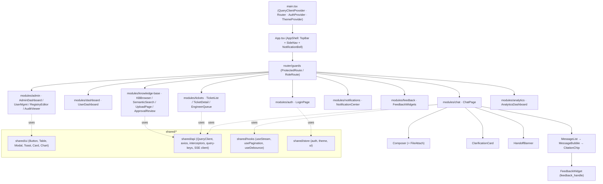

### 6.8 Frontend module structure

Each `modules/<name>` folder is self-contained with `components/`, `hooks/` (React Query hooks + local logic), `api.ts` (typed endpoint calls), `types.ts`, and `routes.tsx` fragments, consuming only `shared/*` for cross-cutting infrastructure. Canonical modules: `auth, chat, dashboard, admin, tickets, knowledge-base, analytics, notifications, feedback`; shared infra: `shared/ui, shared/api, shared/hooks, shared/store`.

---

## 7. Database Modules

The persistence layer is split across three coordinated stores, each with a distinct responsibility and a single owner:

| Store | Role | Owned by |
|-------|------|----------|
| **PostgreSQL** | System of record for all relational state: identity, conversations, tickets, KB metadata, feedback, audit, analytics, and the LangGraph checkpointer. Also backs sparse/BM25 full-text retrieval. | `db`, `models`, `repositories` |
| **ChromaDB** | Dense vector index for semantic search over published knowledge chunks (`kb_chunks`) plus a `kb_chunks_pending` staging collection. | `rag` |
| **Redis** (cross-cutting) | Hot conversation window cache + answer cache keyed on `query_hash`. Not a system of record; fully rebuildable. | `services.memory` |

PostgreSQL is authoritative. ChromaDB vectors and Redis caches are derived projections that are invalidated/rebuilt from Postgres on any KB upsert or feedback demotion (see §7.6).

### 7.1 Schema conventions (binding on every table)

- **Primary keys:** `uuid` (`gen_random_uuid()`), column name `id`, unless noted. UUIDs prevent cross-tenant enumeration and allow client-side id minting for idempotency.
- **Tenancy:** every tenant-scoped table carries `org_id uuid FK -> organizations(id)` (and `tenant_id` where a sub-org boundary applies). All queries filter on `org_id` at the repository layer; a composite index leads with `org_id`.
- **Timestamps:** `created_at timestamptz NOT NULL DEFAULT now()`, `updated_at timestamptz NOT NULL DEFAULT now()` (touch-on-update via ORM event), both stored UTC.
- **Soft delete:** `deleted_at timestamptz NULL` on user-content tables (`conversations`, `messages`, `tickets`, `kb_documents`, `files`). Hard deletes are prohibited by policy; workers purge only after retention windows.
- **Enums:** implemented as Postgres native `ENUM` types (listed inline) so invalid states are unrepresentable and mirror the `AgentState` enums.
- **JSON:** structured but schema-flexible payloads use `jsonb` with GIN indexes where queried.
- **Optimistic concurrency:** mutable aggregates (`tickets`, `kb_documents`) carry `version int NOT NULL DEFAULT 1`.

Legend for the tables below — **PK** primary key, **FK** foreign key, **U** unique, **IX** indexed, **N** nullable.

> **Column-naming note:** `kb_chunks` names its FK to `category_registry` as column `category_key`, whereas `conversations`, `tickets`, and `kb_documents` name the same FK simply `category`. This column-naming divergence is intentional and left as-is.

### 7.2 Identity, tenancy & session tables

**`organizations`**

| Column | Type | Key | N | Notes |
|--------|------|-----|---|-------|
| id | uuid | PK | | |
| name | text | | | |
| slug | text | U, IX | | tenant subdomain / routing key |
| settings | jsonb | | | feature flags, branding |
| is_active | boolean | | | default true |
| created_at / updated_at | timestamptz | | | |

**`roles`** (seed-data table; canonical RBAC roles)

| Column | Type | Key | N | Notes |
|--------|------|-----|---|-------|
| id | uuid | PK | | |
| key | text | U, IX | | `end_user`, `support_engineer`, `admin`, `sme_reviewer` |
| display_name | text | | | |
| permissions | jsonb | | | permission-string array consumed by `core.security` |

**`users`**

| Column | Type | Key | N | Notes |
|--------|------|-----|---|-------|
| id | uuid | PK | | |
| org_id | uuid | FK -> organizations, IX | | |
| email | citext | U (per org), IX | | unique on `(org_id, email)` |
| hashed_password | text | | | bcrypt/argon2; never returned by any DTO |
| full_name | text | | Y | |
| role_id | uuid | FK -> roles, IX | | RBAC role; also flattened into JWT claims |
| locale | text | | Y | drives `user_context.locale` |
| is_active | boolean | | | default true |
| last_login_at | timestamptz | | Y | |
| created_at / updated_at / deleted_at | timestamptz | | | |

**`user_sessions`** (refresh-token / session ledger for JWT rotation and revocation)

| Column | Type | Key | N | Notes |
|--------|------|-----|---|-------|
| id | uuid | PK | | |
| user_id | uuid | FK -> users, IX | | |
| refresh_token_hash | text | U, IX | | hashed; supports rotation + reuse detection |
| user_agent | text | | Y | |
| ip_address | inet | | Y | |
| expires_at | timestamptz | IX | | |
| revoked_at | timestamptz | | Y | set on logout / rotation |
| created_at | timestamptz | | | |

### 7.3 Conversation & memory tables

**`conversations`** (one row per chat thread; `id` doubles as the LangGraph `thread_id`)

| Column | Type | Key | N | Notes |
|--------|------|-----|---|-------|
| id | uuid | PK | | == `thread_id` / `AgentState.thread_id` |
| org_id | uuid | FK, IX | | |
| user_id | uuid | FK -> users, IX | | |
| title | text | | Y | auto-derived from first turn |
| status | enum(`active`,`awaiting_human`,`resolved`,`closed`) | IX | | mirrors thread lifecycle |
| category | text | FK -> category_registry(category_key), IX | Y | last classified category |
| last_message_at | timestamptz | IX | | list ordering |
| created_at / updated_at / deleted_at | timestamptz | | | |

**`messages`** (append-only turn log; source for `add_messages` hydration)

| Column | Type | Key | N | Notes |
|--------|------|-----|---|-------|
| id | uuid | PK | | |
| conversation_id | uuid | FK -> conversations, IX | | |
| turn_id | int | IX | | == `AgentState.turn_id` |
| role | enum(`user`,`assistant`,`system`,`tool`) | | | |
| content | text | | | redacted variant persisted for `user` role |
| citations | jsonb | | Y | `[{chunk_id, doc_id, source_uri, version}]` |
| decision | enum(`deliver`,`clarify`,`retry_retrieval`,`escalate`) | | Y | for assistant turns |
| trace_id | text | IX | | joins to `agent_runs` |
| token_usage | jsonb | | Y | prompt/completion/tier |
| created_at | timestamptz | IX | | |

Composite index `(conversation_id, turn_id)`.

**`conversation_summaries`** (rolling long-term summary — one current row per conversation, prior versions retained)

| Column | Type | Key | N | Notes |
|--------|------|-----|---|-------|
| id | uuid | PK | | |
| conversation_id | uuid | FK -> conversations, IX | | |
| summary_text | text | | | LLM rolling summary (`AgentState.conversation_summary`) |
| covered_through_turn | int | | | last turn folded into summary |
| version | int | | | |
| is_current | boolean | IX | | partial unique index `(conversation_id) WHERE is_current` |
| created_at | timestamptz | | | |

**`memory_facts`** (durable per-user facts surviving across conversations)

| Column | Type | Key | N | Notes |
|--------|------|-----|---|-------|
| id | uuid | PK | | |
| org_id | uuid | FK, IX | | |
| user_id | uuid | FK -> users, IX | | |
| fact_key | text | IX | | e.g. `default_device`, `vpn_client` |
| fact_value | text | | | |
| confidence | float | | | |
| source_conversation_id | uuid | FK -> conversations | Y | provenance |
| expires_at | timestamptz | | Y | TTL for volatile facts |
| created_at / updated_at | timestamptz | | | |

Unique on `(user_id, fact_key)` (upsert semantics).

**`graph_checkpoints`** (LangGraph Postgres checkpointer store — schema owned by the checkpointer library; catalogued here for completeness)

| Column | Type | Key | N | Notes |
|--------|------|-----|---|-------|
| thread_id | text | PK part, IX | | == conversation id |
| checkpoint_ns | text | PK part | | namespace / subgraph |
| checkpoint_id | text | PK part | | monotonic checkpoint id |
| parent_checkpoint_id | text | | Y | |
| checkpoint | jsonb/bytea | | | serialized `AgentState` snapshot |
| metadata | jsonb | | | writes, versions, `interrupt()` markers |
| created_at | timestamptz | | | |

This table is what makes `human_handoff` durable: `interrupt()` parks the run here and `Command(resume=...)` rehydrates it.

### 7.4 Ticket & handoff tables

**`tickets`**

| Column | Type | Key | N | Notes |
|--------|------|-----|---|-------|
| id | uuid | PK | | == `AgentState.ticket_id` |
| org_id | uuid | FK, IX | | |
| conversation_id | uuid | FK -> conversations, U, IX | | idempotent per thread (unique) |
| created_by_user_id | uuid | FK -> users, IX | | |
| assigned_engineer_id | uuid | FK -> users, IX | Y | |
| category | text | FK -> category_registry, IX | | |
| priority | enum(`low`,`medium`,`high`,`urgent`) | IX | | auto-classified |
| status | enum(`open`,`triaged`,`in_progress`,`awaiting_user`,`resolved`,`closed`,`reopened`) | IX | | |
| assigned_queue | text | IX | | from `category_registry.handoff_queue` |
| subject | text | | | |
| intake_fields | jsonb | | | `filled_slots` snapshot |
| escalation_reason | text | | | machine-readable code |
| final_confidence | float | | Y | gate score at escalation |
| engineer_hints | jsonb | | Y | rejected retrieval candidates |
| redacted_transcript | jsonb | | | PII-redacted turn slice |
| resolution | jsonb | | Y | `engineer_resolution`; seeds `feedback_learner` |
| sla_due_at | timestamptz | IX | | from category SLA tier |
| version | int | | | optimistic lock |
| created_at / updated_at / deleted_at | timestamptz | | | |

**`ticket_events`** (append-only state-transition + activity log per ticket)

| Column | Type | Key | N | Notes |
|--------|------|-----|---|-------|
| id | uuid | PK | | |
| ticket_id | uuid | FK -> tickets, IX | | |
| actor_user_id | uuid | FK -> users | Y | null for system/agent events |
| event_type | enum(`created`,`assigned`,`status_changed`,`commented`,`escalated`,`resolved`,`reopened`,`sla_breached`) | IX | | |
| from_status / to_status | text | | Y | |
| payload | jsonb | | Y | comment body, diff, notification ref |
| created_at | timestamptz | IX | | |

**`ticket_attachments`** (join between tickets and uploaded files)

| Column | Type | Key | N | Notes |
|--------|------|-----|---|-------|
| id | uuid | PK | | |
| ticket_id | uuid | FK -> tickets, IX | | |
| file_id | uuid | FK -> files, IX | | |
| kind | enum(`screenshot`,`log`,`document`,`other`) | | | |
| created_at | timestamptz | | | |

### 7.5 Knowledge-base, ingestion & registry tables

**`kb_documents`** (logical source document; versioned)

| Column | Type | Key | N | Notes |
|--------|------|-----|---|-------|
| id | uuid | PK | | == `AgentState.kb_doc_id` |
| org_id | uuid | FK, IX | | |
| title | text | IX | | |
| source_type | enum(`engineer_resolution`,`admin_upload`,`manual`,`imported`) | IX | | |
| origin_ticket_id | uuid | FK -> tickets | Y | provenance for resolution-derived docs |
| category | text | FK -> category_registry, IX | | |
| retrieval_namespace | text | IX | | denormalized from registry |
| doc_status | enum(`draft`,`pending_review`,`published`,`quarantined`,`archived`) | IX | | drives retrieval filter |
| version | int | | | monotonic per doc |
| source_uri | text | | Y | original file / ticket link |
| last_verified_at | timestamptz | IX | | freshness signal for `retrieval_gate` |
| checksum | text | IX | | content hash for dedup |
| created_by_user_id | uuid | FK -> users | | |
| created_at / updated_at / deleted_at | timestamptz | | | |

**`kb_chunks`** (chunk metadata + provenance mirroring ChromaDB vectors; also holds the FTS column for sparse retrieval)

| Column | Type | Key | N | Notes |
|--------|------|-----|---|-------|
| id | uuid | PK | | == ChromaDB vector id / `RetrievedChunk.chunk_id` |
| doc_id | uuid | FK -> kb_documents, IX | | |
| org_id | uuid | FK, IX | | |
| category_key | text | FK -> category_registry, IX | | |
| retrieval_namespace | text | IX | | metadata filter key |
| chunk_index | int | | | ordinal within doc |
| text | text | | | chunk body (source for BM25 + rehydration) |
| text_fts | tsvector | GIN IX | | generated column; sparse/BM25 retrieval |
| token_count | int | | | |
| version | int | | | mirrors parent doc version |
| doc_status | enum(...) | IX | | denormalized for filter parity with Chroma |
| source_uri | text | | Y | |
| last_verified_at | timestamptz | IX | | |
| embedding_model_id | text | | | which `EmbeddingProvider.model_id` produced the vector |
| created_at / updated_at | timestamptz | | | |

**`kb_ingestion_jobs`** (tracks async parse→chunk→embed→upsert pipeline runs)

| Column | Type | Key | N | Notes |
|--------|------|-----|---|-------|
| id | uuid | PK | | |
| org_id | uuid | FK, IX | | |
| doc_id | uuid | FK -> kb_documents, IX | Y | set once doc row created |
| file_id | uuid | FK -> files | Y | for upload-triggered jobs |
| trigger | enum(`engineer_resolved`,`admin_upload`,`user_feedback`) | IX | | |
| status | enum(`queued`,`parsing`,`chunking`,`embedding`,`upserting`,`completed`,`failed`) | IX | | |
| stats | jsonb | | Y | chunk count, tokens, dedup hits |
| error | text | | Y | |
| started_at / finished_at | timestamptz | | Y | |
| created_at | timestamptz | | | |

**`kb_approvals`** (SME/admin review gate that flips `pending_review` → `published`)

| Column | Type | Key | N | Notes |
|--------|------|-----|---|-------|
| id | uuid | PK | | |
| doc_id | uuid | FK -> kb_documents, IX | | |
| reviewer_id | uuid | FK -> users, IX | Y | `sme_reviewer`/`admin` |
| decision | enum(`pending`,`approved`,`rejected`,`changes_requested`) | IX | | |
| review_notes | text | | Y | |
| decided_at | timestamptz | | Y | |
| created_at | timestamptz | | | |

**`category_registry`** (the data-driven extensibility seam; eight seed rows, never hard-coded in nodes)

| Column | Type | Key | N | Notes |
|--------|------|-----|---|-------|
| category_key | text | PK | | e.g. `login_issue`, `password_reset`, `vpn`, `payment`, `software_install`, `application_error`, `email`, `hardware_request` |
| display_name | text | | | |
| required_intake_fields | jsonb | | | slot schema driving `InfoCollector` |
| retrieval_namespace | text | IX | | Chroma metadata namespace |
| sla_tier | text | | | maps to `sla_due_at` computation |
| handoff_queue | text | | | `HumanHandoff` routing target |
| thresholds | jsonb | | | per-category `retrieval`/`deliver`/`grounding_min`/`retry_budget` (payment & security stricter) |
| tool_bindings | jsonb | | | tool ids available to agents for this category |
| is_active | boolean | | | |

### 7.6 Feedback, learning-signal, notification, audit, file & analytics tables

**`feedback`** (user thumbs / reopen / free-text)

| Column | Type | Key | N | Notes |
|--------|------|-----|---|-------|
| id | uuid | PK | | |
| org_id | uuid | FK, IX | | |
| user_id | uuid | FK -> users, IX | | |
| conversation_id | uuid | FK -> conversations, IX | | |
| message_id | uuid | FK -> messages, IX | Y | the rated assistant turn |
| ticket_id | uuid | FK -> tickets | Y | for reopen feedback |
| rating | enum(`up`,`down`,`reopen`) | IX | | |
| comment | text | | Y | |
| feedback_handle | text | IX | | == `AgentState.feedback_handle` |
| processed_at | timestamptz | | Y | set when `feedback_learner` consumes it |
| created_at | timestamptz | IX | | |

**`relevance_signals`** (aggregated per-chunk/-doc signals consumed by reranker + `retrieval_gate`)

| Column | Type | Key | N | Notes |
|--------|------|-----|---|-------|
| id | uuid | PK | | |
| doc_id | uuid | FK -> kb_documents, IX | | |
| chunk_id | uuid | FK -> kb_chunks | Y | null = doc-level signal |
| upvotes / downvotes | int | | | rolling counters |
| impressions | int | | | times retrieved |
| resolution_success | int | | | validated by engineer resolution |
| boost_factor | float | | | applied at rerank |
| is_quarantined | boolean | IX | | down-voted → excluded |
| updated_at | timestamptz | | | |

Unique on `(doc_id, chunk_id)`.

**`notifications`** (in-app + outbound notification ledger; sends are gated)

| Column | Type | Key | N | Notes |
|--------|------|-----|---|-------|
| id | uuid | PK | | |
| org_id | uuid | FK, IX | | |
| recipient_user_id | uuid | FK -> users, IX | Y | null for queue/channel targets |
| channel | enum(`in_app`,`email`,`queue`,`webhook`) | | | |
| type | enum(`ticket_assigned`,`handoff`,`resolved`,`approval_request`,`sla_breach`,`mention`) | IX | | |
| payload | jsonb | | | |
| status | enum(`pending`,`sent`,`read`,`failed`) | IX | | |
| ticket_id | uuid | FK -> tickets | Y | |
| sent_at / read_at | timestamptz | | Y | |
| created_at | timestamptz | IX | | |

**`audit_logs`** (append-only; immutable; every prohibited/irreversible action)

| Column | Type | Key | N | Notes |
|--------|------|-----|---|-------|
| id | uuid | PK | | |
| org_id | uuid | FK, IX | | |
| actor_user_id | uuid | FK -> users, IX | Y | null = system/agent |
| actor_type | enum(`user`,`agent`,`system`,`worker`) | | | |
| action | text | IX | | e.g. `kb.publish`, `ticket.resolve`, `auth.login` |
| resource_type / resource_id | text / uuid | IX | | polymorphic target |
| trace_id | text | IX | | joins agent runs |
| before / after | jsonb | | Y | change diff |
| ip_address | inet | | Y | |
| created_at | timestamptz | IX | | |

No `updated_at`/`deleted_at` — rows are write-once (enforced by DB grants: INSERT/SELECT only).

**`files`** (uploaded blobs — attachments and KB source docs)

| Column | Type | Key | N | Notes |
|--------|------|-----|---|-------|
| id | uuid | PK | | == `attachment_manifest` entry id |
| org_id | uuid | FK, IX | | |
| uploaded_by_user_id | uuid | FK -> users, IX | | |
| filename | text | | | |
| content_type | text | | | pdf/docx/png/... |
| size_bytes | bigint | | | |
| storage_uri | text | | | object-store key (S3/MinIO) |
| checksum | text | IX | | dedup + integrity |
| scan_status | enum(`pending`,`clean`,`infected`,`error`) | IX | | AV/PII scan gate before ingestion |
| purpose | enum(`ticket_attachment`,`kb_source`,`avatar`) | IX | | |
| created_at / deleted_at | timestamptz | | | |

> **Ownership note:** the `files` table and the File Upload capability are owned by the `/files` router + background `workers` + `repositories.base` — there is no separate file service.

**`agent_runs`** (one row per graph execution turn; observability spine)

| Column | Type | Key | N | Notes |
|--------|------|-----|---|-------|
| id | uuid | PK | | |
| trace_id | text | U, IX | | == `AgentState.trace_id` |
| conversation_id | uuid | FK -> conversations, IX | | |
| turn_id | int | | | |
| decision | enum(`deliver`,`clarify`,`retry_retrieval`,`escalate`) | IX | | terminal decision |
| node_path | jsonb | | | ordered node ids traversed |
| retry_count / clarification_rounds | int | | | budget usage |
| final_confidence / grounding_score | float | | Y | |
| latency_ms | int | | | |
| token_cost | jsonb | | | per-tier usage |
| error | text | | Y | |
| created_at | timestamptz | IX | | |

**`analytics_events`** (denormalized event stream feeding the Analytics dashboard)

| Column | Type | Key | N | Notes |
|--------|------|-----|---|-------|
| id | uuid | PK (bigint identity acceptable for volume) | | |
| org_id | uuid | FK, IX | | |
| event_type | text | IX | | `chat_answered`, `auto_resolved`, `escalated`, `feedback_given`, `kb_published`, ... |
| user_id | uuid | FK -> users | Y | |
| conversation_id / ticket_id | uuid | FK | Y | |
| category | text | IX | | |
| properties | jsonb | | | flexible metrics |
| occurred_at | timestamptz | IX | | partition key candidate |

### 7.7 Entity-relationship diagram

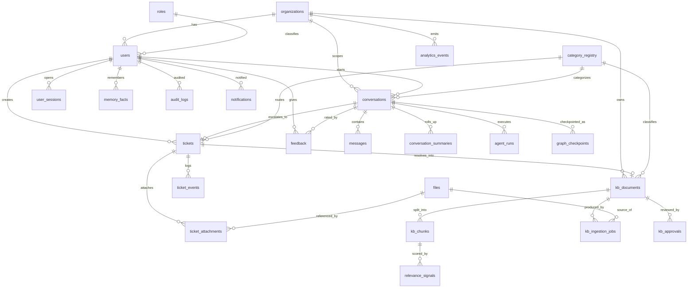

### 7.8 Indexing strategy

| Concern | Index | Rationale |
|---------|-------|-----------|
| Tenant isolation | Composite `(org_id, ...)` leading on every scoped table | All queries pre-filter by tenant; keeps scans within partition |
| Conversation paging | `messages(conversation_id, turn_id)`, `conversations(user_id, last_message_at DESC)` | Ordered turn fetch + dashboard lists |
| Ticket queues | `tickets(assigned_queue, status, priority)`, `tickets(assigned_engineer_id, status)`, `tickets(sla_due_at) WHERE status not in (resolved,closed)` | Engineer worklists + SLA sweeps (partial index) |
| Sparse retrieval | GIN on `kb_chunks.text_fts` | BM25/FTS half of hybrid retrieval |
| Retrieval filter parity | `kb_chunks(org_id, retrieval_namespace, doc_status, last_verified_at)` | Mirrors ChromaDB metadata filter for candidate hydration |
| Dedup | `kb_documents(checksum)`, `files(checksum)` | Ingestion near-duplicate rejection |
| Feedback processing | `feedback(processed_at) WHERE processed_at IS NULL` | Worker claims unprocessed rows |
| Audit/analytics time-series | BRIN on `audit_logs(created_at)`, `analytics_events(occurred_at)` | Append-only, time-ordered, huge → BRIN over B-tree |
| Trace joins | `agent_runs(trace_id)`, `messages(trace_id)`, `audit_logs(trace_id)` | End-to-end request tracing |
| JSONB lookups | GIN on `tickets.intake_fields`, `category_registry.thresholds` | Slot/threshold queries |

High-volume tables (`analytics_events`, `audit_logs`, `messages`) are candidates for monthly `RANGE` partitioning on their time column; the schema is partition-ready via the leading time index.

### 7.9 Migrations approach (Alembic)

- **Tooling:** Alembic drives all DDL; SQLAlchemy `models` are the declarative source, but migrations are hand-reviewed (autogenerate as a starting draft only) so enum changes, index concurrency, and data backfills are explicit.
- **Location:** `backend/app/db/migrations/` (env + `versions/`), configured from `infra` deployment assets; `alembic.ini` reads the DB URL from `core.config`.
- **Discipline:** one logical change per revision; every revision implements both `upgrade()` and `downgrade()`. Enum additions use `ALTER TYPE ... ADD VALUE` (non-transactional, isolated revision). Index creation on large tables uses `CREATE INDEX CONCURRENTLY` in an offline/isolated step.
- **Seed data:** canonical `roles` and the eight `category_registry` rows are inserted via idempotent data-migration revisions (upsert on natural key), so environments converge deterministically.
- **Checkpointer tables:** `graph_checkpoints` DDL is created by the LangGraph Postgres checkpointer's own setup routine, invoked from a dedicated Alembic revision so it is version-pinned alongside app schema.
- **Deployment gate:** migrations run as a one-shot `migrate` service in `docker-compose`/entrypoint **before** the API and workers start; the API refuses to boot if `alembic current` != head (schema-drift guard).

### 7.10 ChromaDB collection design

Two logical collections, both embedding the same dense vector space produced by the active `EmbeddingProvider` (dimension and `model_id` recorded so re-embedding on model change is detectable).

| Collection | Contents | In live retrieval? |
|-----------|----------|--------------------|
| **`kb_chunks`** | All `doc_status=published` chunks. Single collection; category isolation via metadata `retrieval_namespace`, never separate collections. | Yes |
| **`kb_chunks_pending`** | `draft` / `pending_review` chunks staged during ingestion before approval. | No (staging only) |

**Vector record shape (per chunk):**

| Field | Source | Purpose |
|-------|--------|---------|
| `id` | == `kb_chunks.id` (uuid string) | 1:1 join key to Postgres; enables idempotent upsert & targeted delete |
| `embedding` | `EmbeddingProvider.embed(text)` | dense semantic vector |
| `document` | chunk `text` | rehydration + rerank input |
| `metadata.org_id` | tenancy | hard multi-tenant filter |
| `metadata.tenant_id` | tenancy | sub-org boundary |
| `metadata.category_key` | classification | category scoping |
| `metadata.retrieval_namespace` | registry | registry-driven category filter |
| `metadata.doc_id` / `metadata.version` | provenance | citation + version pinning |
| `metadata.doc_status` | lifecycle | `published` filter (defense in depth vs. collection choice) |
| `metadata.source_uri` | provenance | citation link |
| `metadata.last_verified_at` (epoch) | freshness | `retrieval_gate` freshness check |
| `metadata.embedding_model_id` | model provenance | detect stale vectors after model swap |
| `metadata.acl` | ACL tags | query-time access filter |

**Id strategy:** the ChromaDB id **is** the `kb_chunks.id` UUID. This guarantees that a Postgres row and its vector are addressable by the same key, making upsert, re-embed, and delete deterministic and idempotent (no orphan vectors).

### 7.11 Postgres ↔ ChromaDB synchronization

PostgreSQL is authoritative; ChromaDB is a rebuildable projection. Sync is transactional-outbox style, executed only inside the `kb` service / ingestion workers — nodes never write vectors directly.

```mermaid
sequenceDiagram
    participant W as workers (ingestion)
    participant PG as PostgreSQL
    participant CH as ChromaDB
    participant CA as Answer Cache (Redis)
    W->>PG: BEGIN; upsert kb_documents + kb_chunks (doc_status)
    W->>PG: write kb_ingestion_jobs progress
    W->>CH: embed + upsert into kb_chunks_pending (id = chunk_id)
    W->>PG: COMMIT
    Note over W,CH: On approval (kb_approvals=approved)
    W->>PG: set kb_documents.doc_status=published, bump version, set last_verified_at
    W->>CH: move vectors pending -> kb_chunks (upsert by id) ; delete stale/prior-version ids
    W->>CA: invalidate answer cache (KB changed)
    W->>PG: write audit_logs (kb.publish)
```

Sync guarantees and reconciliation:

- **Same-key upsert:** because Chroma id == `kb_chunks.id`, re-ingesting a doc version overwrites vectors deterministically; superseded chunk ids are deleted from the collection in the same job.
- **Status parity:** `doc_status` is stored both as the collection choice (pending vs. published) *and* as metadata, so a stray query still cannot surface unpublished content.
- **Cache invalidation:** any publish, quarantine (down-vote demotion), or version bump invalidates the `query_hash` answer cache and clears affected Redis hot windows, closing the feedback-learning loop.
- **Drift detection:** a periodic reconciliation worker compares `kb_chunks` (Postgres, `doc_status=published`) against the `kb_chunks` collection by id set and by `embedding_model_id`; missing/extra/stale-model vectors are re-embedded or deleted. Counts are emitted to `analytics_events`.
- **Model migration:** changing `EmbeddingProvider.model_id` marks all vectors stale (metadata mismatch); a bulk re-embed job rebuilds the collection from Postgres `kb_chunks.text` — no data loss because text + provenance live in Postgres.

---

## 8. AI Modules

All AI behavior is assembled in `backend/app/agents` (LangGraph graph + nodes + `AgentState`), draws capabilities from `providers` (abstract LLM/Embedding/Verifier), executes retrieval through `rag`, and is parameterized by `registries` (category/threshold/prompt/tool). Nodes are thin orchestrators: they read declared `AgentState` keys, call injected providers/services, and write declared outputs. No business logic lives in nodes beyond routing.

### 8.1 RAG pipeline (end to end)

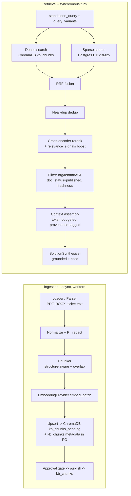

**Stage responsibilities:**

1. **Loaders/parsers** (`rag.parsers`): format-specific extraction (PDF, DOCX, plaintext, resolved-ticket payloads) → normalized text + structural metadata (headings, page/section anchors) used later for citation granularity.
2. **Chunking** (`rag.chunker`): structure-aware splitting (respects headings/lists/tables) with a target token window and fixed overlap; each chunk keeps `doc_id`, `chunk_index`, section anchor, and inherits `category_key`/`retrieval_namespace`. Oversized tables/code blocks are kept atomic.
3. **Embeddings** (`providers.EmbeddingProvider`): batched `embed_batch`; the resolved `model_id` is stamped on every chunk for drift detection.
4. **Vector upsert** (`rag.ingestion`): writes to `kb_chunks_pending` first; publish promotes to `kb_chunks` with id == `kb_chunks.id`.
5. **Retrieval** (`rag.retriever` → `RagRetriever` node): hybrid dense (ChromaDB) + sparse (Postgres FTS) over the same query, each returning ranked candidates.
6. **Fusion + dedup:** reciprocal-rank fusion merges the two ranked lists; near-duplicate chunks (same doc/version or high textual overlap) are collapsed to preserve context diversity.
7. **Reranking/filtering** (`rag.reranker`): cross-encoder reorders fused candidates against the query; `relevance_signals.boost_factor` up-weights validated docs and `is_quarantined` chunks are dropped. Hard filters (`org_id`/`tenant_id`, ACL, `doc_status=published`, freshness via `last_verified_at`) are applied at query time — not post-hoc.
8. **Context assembly:** top-k survivors are packed into a token-budgeted context block, each fragment tagged with `chunk_id`/`doc_id`/`version`/`source_uri` so the synthesizer can cite precisely; scores populate `max_relevance_score`, `score_gap`, `retrieval_coverage`.
9. **Grounded generation with citations** (`SolutionSynthesizer`): large-tier LLM answers **strictly** from assembled candidates, emits `claims[]` each mapped to `cited_chunk_ids`, streams tokens, and may emit `ABSTAIN` when evidence is insufficient (short-circuits to `ticket_creator`).

Two reliability gates bracket generation: `retrieval_gate` (before) checks evidence sufficiency/freshness; `grounding_verifier` + `confidence_gate` (after) check faithfulness before delivery.

### 8.2 PDF/Word ingestion pipeline

Triggered by `ADMIN_DOC_UPLOAD_EVENT` (via `/kb`/`/files`) or by an engineer resolution, and always run in `workers` (never on a chat turn). Tracked row-by-row in `kb_ingestion_jobs`.

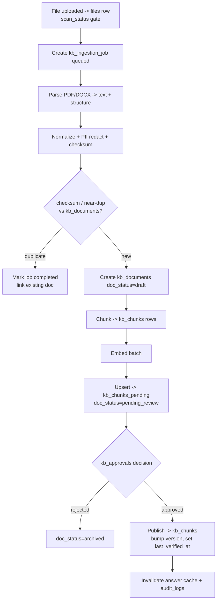

Key properties: virus/PII scan (`files.scan_status`) must be `clean` before parsing; checksum dedup rejects re-uploads; new docs never enter live retrieval until `kb_approvals=approved`; every publish writes `audit_logs` and invalidates caches.

### 8.3 Provider abstraction (interface signatures — types only)

The providers layer keeps Gemini swappable and model-tier aware. All three protocols are injected via LangGraph `config`; nodes never instantiate them and never store them in `AgentState` (keeps state serializable/checkpointable).

```python
class ChatMessage(TypedDict):
    role: str
    content: str

class LLMProvider(Protocol):
    def generate(self, messages: list[ChatMessage], *, temperature: float = 0.0,
                 max_tokens: int | None = None, tier: str = "large") -> str: ...
    def stream(self, messages: list[ChatMessage], *, temperature: float = 0.0,
               tier: str = "large") -> Iterator[str]: ...
    def generate_structured(self, messages: list[ChatMessage], *, schema: type[BaseModel],
                            temperature: float = 0.0, tier: str = "small") -> BaseModel: ...
    def classify(self, text: str, *, labels: list[str],
                 context: str | None = None, tier: str = "small") -> dict[str, float]: ...
    def verify(self, claim: str, evidence: str, *, tier: str = "small") -> dict: ...   # {label, score}
    def summarize(self, text: str, *, max_tokens: int = 512, tier: str = "small") -> str: ...

class EmbeddingProvider(Protocol):
    def embed(self, text: str) -> list[float]: ...
    def embed_batch(self, texts: list[str]) -> list[list[float]]: ...
    @property
    def dimension(self) -> int: ...
    @property
    def model_id(self) -> str: ...

class VerifierProvider(Protocol):
    def check_entailment(self, claim: str, evidence: str) -> dict: ...                  # {label, score}
    def validate_citations(self, claims: list[dict], candidates: list[dict]) -> bool: ...
    def score_relevance(self, query: str, answer: str) -> float: ...
```

**Model tiering:** `tier="small"` serves classification, structured extraction, summarization, and entailment (cheap/fast); `tier="large"` serves grounded synthesis (quality-critical). Tier→concrete-model mapping lives in `core.config`, so cost/latency posture is tunable without touching nodes. The Gemini implementation is one concrete adapter behind these protocols; a replacement provider only re-implements the protocols.

### 8.4 Conversation-memory design

Three coordinated layers give bounded, cost-flat, cross-session memory, owned by `MemoryManager` (loads at `ingress_guard`, persists after `responder`; also exposed as a tool binding):

| Layer | Mechanism | Store |
|-------|-----------|-------|
| **Short-term window** | LangGraph `messages` with `add_messages` reducer; a hot window may be cached in Redis for fast turn assembly | `graph_checkpoints` (authoritative) + `messages` (durable log) + Redis (cache) |
| **Rolling summary (mid-term)** | `MemoryManager` compresses older turns via `LLMProvider.summarize` (small tier) into `conversation_summary`; keeps prompt token cost flat regardless of thread length | `conversation_summaries` (versioned, `is_current`) |
| **Durable facts (long-term)** | Per-user stable facts (device, VPN client, prior categories) extracted and upserted; survive across conversations | `memory_facts` (unique per `user_id, fact_key`, TTL for volatile facts) |

Persistence is checkpointed per `thread_id` via the Postgres checkpointer, which is also what makes `human_handoff` durable: `interrupt()` parks the exact state, `Command(resume=...)` rehydrates it. The **answer cache** (Redis, keyed on `query_hash`) enables the zero-LLM `ingress_guard` short-circuit and is invalidated on any KB upsert or feedback demotion.

### 8.5 Semantic search

Semantic search is the dense half of §8.1 exposed as a first-class capability (used by both the chat graph and the KB admin UI's search box):

- **Query embedding:** `EmbeddingProvider.embed(standalone_query)` (and each `query_variant`/HyDE expansion from `QueryPlanner`).
- **ANN lookup:** ChromaDB `kb_chunks` nearest-neighbor search constrained by metadata filters (`org_id`, `tenant_id`, `retrieval_namespace`, `doc_status=published`, ACL, freshness).
- **Hybrid fusion:** RRF-merged with Postgres FTS for lexical recall, then cross-encoder reranked and boosted by `relevance_signals` — so semantic search benefits from the learning loop.
- **Provenance:** every hit returns `RetrievedChunk{chunk_id, doc_id, version, text, score, source_uri, last_verified_at}`, enabling citations and freshness gating.
- **Category-agnostic:** scoping is by registry-driven `retrieval_namespace` metadata, never hard-coded per category.

### 8.6 Feedback-learning loop mechanics

Runs as the separate, event-triggered `feedback_learner` subgraph (never inline on a chat turn). Three converging triggers feed one canonical pipeline, with a human approval gate before anything enters live retrieval.

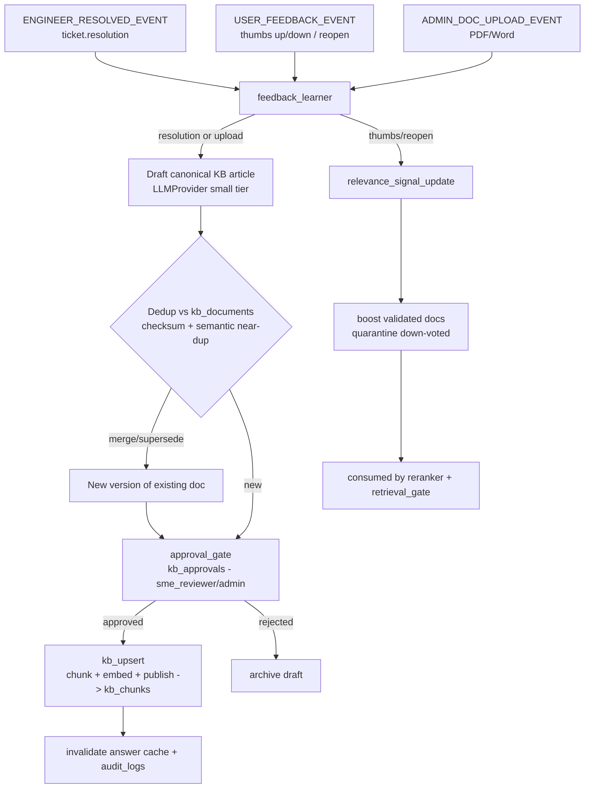

**Mechanics by trigger:**

1. **Engineer resolves a ticket** → `feedback_learner` drafts a canonical KB article from `ticket.resolution` + the redacted transcript, links `origin_ticket_id` for provenance, dedups against existing `kb_documents` (checksum + semantic near-dup — merge as a new version if the topic already exists), then routes to `approval_gate`.
2. **User thumbs up / down / reopen** → updates `relevance_signals` (increment up/down, adjust `boost_factor`; a strong down-vote sets `is_quarantined=true`). This is consumed by the `rag.reranker` and `retrieval_gate` immediately — no re-embedding required. Down-voted content is demoted/quarantined, not deleted.
3. **Admin PDF/Word upload** → identical draft→approve→publish pipeline (§8.2).

**Review/approval:** drafts land in `kb_chunks_pending` with `doc_status=pending_review`; an `sme_reviewer`/`admin` decision in `kb_approvals` flips to `published` and triggers `kb_upsert`.

**Re-embedding:** on publish, chunks are (re)chunked and embedded with the current `EmbeddingProvider.model_id`, upserted into live `kb_chunks` with a bumped `version` + fresh `last_verified_at`, prior-version vectors deleted by id.

**Cache + audit:** every publish/quarantine invalidates the `query_hash` answer cache and writes append-only `audit_logs`, closing the continuous-improvement loop.

### 8.7 Prompt templates as contracts

Prompts live in `registries` (prompt registry), versioned and category-parameterizable. Each is a contract of role + typed inputs + expected output shape — never free-form. (Contracts only; full prompt text is not part of the architecture artifact.)

| Prompt contract | Owner node | Role | Inputs (typed) | Output contract |
|-----------------|-----------|------|----------------|-----------------|
| `intent_classification` | `IntentClassifier` | classifier | `redacted_query`, `category_registry` labels, `conversation_summary` | structured: `candidate_categories[]`, `category`, `intent`, `required_slots`, `intent_confidence`, `sensitivity_level`, `is_out_of_scope`, `is_multi_intent` |
| `query_rewrite_expand` | `QueryPlanner` | rewriter | `messages` (coref context), `raw_user_message` | `standalone_query`, `query_variants[]` (+ HyDE), `retrieval_filters` |
| `solution_synthesis` | `SolutionSynthesizer` | grounded answerer | `standalone_query`, assembled `candidates[]` (with provenance), `filled_slots` | streamed `draft_answer`, `claims[]{text, cited_chunk_ids}`, `used_chunk_ids`, `self_reported_confidence`, `abstained` |
| `grounding_entailment` | `GroundingVerifier` | verifier/NLI | `claims[]`, source `candidates[]` | `{label, score}` per claim → `grounding_score`, `unsupported_claims`, `contradicted_claims`, `citation_valid`, `answer_relevant` |
| `slot_filling_clarify` | `InfoCollector` | elicitation | `missing_slots`, `required_slots`, `category_registry.required_intake_fields` | batched clarification message + updated `filled_slots` schema |
| `rolling_summary` | `MemoryManager` | summarizer | prior `conversation_summary`, new `recent_turns` | new `conversation_summary`, `covered_through_turn` |
| `kb_article_draft` | `FeedbackLearner` | author | `engineer_resolution`, redacted transcript, existing similar docs | draft KB doc (title, body, category) for `approval_gate` |
| `ticket_summarization` | `TicketCreator`/`HumanHandoff` | summarizer | `filled_slots`, redacted transcript, rejected candidates, `escalation_reason` | engineer-facing ticket summary + `priority` suggestion |

Prompt versions are pinned per environment; changing a prompt is a registry change, auditable and rollback-safe.

### 8.8 Guardrails: hallucination & injection (AI layer)

Defense in depth across the graph — no single node is trusted to be safe alone.

**Injection / prompt-safety (entry):**
- `IngressGuard` (deterministic, no-LLM) normalizes, **PII-redacts**, screens for prompt-injection/jailbreak patterns, rate-limits, and detects control intents before any LLM sees the text. A `safety_verdict=block` routes to a safe canned reply via `responder`.
- Identity/role is populated **only** from JWT into `user_context`/`auth_claims` — never parsed from message body — so injected "I am admin" text cannot escalate privileges.
- Retrieved documents are treated as **data, not instructions**: the synthesis contract answers *from* candidates but does not execute directives embedded in them.

**Hallucination guard (before delivery):**
- **Gate #1 `retrieval_gate`:** delivery is impossible unless `max_relevance_score >= threshold(category, sensitivity)` and ≥1 fresh, non-expired supporting doc exists. Thin evidence → `info_collector` or `ticket_creator`.
- **Mandatory citations + ABSTAIN:** `SolutionSynthesizer` must cite every claim (`claims[].cited_chunk_ids`) and may `ABSTAIN` → straight to `ticket_creator` (skips verification).
- **Gate #2 `grounding_verifier`:** independent `VerifierProvider` NLI checks entailment of each claim against sources, validates citations, and scores answer relevance.
- **`confidence_gate` (deterministic router):** any contradicted claim, `citation_valid=false`, or `answer_relevant=false` forces **escalate** — this hard hallucination guard **overrides** high model self-confidence. Only `final_confidence >= deliver_threshold(category)` **and** `grounding_score >= grounding_min` yields **deliver**. Payment/security categories carry stricter thresholds and lower retry budgets.
- **Loop safety:** `retry_count` and `clarification_rounds` are bounded; exceeding either budget forces deterministic escalation. The graph always terminates in **deliver** or **handoff** — it never emits an ungrounded auto-answer or a fabricated stopgap.

---

## 9. API Modules

All HTTP surface lives in `backend/app/api` (FastAPI routers), one router per canonical prefix, all mounted under **`/api/v1`**. DTOs are Pydantic (`schemas`); auth/RBAC is enforced by `core.security` dependencies that decode the JWT and inject `user_context`. Role claims are never trusted from the request body.

### 9.1 Cross-cutting API conventions

**Versioning.** Every route is prefixed `/api/v1`. Breaking changes introduce `/api/v2`; the version is a URL segment (not a header) for cache/proxy friendliness. Response bodies carry a stable envelope so clients can evolve safely.

**Standard success + error envelope.** All non-streaming responses use a uniform envelope; errors are machine-readable and never leak internals.

```
# Success
{ "data": <payload>, "meta": { "trace_id": str, "request_id": str } }

# Error
{ "error": { "code": str,              # stable machine code, e.g. AUTH_INVALID_CREDENTIALS
             "message": str,           # human-readable, safe
             "details": [ {"field": str, "issue": str} ] | null,
             "trace_id": str } }
```

| HTTP | `error.code` family | Meaning |
|------|---------------------|---------|
| 400 | `VALIDATION_*` | malformed/invalid request |
| 401 | `AUTH_*` | missing/invalid/expired token |
| 403 | `RBAC_FORBIDDEN` | role lacks permission |
| 404 | `NOT_FOUND` | resource absent or out-of-tenant |
| 409 | `CONFLICT_*` | idempotency/version conflict |
| 422 | `UNPROCESSABLE_*` | semantic validation (slot/schema) |
| 429 | `RATE_LIMITED` | rate/quota exceeded (Retry-After) |
| 5xx | `INTERNAL_*` | masked server error (trace_id only) |

**Pagination.** List endpoints use keyset (cursor) pagination for stable, scalable paging:

```
Request:  ?limit=<int, default 25, max 100>&cursor=<opaque>&sort=<field>&order=asc|desc  (+ resource filters)
Response: { "data": [ ... ],
            "meta": { "next_cursor": str|null, "prev_cursor": str|null, "has_more": bool, "trace_id": str } }
```

**Auth model.** Bearer JWT access tokens (short-lived) + rotating refresh tokens tracked in `user_sessions`. RBAC roles: `end_user`, `support_engineer`, `admin`, `sme_reviewer`. In the tables below, **Auth/Role** lists the minimum role(s); all endpoints are tenant-scoped by `org_id` from the token.

### 9.2 Auth — `/api/v1/auth`

| Method | Path | Auth/Role | Request summary | Response summary |
|--------|------|-----------|-----------------|------------------|
| POST | `/auth/login` | public | `{email, password}` | `{access_token, refresh_token, expires_in, user}` |
| POST | `/auth/refresh` | valid refresh token | `{refresh_token}` | rotated `{access_token, refresh_token, expires_in}` |
| POST | `/auth/logout` | any authenticated | `{refresh_token}` | revokes session; `{ok}` |
| GET | `/auth/me` | any authenticated | — | current `user` + role + org context |
| POST | `/auth/password/change` | any authenticated | `{current_password, new_password}` | `{ok}` (self-service only) |

Account creation and password entry are user-driven/admin-provisioned; the API never auto-creates accounts from observed content.

### 9.3 Users & admin identity — `/api/v1/admin` (+ user self-read via `/auth/me`)

| Method | Path | Auth/Role | Request summary | Response summary |
|--------|------|-----------|-----------------|------------------|
| GET | `/admin/users` | `admin` | filters: role, is_active; paginated | list of users |
| POST | `/admin/users` | `admin` | `{email, full_name, role_key, locale}` (invite) | created user (no password returned) |
| PATCH | `/admin/users/{id}` | `admin` | `{full_name?, role_key?, is_active?}` | updated user |
| GET | `/admin/roles` | `admin` | — | canonical roles + permissions |
| GET | `/admin/categories` | `admin` | — | `category_registry` rows |
| POST | `/admin/categories` | `admin` | full `category_registry` row (namespace, slots, thresholds, queue, tool_bindings) | created category |
| PATCH | `/admin/categories/{key}` | `admin` | partial registry fields | updated category (extensibility seam) |
| GET | `/admin/config` | `admin` | — | tier→model map, thresholds, feature flags |
| PATCH | `/admin/config` | `admin` | config delta | updated config (audited; setting change) |

### 9.4 Chat & conversations — `/api/v1/chat`, `/api/v1/conversations`

> **Note:** `/chat` is shorthand for the canonical chat path `/chat/messages` used throughout this document.

| Method | Path | Auth/Role | Request summary | Response summary |
|--------|------|-----------|-----------------|------------------|
| POST | `/chat/messages` | `end_user`+ | `{conversation_id?, message, attachment_ids?}` | **SSE stream** (see §9.11); on new thread returns `conversation_id` |
| POST | `/chat/messages/{trace_id}/cancel` | owner | — | cancels in-flight run (maps `control_intent=cancel`) |
| GET | `/conversations` | owner | paginated; filter status/category | user's conversations |
| GET | `/conversations/{id}` | owner / engineer(assigned) | — | conversation + summary metadata |
| GET | `/conversations/{id}/messages` | owner / engineer(assigned) | paginated by `turn_id` | turn history with citations + decisions |
| POST | `/conversations/{id}/resume` | owner | `{message}` | resumes an interrupted (awaiting-input) thread at `ingress_guard` |
| DELETE | `/conversations/{id}` | owner / `admin` | — | soft-delete (`deleted_at`); hard delete prohibited |

### 9.5 Tickets — `/api/v1/tickets`

| Method | Path | Auth/Role | Request summary | Response summary |
|--------|------|-----------|-----------------|------------------|
| GET | `/tickets` | `end_user`(own) / `support_engineer` / `admin` | filters: status, priority, queue, category, assignee; paginated | ticket list |
| GET | `/tickets/{id}` | owner / engineer / admin | — | full ticket (intake_fields, transcript, hints, SLA) |
| PATCH | `/tickets/{id}` | `support_engineer` / `admin` | `{status?, priority?, assigned_engineer_id?, comment?}` (version) | updated ticket; writes `ticket_events` |
| POST | `/tickets/{id}/assign` | `support_engineer` / `admin` | `{engineer_id}` | assignment event |
| POST | `/tickets/{id}/resolve` | `support_engineer` / `admin` | `{resolution}` | resolves ticket; emits `ENGINEER_RESOLVED_EVENT` → resumes thread + `feedback_learner` |
| POST | `/tickets/{id}/reopen` | owner / engineer | `{reason}` | reopens; emits `USER_FEEDBACK_EVENT` |
| GET | `/tickets/{id}/events` | owner / engineer / admin | paginated | ticket audit timeline |

`resolve` is an irreversible, role-gated action (audited); it is the loop-closing trigger into the KB.

### 9.6 Knowledge base & ingestion — `/api/v1/kb`

| Method | Path | Auth/Role | Request summary | Response summary |
|--------|------|-----------|-----------------|------------------|
| GET | `/kb/documents` | `sme_reviewer` / `admin` / `support_engineer` | filters: doc_status, category; paginated | KB document list |
| GET | `/kb/documents/{id}` | as above | — | document + version + chunks metadata |
| POST | `/kb/documents` | `admin` / `sme_reviewer` | `{file_id}` or `{title, body, category}` | creates draft; starts `kb_ingestion_job` |
| POST | `/kb/ingest` | `admin` / `sme_reviewer` | `{file_id, category}` (PDF/Word) | enqueues ingestion job; `{job_id}` |
| GET | `/kb/ingestion-jobs/{id}` | `admin` / `sme_reviewer` | — | job status + stats |
| GET | `/kb/search` | any authenticated | `?q=&category=&limit=` | semantic-search hits with provenance (published only, tenant-scoped) |
| GET | `/kb/approvals` | `sme_reviewer` / `admin` | filter: pending; paginated | pending approval queue |
| POST | `/kb/documents/{id}/approve` | `sme_reviewer` / `admin` | `{decision, notes?}` | publishes/rejects; publish upserts vectors + invalidates cache (audited) |
| POST | `/kb/documents/{id}/quarantine` | `sme_reviewer` / `admin` | `{reason}` | demotes doc; updates `relevance_signals` |
| DELETE | `/kb/documents/{id}` | `admin` | — | archive (`doc_status=archived`); no hard delete |

Publishing/approval are irreversible, role-gated, audited actions and require explicit reviewer decision — never automated from observed content.

### 9.7 Files & upload — `/api/v1/files`

| Method | Path | Auth/Role | Request summary | Response summary |
|--------|------|-----------|-----------------|------------------|
| POST | `/files` | any authenticated | multipart upload `{file, purpose}` | `{file_id, filename, size, scan_status}` |
| GET | `/files/{id}` | owner / permitted role | — | file metadata |
| GET | `/files/{id}/content` | owner / permitted role | — | signed download URL / stream (scan-clean only) |
| DELETE | `/files/{id}` | owner / `admin` | — | soft-delete |

Uploads are size/type-validated and virus/PII-scanned (`scan_status`) before any KB ingestion or attachment linkage.

### 9.8 Feedback — `/api/v1/feedback`

| Method | Path | Auth/Role | Request summary | Response summary |
|--------|------|-----------|-----------------|------------------|
| POST | `/feedback` | `end_user`+ | `{conversation_id, message_id, rating: up\|down\|reopen, comment?, feedback_handle}` | records feedback; emits `USER_FEEDBACK_EVENT` |
| GET | `/feedback` | `admin` / `sme_reviewer` | filters: rating, processed; paginated | feedback list (learning triage) |

`feedback_handle` ties the rating back to the exact turn via `Responder`'s feedback affordance; ingestion into `relevance_signals` runs out-of-band in `feedback_learner`.

### 9.9 Notifications — `/api/v1/notifications`

| Method | Path | Auth/Role | Request summary | Response summary |
|--------|------|-----------|-----------------|------------------|
| GET | `/notifications` | any authenticated | filters: status, type; paginated | recipient's notifications |
| POST | `/notifications/{id}/read` | recipient | — | marks read |
| POST | `/notifications/read-all` | any authenticated | — | bulk mark read |
| GET | `/notifications/stream` | any authenticated | — | **SSE** live push of in-app notifications |

Outbound sends (email/queue/webhook) are performed only by `workers` as gated send-only actions; this API exposes in-app read/consume, not arbitrary send.

### 9.10 Analytics & audit — `/api/v1/analytics`, `/api/v1/audit`

| Method | Path | Auth/Role | Request summary | Response summary |
|--------|------|-----------|-----------------|------------------|
| GET | `/analytics/overview` | `admin` / `support_engineer` | `?from=&to=&category=` | KPIs: volume, auto-resolve rate, escalation rate, CSAT, SLA |
| GET | `/analytics/timeseries` | `admin` / `support_engineer` | `?metric=&interval=&from=&to=` | bucketed series from `analytics_events` |
| GET | `/analytics/categories` | `admin` | `?from=&to=` | per-category breakdown + threshold efficacy |
| GET | `/analytics/agent-runs` | `admin` | filters: decision, latency; paginated | `agent_runs` observability (confidence, grounding, retries) |
| GET | `/audit/logs` | `admin` | filters: actor, action, resource, time; paginated | append-only `audit_logs` (read-only) |

Audit logs are read-only over the API (no create/update/delete endpoints) — writes happen server-side only.

### 9.11 Streaming chat mechanism (SSE) & error handling on the stream

Primary chat delivery is **Server-Sent Events** over `POST /api/v1/chat/messages` (chosen over WebSocket: unidirectional token push, native HTTP/proxy/JWT compatibility, auto-reconnect via `Last-Event-ID`; the request body carries the user turn, the response is the event stream). `Responder` is the single egress that streams every path.

**Event contract (`event:` types):**

| Event | Payload | Meaning |
|-------|---------|---------|
| `meta` | `{conversation_id, trace_id, turn_id}` | stream opened; ids for correlation |
| `token` | `{text}` | incremental answer token from `SolutionSynthesizer` |
| `citation` | `{chunk_id, doc_id, source_uri, version}` | grounding reference attached to the answer |
| `decision` | `{decision, rationale}` | terminal routing result (`deliver`/`clarify`/`retry_retrieval`/`escalate`) |
| `clarify` | `{questions[], missing_slots[]}` | `InfoCollector` needs input; stream ends, thread interrupts |
| `ticket` | `{ticket_id, status, queue, priority}` | handoff created (escalate/ABSTAIN paths) |
| `feedback` | `{feedback_handle, message_id}` | affordance for thumbs up/down/reopen |
| `error` | standard error envelope `error` object | mid-stream failure; stream closes |
| `done` | `{status}` | stream complete; persist checkpoint |

On interruption (`clarify`/handoff), the stream emits its terminal event and closes; the LangGraph Postgres checkpointer parks the run (`interrupt()`), and the client resumes next turn via `POST /conversations/{id}/resume` (rehydrated at `ingress_guard`). Cancellation is via `POST /chat/messages/{trace_id}/cancel`. Errors on the stream use the same `error` envelope as REST (with `trace_id`) so clients handle failures uniformly whether they arrive as an HTTP body or an SSE `error` event.

---

## 10. Security Architecture

Security for the Enterprise Multi-Agent AI Helpdesk Platform is designed as **defense-in-depth**: no single control is trusted in isolation, every layer assumes the layers around it may be bypassed, and every privileged or irreversible action is gated by RBAC + audit. The threat model spans classic web/API threats (OWASP Top 10, OWASP API Top 10), multi-tenant data leakage, and the LLM/RAG-specific threat surface (OWASP LLM Top 10: prompt injection, sensitive-information disclosure, insecure output handling, data/model poisoning of the knowledge base).

The security posture directly reuses canonical foundation-spec seams:
- **`IngressGuard`** (`ingress_guard`) is the deterministic, no-LLM security frontline of the agent graph: normalization, PII redaction, injection/jailbreak screening, and rate-limit enforcement happen here before any LLM token is spent.
- **`core`** backend module owns config, JWT security, dependency injection, and structured logging.
- **`audit_logs`** table + `/api/v1/audit` provide append-only, tamper-evident coverage.
- **`user_context` / `auth_claims`** in `AgentState` are populated **only** from the verified JWT by the API layer — never from message body content — which is the structural root of tenant isolation and privilege integrity.

### 10.1 Defense-in-depth control matrix

| Layer | Control domain | Mechanism (architecture) | Owning module / seam | Failure mode mitigated |
|---|---|---|---|---|
| L0 — Edge / transport | TLS termination | HTTPS-only at reverse proxy (`infra`), TLS 1.2+ (prefer 1.3), HSTS, redirect 80→443, modern cipher suite, OCSP stapling | `infra` reverse proxy | Eavesdropping, MITM, downgrade |
| L0 — Edge | DoS / flood | Connection limits, request-body size caps, slow-loris timeouts at proxy; WAF ruleset (OWASP CRS) in prod | `infra` reverse proxy / WAF | Volumetric & app-layer DoS |
| L1 — Network | Service isolation | Private Docker network; only reverse proxy exposes public ports; Postgres/ChromaDB/Redis never published to host | `infra` compose topology | Lateral movement, direct DB access |
| L2 — AuthN | Identity | JWT access (short TTL) + refresh (long TTL, rotating); `argon2id` (preferred) or `bcrypt` password hashing with per-user salt + pepper | `core.security`, `services.auth`, `/auth` | Credential theft, replay |
| L2 — AuthN | Session lifecycle | `user_sessions` tracks refresh-token family; refresh rotation with reuse-detection; revocation/blacklist by `jti` | `services.auth`, `user_sessions` | Stolen refresh token, session fixation |
| L3 — AuthZ | RBAC | Canonical roles `end_user`, `support_engineer`, `admin`, `sme_reviewer`; role claims from JWT into `user_context`; per-endpoint dependency guards | `core.dependencies`, `roles` | Privilege escalation, IDOR |
| L3 — AuthZ | Object-level authZ | Every repository query filtered by `org_id`/`tenant_id` + ownership/ACL; no raw ID trust | `repositories`, `models` | Cross-object / cross-tenant read |
| L4 — Input | Validation & schema | Pydantic DTO validation on every request boundary (`schemas`); strict types, length bounds, enum whitelists; reject-unknown-fields | `schemas`, `api` | Injection, mass-assignment, malformed input |
| L4 — Input | Rate limiting / throttling | Per-user + per-IP + per-org token buckets (Redis); stricter buckets on `/auth`, `/chat`, `/files`; `IngressGuard` enforces per-thread turn budget | `ingress_guard`, `core`, Redis | Brute force, cost-abuse, scraping |
| L4 — Input | CORS | Explicit origin allowlist per environment; credentials mode restricted; no wildcard in prod | `core.config`, `api` | CSRF-adjacent, illicit cross-origin calls |
| L5 — Data | Multi-tenant isolation | Hard `org_id`/`tenant_id` filter at Postgres query time AND ChromaDB metadata filter (`org_id`, `retrieval_namespace`, `doc_status=published`) + ACL | `rag`, `repositories`, `RagRetriever` | Tenant data leakage via RAG or SQL |
| L5 — Data | PII handling & classification | Data-classification tags on fields; `IngressGuard` PII-redaction produces `redacted_query`; tickets/transcripts persisted redacted; least-exposure logging | `ingress_guard`, `services.audit` | Sensitive-info disclosure, log leakage |
| L5 — Data | Secrets management | 12-factor env injection; secrets from vault/orchestrator secret store, never in image or VCS; rotation supported; provider keys injected via LangGraph `config` | `core.config`, `infra` | Secret sprawl, key leakage |
| L5 — Data | Encryption at rest | Volume/disk encryption for Postgres + ChromaDB + file storage; hashed-not-encrypted for passwords | `infra` | Offline data theft |
| L6 — File upload | Upload safety | MIME + magic-byte type validation, size caps, extension allowlist (PDF/DOCX/images), AV/malware scan in `workers` before ingestion, sandboxed object storage, randomized non-guessable keys, no execute perms | `/files` router, `workers`, `repositories.base` | Malware, RCE via upload, path traversal |
| L7 — LLM/RAG | Prompt-injection defense | `IngressGuard` injection/jailbreak screen; retrieved documents treated as **untrusted data**, wrapped/delimited, never as instructions; system-prompt/user/tool channel separation | `ingress_guard`, `agents`, `registries.prompt` | Direct & indirect prompt injection |
| L7 — LLM/RAG | Grounding / anti-hallucination | Dual reliability gates: `RetrievalGate` (evidence sufficiency) + `GroundingVerifier` + `ConfidenceGate` hard hallucination guard (contradicted claim / invalid citation → escalate) | `retrieval_gate`, `grounding_verifier`, `confidence_gate` | Fabricated/ungrounded answers |
| L7 — LLM/RAG | Data-exfiltration defense | Output never echoes secrets/other-tenant chunks; citations validated against ACL-scoped candidates only; no outbound calls to URLs found in documents; egress solely via `Responder` | `RagRetriever`, `GroundingVerifier`, `Responder` | Exfil via crafted prompt or poisoned doc |
| L7 — LLM/RAG | KB poisoning defense | New/edited docs land in `kb_chunks_pending` (`doc_status=pending_review`), excluded from live retrieval until `kb_approvals` approval by `sme_reviewer`/`admin` | `FeedbackLearner`, `kb_approvals`, `kb_chunks_pending` | Data/model poisoning of KB |
| L8 — Output | Insecure output handling | Frontend treats LLM output as untrusted; render as text/markdown-sanitized, no raw HTML injection; API responses schema-bound | `frontend`, `schemas` | XSS via model output |
| L9 — Observability | Audit coverage | Append-only `audit_logs` for auth events, RBAC-gated actions, KB publish/approval, ticket resolution, config change; `audit_trail` reducer in `AgentState`; `agent_runs` per-run trace | `services.audit`, `audit_logs`, `agent_runs`, `/audit` | Non-repudiation, forensic gaps |
| L10 — Supply chain | Dependency hygiene | Pinned/locked deps (backend + frontend), SCA/vulnerability scan in CI, image scan (Trivy/Grype), SBOM generation, minimal base images, non-root container user | CI/CD, `infra` | Vulnerable/compromised dependency |

### 10.2 Authentication & session lifecycle

**Token model.** JWTs are signed (RS256/asymmetric preferred so verifiers need only the public key; HS256 acceptable for a single trust domain). Two token classes:

- **Access token** — short TTL (e.g. 15 min), carries `sub` (user_id), `org_id`, `tenant_id`, `role`, `jti`, `exp`, `iat`. This is the sole source of `user_context`/`auth_claims` injected into `AgentState`.
- **Refresh token** — long TTL (e.g. 7–30 days), opaque-to-client, tracked server-side in `user_sessions` as a rotating **token family**.

**Rotation & reuse detection.** Every refresh mints a new access+refresh pair and invalidates the prior refresh `jti`. If a already-rotated (consumed) refresh token is presented, the entire family is revoked — this detects token theft/replay.

**Revocation / blacklist.** A `jti` denylist (Redis, TTL = token remaining lifetime) is checked on every request in `core.dependencies`; logout, password change, role change, and admin force-revoke all push to the denylist and expire `user_sessions` rows. Because access tokens are short-lived, the denylist stays small.

**Password storage.** `argon2id` (memory-hard, tuned time/memory/parallelism) with unique per-user salt and an application-wide pepper stored as a secret; `bcrypt` (cost ≥ 12) is the sanctioned fallback. Plaintext passwords are never logged, never stored, and never enter `AgentState`.

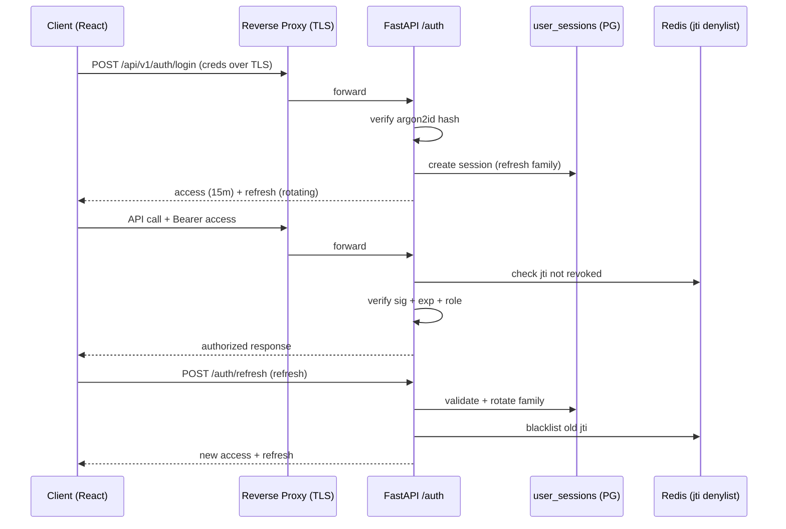

### 10.3 Authorization (RBAC)

Authorization is enforced at two altitudes, both mandatory:

1. **Endpoint-level (function/role guard):** FastAPI dependencies in `core.dependencies` assert the caller's `role` against a per-endpoint requirement matrix. All prohibited/irreversible actions require elevated roles.
2. **Object-level (row/tenant guard):** `repositories` never return a row without an explicit `org_id`/`tenant_id` (and, where applicable, ownership/ACL) predicate, preventing IDOR and cross-tenant access even for correctly-authenticated callers.

| Capability / endpoint area | `end_user` | `support_engineer` | `sme_reviewer` | `admin` |
|---|---|---|---|---|
| `/chat`, own `/conversations`, own `/feedback` | ✅ | ✅ | ✅ | ✅ |
| Create/view own `/tickets` | ✅ | ✅ | ✅ | ✅ |
| Work queue, resolve tickets (`/tickets` admin ops) | ❌ | ✅ | ➖ | ✅ |
| KB draft/edit (`/kb`) | ❌ | ✅ | ✅ | ✅ |
| KB **publish/approve** (`kb_approvals`) | ❌ | ❌ | ✅ | ✅ |
| `/analytics`, `/admin` dashboards | ❌ | ➖ (scoped) | ➖ (scoped) | ✅ |
| `/audit` read | ❌ | ❌ | ❌ | ✅ |
| `category_registry` / threshold config | ❌ | ❌ | ❌ | ✅ |

(✅ allowed, ❌ denied, ➖ partial/scoped by policy.)

Role claims are **only** trusted from the verified JWT. The foundation-spec rule is structural: message content, retrieved documents, and tool outputs can never elevate privilege because `user_context`/`auth_claims` are set by the API layer, not by anything flowing through `AgentState.messages`.

### 10.4 Input validation, rate limiting, CORS

- **Validation:** Every inbound payload is a Pydantic `schemas` DTO with strict typing, bounded lengths, enum whitelists, and rejected unknown fields; path/query IDs are typed and ownership-checked. Outbound responses are also schema-bound to prevent accidental over-exposure of model attributes.
- **Rate limiting / throttling:** Redis-backed token buckets keyed per-user, per-IP, and per-org. `/auth` (anti-brute-force), `/chat` and `/files` (anti-cost-abuse) get stricter buckets. Inside the graph, `IngressGuard` enforces a per-thread turn budget and short-circuits control intents/cache hits to avoid spending LLM tokens on abusive or trivial traffic.
- **CORS:** Explicit per-environment origin allowlist (dev localhost origins vs. exact prod domains), credentialed-request restrictions, no wildcard origins in production.

### 10.5 PII handling & data classification

Fields carry a data-classification tier (Public / Internal / Confidential / Restricted-PII). `IngressGuard` performs deterministic PII redaction to produce `redacted_query`; downstream persistence (ticket transcripts, `messages`, audit entries) stores the **redacted** form. Logs follow least-exposure: no secrets, no raw PII, no full tokens — only hashes/identifiers. The `Responder` egress ensures no cross-tenant chunk text or secret ever reaches the client.

### 10.6 File-upload safety

Uploads (`/files`, `repositories.base`, `files` table, `workers`) pass a pipeline before any KB ingestion:

1. Enforce size cap + extension allowlist (PDF/DOCX/images).
2. Validate MIME **and** magic bytes (defeat renamed executables).
3. Store to sandboxed object storage under randomized, non-guessable keys with no execute permission; never serve from an executable path.
4. `workers` run AV/malware scan; only clean files proceed.
5. PDF/Word parsing (`rag.parsers`) treats extracted text as **untrusted data** feeding the `pending_review` ingestion path, never as instructions.

### 10.7 Prompt-injection & data-exfiltration defenses (RAG/LLM path)

- **Channel separation:** System prompt (from `registries.prompt`), user message, and retrieved evidence occupy distinct, delimited channels; retrieved documents are labeled untrusted and explicitly not authoritative for instructions.
- **Frontline screen:** `IngressGuard` runs deterministic injection/jailbreak detection and sets `injection_flag`/`safety_verdict`; blocked inputs route straight to `Responder` with a safe canned reply (no LLM spend).
- **Indirect injection (poisoned documents):** Because retrieval is ACL- and tenant-scoped and documents are data, a malicious instruction embedded in a KB doc cannot change routing or exfiltrate other tenants' data. The `GroundingVerifier` validates that every claim's citation maps to an ACL-scoped candidate, and no node makes outbound network calls to URLs discovered inside documents.
- **KB-poisoning barrier:** Ingested/edited knowledge is quarantined in `kb_chunks_pending` (`doc_status=pending_review`) and excluded from live retrieval until human approval via `kb_approvals` — closing the data-poisoning vector inherent to a self-improving KB.
- **Single egress:** All outbound responses flow through `Responder`, the only node permitted to emit to the user, which centralizes output sanitization, cache writes, and audit.

### 10.8 Audit logging coverage & supply-chain hygiene

- **Audit coverage:** `audit_logs` is append-only and captures auth events (login/refresh/revoke/failure), every RBAC-gated action, KB publish/approval transitions, ticket resolution, and config/registry changes. `AgentState.audit_trail` (append reducer) plus `agent_runs` give per-turn, per-node forensic traceability. `/audit` is admin-scoped read-only.
- **Supply chain:** Backend and frontend dependencies are pinned and lockfile-committed; CI runs software-composition analysis and container image scanning, generates an SBOM, and fails the build on high-severity findings. Containers run as a non-root user on minimal base images.

---

## 11. Deployment Architecture

Deployment follows **12-factor** principles and packages the entire platform as composable Docker services orchestrated by `docker-compose` (dev/staging) with a straightforward promotion path to an orchestrator (Kubernetes/ECS) in production. All deployment assets live under the canonical top-level **`infra`** folder.

### 11.1 Service topology

| Service | Image / base | Responsibility | Exposed | Depends on |
|---|---|---|---|---|
| **reverse-proxy** | nginx / Traefik | Public entrypoint; TLS termination + HSTS; routes `/` → frontend, `/api` → backend; request-size caps, timeouts, gzip; static asset caching; WAF hook (prod) | 80/443 (public) | frontend, backend-api |
| **frontend** | node build → static (served by proxy or lightweight nginx) | React + Vite build (Tailwind, React Query); SPA assets only — no secrets baked in | internal | — |
| **backend-api** | python/FastAPI (uvicorn/gunicorn workers) | Synchronous API + LangGraph **main chat subgraph** (`ingress_guard`…`responder`); JWT authN/authZ; serves `/api/v1/*` | internal | postgres, chromadb, redis |
| **worker** | python (same image, worker entrypoint) | Event-triggered **learning subgraph** (`feedback_learner`: draft→approval→chunk→embed→upsert), KB ingestion (PDF/Word parse, embed), notifications, AV scan, async jobs | internal | postgres, chromadb, redis |
| **postgres** | postgres | Relational store for all canonical entities incl. `graph_checkpoints` (LangGraph Postgres checkpointer) and sparse FTS/BM25 index for hybrid retrieval | internal | — |
| **chromadb** | chromadb | Vector store for `kb_chunks` (published) + `kb_chunks_pending` (staging); dense semantic retrieval | internal | — |
| **redis** | redis | **Required infrastructure.** Celery (Redis broker) message broker/queue for `worker` jobs, rate-limit token buckets, `jti` denylist, hot conversation-memory window / answer cache | internal | — |
| **migrator** (init job) | python/Alembic | One-shot: runs DB migrations to head before backend-api accepts traffic; exits 0 on success | — (run-once) | postgres |

Optional prod add-ons: an observability stack (see 11.7). Only **reverse-proxy** publishes ports; all data services stay on the private Docker network.

### 11.2 Deployment diagram

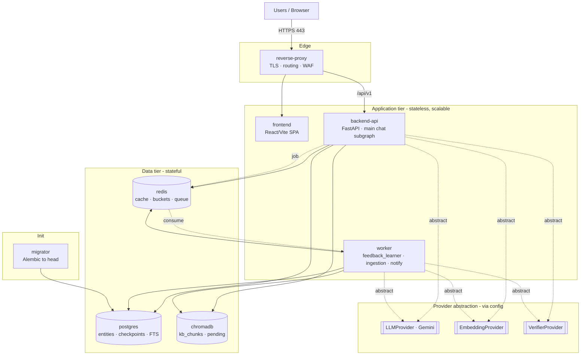

### 11.3 Environment & configuration strategy (12-factor)

- **Config in the environment:** All runtime config comes from environment variables loaded by `core.config`. A committed `.env.example` documents every key; real `.env` files are git-ignored. In production, values are supplied by the orchestrator's secret store / vault — never baked into images.
- **Strict separation of config from code:** The same immutable image runs in every environment; behavior differs only by env vars (DB DSNs, provider keys, CORS origins, token TTLs, rate limits, log level).
- **Provider keys via abstraction:** Gemini and embedding/verifier credentials are injected into the app and passed to LangGraph via `config` (per the `LLMProvider`/`EmbeddingProvider`/`VerifierProvider` contracts) — nodes never read env directly and never store provider handles in `AgentState`. Swapping the LLM provider is a config/adapter change, not a code change across the graph.
- **Backing services as attached resources:** Postgres, ChromaDB, and Redis are addressed purely by connection URLs, so managed cloud equivalents can replace containers in prod without code changes.

### 11.4 Reverse proxy, TLS, and per-service scaling

- **TLS:** Terminated at `reverse-proxy` (managed/ACME certs in prod), HTTP→HTTPS redirect, HSTS, modern ciphers. Internal service traffic rides the private network.
- **Scaling model:**
  - `frontend` — static; scale via CDN/replicas trivially.
  - `backend-api` — **stateless** (state lives in Postgres checkpointer + Redis), so it scales horizontally behind the proxy; concurrency tuned via gunicorn/uvicorn workers.
  - `worker` — scales independently by queue depth (KB ingestion / learning bursts don't impact chat latency).
  - `postgres` — vertical scale + read replicas + connection pooling (PgBouncer) as load grows.
  - `chromadb` — scale storage/replicas per vector volume.
  - `redis` — scale/replicate; cluster mode if cache/queue volume demands.

Statelessness of `backend-api` and `worker` is the key enabler: because per-thread state is durably checkpointed in `graph_checkpoints` (Postgres) and `interrupt()` parks long-running human-handoff runs, any replica can resume any thread via `Command(resume=...)`.

### 11.5 Database migrations on deploy

Migrations (SQLAlchemy + Alembic under `backend/app/db`) run as a dedicated **`migrator`** init job that must reach `head` and exit 0 before `backend-api` and `worker` start serving. This ordering (enforced by compose `depends_on` + healthcheck / orchestrator init-container) guarantees schema and code deploy atomically. Migrations are forward-only and reviewed; the LangGraph checkpointer schema (`graph_checkpoints`) is provisioned through the same path.

### 11.6 Health checks & readiness

| Service | Liveness | Readiness | Gate effect |
|---|---|---|---|
| backend-api | process up (`/health/live`) | DB + ChromaDB + Redis reachable, migrations at head (`/health/ready`) | proxy routes only when ready |
| worker | process up | broker + DB reachable | consumes jobs only when ready |
| postgres | `pg_isready` | accepting connections | blocks dependents until healthy |
| chromadb | heartbeat endpoint | collections reachable | blocks retriever startup |
| redis | `PING` | responds | blocks cache/queue-dependent starts |
| reverse-proxy | process up | upstreams healthy | serves 503 until upstreams ready |

Compose `depends_on: condition: service_healthy` (and orchestrator readiness probes) sequence startup: data tier → migrator → app tier → proxy.

### 11.7 CI/CD outline

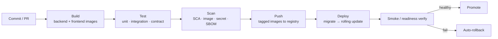

- **Build:** Reproducible multi-stage Docker builds (frontend static bundle; backend slim runtime, non-root user), dependency lockfiles honored.
- **Test:** Backend unit + integration (spun-up Postgres/Chroma/Redis), Pydantic schema/contract tests for API DTOs, frontend build + component tests.
- **Scan:** Software-composition analysis, container image vulnerability scan, secret scanning, SBOM generation; high-severity findings fail the pipeline (supply-chain gate from §10.8).
- **Push:** Images tagged by immutable git SHA + semver to the registry.
- **Deploy:** `migrator` runs to head, then rolling update of `backend-api`/`worker` (zero-downtime, drain old replicas), readiness-gated cutover, auto-rollback on failed smoke/readiness.

### 11.8 Observability stack

- **Logs:** Structured JSON logs (`core.logging`) with `trace_id`/`thread_id`/`turn_id` correlation from `AgentState`, shipped to a central aggregator; least-exposure (no PII/secrets) per §10.5.
- **Metrics:** Per-service metrics (request latency/throughput/errors, rate-limit hits) plus domain metrics from `AgentState.metrics` and `analytics_events` (per-node timings, gate decisions, deflection rate, escalation rate, cache-hit rate, retrieval scores) exposed for scraping (Prometheus-style) and surfaced in the Admin/Analytics dashboards.
- **Traces:** Distributed tracing spans across proxy → api → providers → data tier; each LangGraph node emits a span keyed by `trace_id`, with per-run records persisted in `agent_runs` for replay and audit.
- **Audit vs. observability:** `audit_logs` is the tamper-evident security/compliance record (§10.8); the observability stack is the operational telemetry plane — kept distinct so security evidence is not diluted by ops noise.

### 11.9 Dev vs. prod differences

| Concern | Development | Production |
|---|---|---|
| Orchestration | `docker-compose` on one host | Orchestrator (K8s/ECS) or hardened compose; multi-node |
| TLS | Self-signed / local certs (or plain localhost) | Managed/ACME certs, HSTS, WAF enabled |
| Data services | Containerized postgres/chromadb/redis | Managed/HA equivalents; backups, replicas, PITR |
| Secrets | `.env` file (git-ignored) | Vault / orchestrator secret store, rotation |
| Scaling | Single replica each | Horizontal `backend-api`/`worker`, autoscaling, pooling |
| Logging | Console/pretty, `DEBUG` | Central aggregation, JSON, `INFO`+, retention policy |
| CORS / origins | localhost allowlist | Exact prod domains, no wildcards |
| Images | Fast-rebuild, hot-reload mounts | Immutable, scanned, non-root, pinned by SHA |
| Migrations | Run on demand | Gated `migrator` job in deploy pipeline, forward-only |
| Providers | Cheap/small tiers, optional local stubs | Full Gemini tiering (small/large) via `LLMProvider` config |

---

## 12. Sequence Diagram

This section renders the two canonical runtime paths through the LangGraph main subgraph. Both share the identical entry spine (`ingress_guard` → `memory_manager` → `intent_classifier` → `query_planner` → `rag_retriever`) and the identical single egress (`Responder` → `MemoryManager` persist → END); they diverge at the two reliability gates (`retrieval_gate`, `grounding_verifier` + `confidence_gate`). Diagram 12.1 is the happy path where evidence and grounding are strong enough to auto-answer. Diagram 12.2 is the escalation path where a gate withholds delivery, slots are collected, a ticket is created, a human resolves it, and the resolution is folded back into the knowledge base.

Participant legend (stable across both diagrams):
- **User** — browser client (React `chat` module) holding a JWT.
- **API** — FastAPI `/api/v1/chat` router; the ONLY place `user_context`/`auth_claims` are populated (from the JWT, never from the message body). *Note: `/chat` throughout this section is shorthand for the canonical `POST /chat/messages` (cancel via `/chat/messages/{trace_id}/cancel`).*
- **Orchestrator** — LangGraph runtime executing the main subgraph against `AgentState`, checkpointed per `thread_id` in `graph_checkpoints`.
- Node actors use the canonical `snake_case` node ids (`ingress_guard`, `intent_classifier`, …).
- **ChromaDB** — vector store (`kb_chunks` collection, dense side of hybrid retrieval).
- **Postgres** — relational store (sparse FTS side + all entity tables + checkpointer).
- **LLM** — abstract `LLMProvider` (Gemini behind the Protocol), tier-aware; **Verifier** — abstract `VerifierProvider` (independent NLI/entailment).

### 12.1 AI-Resolved Chat Path (auto-answer)

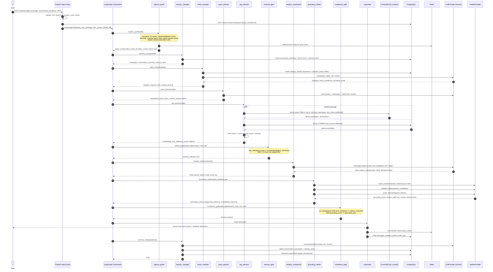

**Prose — what each phase does.** The **API layer** is the trust seam: it validates the JWT and stamps `user_context`/`auth_claims` into state so downstream nodes never derive identity or role from user-supplied text. **`ingress_guard`** runs entirely without an LLM — it redacts PII, screens for prompt injection/jailbreak, enforces rate limits, computes `query_hash`, and consults the answer cache; a cache hit or a `greeting`/`cancel` control intent would short-circuit straight to `responder` (not shown here since this is the full-path case). **`memory_manager` (load)** hydrates short-term context (`messages`, `conversation_summary`) and durable `memory_facts`. **`intent_classifier`** uses a small-tier model plus the `category_registry` to assign `category`, `intent_confidence`, `sensitivity_level`, and the required-slot schema; here all critical slots are present. **`query_planner`** rewrites the turn into a standalone query with multi-query + HyDE expansion and derives `retrieval_filters`. **`rag_retriever`** performs hybrid dense (ChromaDB `kb_chunks`) + sparse (Postgres FTS) retrieval under hard `org_id`/`tenant_id` + ACL + `doc_status=published` filters, then RRF-fuses, reranks, and dedupes, attaching provenance to every candidate. **`retrieval_gate`** is reliability gate #1 (deterministic): evidence clears the category/sensitivity threshold with at least one fresh document, so the run proceeds to synthesis. **`solution_synthesizer`** produces a streamed, strictly grounded answer with a citation for every claim. **`grounding_verifier`** is reliability gate #2 and runs an *independent* verifier — entailment per claim, citation validity, answer relevance — so the answer's own self-confidence cannot mask a hallucination. **`confidence_gate`** fuses all signals and, seeing no contradictions and sufficient confidence/grounding, returns `deliver`. **`responder`** is the single egress: it streams the final answer, writes the answer cache, and emits `analytics_events` + `audit_logs`. Finally **`memory_manager` (persist)** rolls the summary forward and checkpoints `AgentState` into `graph_checkpoints`, keeping token cost flat across long conversations.

### 12.2 Escalation Path (low confidence → info collection → ticket → human → KB ingestion)

```mermaid
sequenceDiagram
    autonumber
    actor User
    participant API as FastAPI /api/v1/chat
    participant Orchestrator as LangGraph Orchestrator
    participant RG as retrieval_gate
    participant CG as confidence_gate
    participant INFO as info_collector
    participant TC as ticket_creator
    participant HH as human_handoff
    participant RESP as responder
    participant MM as memory_manager
    participant PG as PostgreSQL
    participant NOTIF as notification service / workers
    actor Engineer as Support Engineer (Admin Dashboard)
    participant FL as feedback_learner (async subgraph)
    participant AG as approval_gate
    participant Chroma as ChromaDB (kb_chunks)
    participant EMB as EmbeddingProvider

    Note over Orchestrator,CG: Entry spine (ingress_guard → memory → intent →<br/>query_planner → rag_retriever) already executed as in 12.1

    Orchestrator->>CG: confidence_gate(state)
    Note over CG: final_confidence < deliver_threshold (borderline)<br/>missing_slots non-empty, clarification_rounds < max
    CG-->>Orchestrator: decision=clarify

    Orchestrator->>INFO: info_collector(state)
    Note over INFO: registry-driven batched slot questions,<br/>bounded by clarification_rounds
    INFO-->>Orchestrator: need_user_input
    Orchestrator->>RESP: responder(clarifying questions)
    RESP-->>User: ask for missing fields (batched)
    RESP->>MM: persist + checkpoint (graph_checkpoints)
    Note over Orchestrator: INTERRUPT — run parked, resumes next turn at ingress_guard

    User->>API: next turn with answers (same thread_id)
    API->>Orchestrator: resume(AgentState)
    Note over Orchestrator: re-runs spine; retrieval still thin OR budget exhausted
    Orchestrator->>CG: confidence_gate(state)
    Note over CG: retry/clarify budgets exhausted → hard escalate
    CG-->>Orchestrator: decision=escalate

    Orchestrator->>TC: ticket_creator(state)  (idempotent per thread)
    TC->>PG: INSERT tickets{category, filled_slots, redacted transcript,<br/>rejected candidates as hints, final_confidence, priority, escalation_reason}
    TC->>PG: INSERT ticket_events + ticket_attachments + audit_logs
    TC-->>Orchestrator: ticket_id, ticket_status=open

    Orchestrator->>HH: human_handoff(state)
    HH->>PG: set thread awaiting_human, assign handoff_queue, set sla_due_at
    HH->>NOTIF: gated send-only notification to handoff_queue
    NOTIF->>PG: INSERT notifications
    NOTIF-->>Engineer: alert (queue/email)
    Orchestrator->>RESP: responder("routed to a human engineer")
    RESP-->>User: handoff acknowledgement
    Note over Orchestrator: INTERRUPT() + checkpoint — durably parked (no polling)

    Engineer->>API: work ticket, POST resolution (/tickets, /admin)
    API->>PG: UPDATE tickets ticket_status=resolved, engineer_resolution
    API->>PG: INSERT ticket_events + audit_logs
    API->>Orchestrator: Command(resume=engineer_resolution) at same thread_id

    Note over Orchestrator,FL: ENGINEER_RESOLVED_EVENT → learning subgraph (out-of-band)
    Orchestrator->>FL: feedback_learner(engineer_resolution)
    FL->>PG: draft canonical KB article → kb_documents{doc_status=pending_review}
    FL->>EMB: embed_batch(pending chunks)
    FL->>Chroma: upsert into kb_chunks_pending (staging, excluded from live retrieval)
    FL->>AG: approval_gate
    AG->>Engineer: SME/admin review (kb_approvals)
    Engineer-->>AG: approved
    AG->>PG: kb_documents.doc_status=published (+ new version, last_verified_at)
    AG->>PG: kb_chunks metadata + provenance
    AG->>Chroma: upsert into kb_chunks (live) ; purge from kb_chunks_pending
    AG->>PG: invalidate answer cache + write audit_logs
    AG-->>Orchestrator: KB updated — future turns retrieve this resolution
```

**Prose — what each phase does.** The path forks at the gates. When evidence is present but thin, **`confidence_gate`** first returns `clarify` (or `retrieval_gate` routes a fixable gap to `info_collector` directly). **`info_collector`** asks batched, registry-driven questions for the `missing_slots`; because it needs user input, the run flows through **`responder`** and then LangGraph **`interrupt()`s**, checkpointing state so the conversation resumes on the user's next turn at `ingress_guard` — no busy-polling, no lost context. On resume, if retrieval is still insufficient or the `clarification_rounds`/`retry_count` budgets are exhausted, `confidence_gate` deterministically escalates; the graph is guaranteed to terminate in `deliver` or `handoff` and never fabricates an ungrounded stopgap answer.

**`ticket_creator`** (idempotent per `thread_id`) persists an engineer-ready `tickets` row: `category`, `filled_slots`, the redacted transcript, the rejected retrieval candidates as engineer hints, `final_confidence`, auto-classified `priority`, and a machine-readable `escalation_reason`, alongside `ticket_events`, `ticket_attachments`, and `audit_logs`. **`human_handoff`** assigns the registry-defined `handoff_queue`, sets `awaiting_human` and `sla_due_at`, fires a *gated, send-only* notification through the notification service/`workers`, tells the user it has been routed to a human, and `interrupt()`s so the Postgres checkpointer durably parks the run.

The **Support Engineer** works the ticket in the Admin Dashboard and posts a resolution; the backend flips `ticket_status=resolved`, records `engineer_resolution`, and resumes the same `thread_id` via `Command(resume=...)`. This emits an `ENGINEER_RESOLVED_EVENT` into the **`feedback_learner`** async subgraph — deliberately *out-of-band*, never on the synchronous chat turn. `feedback_learner` drafts a canonical KB article into `kb_documents` as `pending_review`, chunks and embeds it via the abstract `EmbeddingProvider`, and stages vectors in the **`kb_chunks_pending`** ChromaDB collection so unreviewed content can never leak into live retrieval. The **`approval_gate`** requires SME/admin sign-off recorded in `kb_approvals`; on approval the document flips to `published` with a new version and `last_verified_at`, vectors are upserted into the live **`kb_chunks`** collection (and purged from staging), the `query_hash` answer cache is invalidated, and every transition is written to append-only `audit_logs`. The next user with the same problem is now served automatically from this newly ingested resolution — closing the continuous-improvement loop.

---

## 13. Data Flow Diagram

The flowchart below traces every material data movement across the four functional pipelines — **admin knowledge ingestion**, **retrieval/chat**, **ticketing/handoff**, and the **feedback-learning loop** — and groups nodes into four explicit trust boundaries. Data crossing a boundary is always mediated: the client↔backend edge is gated by JWT + `ingress_guard`, the backend↔external-LLM edge carries only PII-redacted text, and nothing reaches the live vector index without passing the `approval_gate`.

```mermaid
flowchart TB
    subgraph CLIENT["🔒 TRUST BOUNDARY: CLIENT (browser, untrusted)"]
        U["End User<br/>chat module"]
        ADM["Admin / SME<br/>admin + knowledge-base modules"]
        ENG["Support Engineer<br/>tickets + admin modules"]
    end

    subgraph BACKEND["🔒 TRUST BOUNDARY: BACKEND (FastAPI, trusted app tier)"]
        API["API layer /api/v1<br/>JWT auth → user_context"]
        subgraph GRAPH["LangGraph Orchestrator (AgentState)"]
            IG["ingress_guard<br/>redact + injection screen + cache check"]
            RETR["rag_retriever<br/>hybrid + RRF + rerank"]
            GATES["retrieval_gate → solution_synthesizer<br/>→ grounding_verifier → confidence_gate"]
            RESP["responder (single egress)"]
            TC["ticket_creator → human_handoff"]
        end
        ING["rag ingestion + parsers<br/>PDF/Word → chunker"]
        FL["feedback_learner subgraph<br/>draft → approval_gate → embed → upsert"]
        WRK["workers<br/>events + gated notifications"]
    end

    subgraph EXT["🔒 TRUST BOUNDARY: EXTERNAL LLM (3rd-party, redacted I/O only)"]
        LLMP["LLMProvider (Gemini)"]
        EMBP["EmbeddingProvider"]
        VERP["VerifierProvider (NLI)"]
    end

    subgraph DATA["🔒 TRUST BOUNDARY: DATA STORES (private network)"]
        CHROMA[("ChromaDB<br/>kb_chunks (live)<br/>kb_chunks_pending (staging)")]
        PG[("PostgreSQL<br/>entities + FTS + graph_checkpoints")]
        REDIS[("Redis (required)<br/>hot memory window + answer cache")]
        BLOB[("File storage<br/>files + ticket_attachments")]
    end

    %% ---- Ingestion pipeline ----
    ADM -- "upload PDF/Word (gated)" --> API
    API -- "raw file" --> BLOB
    API -- "ADMIN_DOC_UPLOAD_EVENT" --> ING
    ING -- "parse + chunk" --> FL
    FL -- "embed_batch" --> EMBP
    EMBP -- "vectors" --> FL
    FL -- "pending vectors" --> CHROMA
    FL -- "kb_documents/kb_chunks pending_review" --> PG

    %% ---- Retrieval / chat pipeline ----
    U -- "message + JWT" --> API
    API --> IG
    IG -- "read answer cache / hot window" --> REDIS
    IG -- "load memory + summaries" --> PG
    IG -- "redacted classify/plan text" --> LLMP
    LLMP -- "intent/plan" --> GATES
    IG --> RETR
    RETR -- "dense semantic query" --> CHROMA
    RETR -- "sparse FTS/BM25" --> PG
    CHROMA -- "candidates + provenance" --> RETR
    RETR --> GATES
    GATES -- "grounded generate (redacted)" --> LLMP
    GATES -- "entailment / citation / relevance" --> VERP
    GATES --> RESP
    RESP -- "stream cited answer" --> U
    RESP -- "write answer cache" --> REDIS
    RESP -- "messages + analytics_events + audit_logs" --> PG

    %% ---- Ticketing / handoff pipeline ----
    GATES -- "escalate / abstain" --> TC
    TC -- "tickets + ticket_events + audit_logs" --> PG
    TC -- "attachments" --> BLOB
    TC --> WRK
    WRK -- "gated send-only notification" --> ENG
    WRK -- "notifications rows" --> PG

    %% ---- Feedback-learning loop ----
    ENG -- "resolve ticket (gated)" --> API
    API -- "ENGINEER_RESOLVED_EVENT / resume thread" --> FL
    U -- "thumbs up/down feedback" --> API
    API -- "USER_FEEDBACK_EVENT" --> FL
    FL -- "relevance_signals update" --> PG
    ADM -- "SME approval (gated)" --> API
    API -- "approve" --> FL
    FL -- "publish: live vectors upsert + purge staging" --> CHROMA
    FL -- "doc_status=published + version + last_verified_at" --> PG
    FL -- "invalidate answer cache" --> REDIS
    FL -- "audit_logs" --> PG
```

**Prose — data stores and their in/out flows.**

- **PostgreSQL** is the system of record and the busiest store. *In:* identity/session rows (`organizations`, `users`, `roles`, `user_sessions`); every conversational artifact (`conversations`, `messages`, `conversation_summaries`, `memory_facts`); the LangGraph checkpointer (`graph_checkpoints`); ticketing (`tickets`, `ticket_events`, `ticket_attachments`); KB metadata + provenance mirroring the vectors (`kb_documents`, `kb_chunks`, `kb_ingestion_jobs`, `kb_approvals`); the extensibility seam (`category_registry`); learning signals (`feedback`, `relevance_signals`); and cross-cutting `notifications`, `audit_logs`, `files`, `agent_runs`, `analytics_events`. *Out:* memory/summary hydration at `ingress_guard`, the sparse FTS/BM25 half of hybrid retrieval, category/threshold config for the gates, and checkpoint resume for parked (`awaiting_human`) threads. Postgres is the sparse side of RAG, so it is read on every retrieval, not just for relational lookups.

- **ChromaDB** holds the dense vector index. *In:* embeddings of approved chunks upserted into the live **`kb_chunks`** collection, and embeddings of unreviewed drafts staged in **`kb_chunks_pending`**. *Out:* the dense candidate set for `rag_retriever`, always constrained by metadata filters (`org_id`/`tenant_id`, `retrieval_namespace`, `category_key`, `doc_status=published`, `version`, `last_verified_at`). Category isolation is by the `retrieval_namespace` metadata filter, never by separate collections, and staged pending vectors are structurally excluded from live queries — content only becomes retrievable after the `approval_gate` promotes it.

- **Redis (required hot tier)** accelerates two flat-cost mechanisms. *In:* the rolling hot memory window written on persist, and the `query_hash`-keyed answer cache written by `responder`. *Out:* zero-LLM cache short-circuits and fast memory reads at `ingress_guard`. Any KB upsert or feedback-driven demotion invalidates the affected answer-cache entries, so improvements propagate immediately and stale auto-answers cannot survive a knowledge change.

- **File storage (blob)** holds binary payloads referenced by the `files` and `ticket_attachments` tables. *In:* admin-uploaded PDF/Word source documents (before parsing) and user/engineer ticket attachments. *Out:* source bytes streamed to the `rag` parsers/chunker during ingestion, and attachment retrieval for engineers working a ticket. Binaries live here; only extracted text, chunk metadata, and provenance flow onward into the KB pipeline.

**Prose — trust boundaries.** The **CLIENT** boundary is untrusted: browsers submit messages, uploads, feedback, and (for engineers/admins) resolutions and approvals, but every entry is gated by JWT validation at the API and by `ingress_guard`'s redaction/injection screening — role and identity are taken from verified `auth_claims`, never from message content, and side-effectful client actions (uploads, ticket resolution, KB approval) are RBAC-restricted to `support_engineer`/`sme_reviewer`/`admin`. The **BACKEND** boundary is the trusted application tier where the LangGraph orchestrator, RAG ingestion, learning subgraph, and workers execute against `AgentState`. The **EXTERNAL LLM** boundary is third-party and receives only PII-redacted text for classification, planning, grounded generation, embedding, and NLI verification; provider handles are injected via graph `config` behind the `LLMProvider`/`EmbeddingProvider`/`VerifierProvider` Protocols and are never persisted in state, keeping Gemini swappable. The **DATA STORES** boundary sits on the private network, reachable only from the backend tier; no client or external LLM ever touches Postgres, ChromaDB, Redis, or blob storage directly.

---

## 14. Design Decisions

The table below records the load-bearing architectural choices for the Enterprise Multi-Agent AI Helpdesk Platform. Each row states the alternatives evaluated, the selected option, why it won under this platform's constraints (reliability-first, latency/cost-aware, extensible, multi-tenant, production-grade), and the trade-offs accepted. All choices are consistent with the LOCKED foundation spec — the fixed tech stack is treated as a constraint, and the rationale explains *why the fixed choice remains correct* rather than re-litigating it.

| Decision | Options considered | Chosen | Rationale | Trade-offs |
|---|---|---|---|---|
| **Agent orchestration framework** | LangGraph; raw LangChain chains; bespoke async state machine; CrewAI/AutoGen conversational swarms | **LangGraph** (canonical `AgentState` graph) | Explicit graph gives deterministic, inspectable control flow with named nodes (`ingress_guard` … `responder`), conditional edges for the three decision points, bounded loops (`retry_count`, `clarification_rounds`), first-class `interrupt()`/`Command(resume=...)` for human handoff, and a **Postgres checkpointer** (`graph_checkpoints`) for durable per-thread resume. Reducer-based single-State contract keeps inter-node coupling to one versioned object, enabling agents to be spliced in without touching neighbors. | Steeper learning curve than linear chains; graph must be assembled and versioned deliberately; conversational-swarm spontaneity is intentionally traded away for auditability and reliability. |
| **Vector store** | ChromaDB; pgvector; Qdrant; Milvus; Pinecone (managed) | **ChromaDB** (`kb_chunks`, `kb_chunks_pending` collections) | Fixed by stack; validated as correct for the target scale: embeddable/self-hostable inside a Fortune-500 boundary (no data egress), simple metadata-filter model that cleanly supports the registry-driven `retrieval_namespace` + `org_id`/`tenant_id` + `doc_status` isolation, and low operational surface for v1. Kept behind `EmbeddingProvider` + `rag` retriever seam so it is swappable (see §15 migration path). | Single-node ChromaDB has horizontal-scale and HA ceilings; sparse/BM25 half of hybrid retrieval must live in Postgres FTS rather than in the vector store; requires a documented migration path before it becomes the bottleneck. |
| **Authentication & authorization** | JWT (stateless); server-side sessions; opaque tokens + introspection | **JWT** with canonical RBAC roles (`end_user`, `support_engineer`, `admin`, `sme_reviewer`) | Fixed by stack and well-matched to a horizontally scaled, stateless FastAPI tier — no shared session store required on the hot path. Role/tenant claims are populated by the API layer into `user_context`/`auth_claims` and **never trusted from message content**, which is the security spine for multi-tenant ACL filtering in `rag_retriever`. `user_sessions` table backs refresh/rotation and revocation. | Stateless JWTs are hard to revoke instantly; mitigated with short-lived access tokens + refresh rotation + a `user_sessions` denylist. Clock-skew and key-rotation discipline required. |
| **RAG & grounding design** | Single-shot dense retrieval + generate; dense-only + generate; **hybrid retrieval + dual reliability gates + citation-forced synthesis + independent verifier**; agentic tool-calling retrieval | **Hybrid (dense ChromaDB + sparse Postgres FTS) → RRF → cross-encoder rerank → dedupe, then two sequential gates** (`retrieval_gate`, then `grounding_verifier` + `confidence_gate`) | Reliability-first mandate: the platform must never emit an ungrounded auto-answer. Hybrid recall beats dense-only on exact-string IT tokens (error codes, CLI flags). `SolutionSynthesizer` cites every claim and may `ABSTAIN`; an **independent `VerifierProvider`** does NLI entailment so grounding is not self-graded. Deterministic gates make the deliver-vs-escalate decision explainable and category-tunable via `thresholds`. | More LLM/compute hops per turn and higher p95 latency than single-shot; extra moving parts (reranker, verifier) to operate; stricter gates increase escalation rate for thin-KB categories (accepted: safe handoff over wrong fix). |
| **Conversation-memory approach** | Full transcript replay each turn; sliding window only; **rolling LLM summary + durable facts + checkpointer**; external long-term vector memory | **Layered**: `add_messages` short-term window + Postgres checkpointer (`graph_checkpoints`), rolling summary (`conversation_summaries`), durable per-user facts (`memory_facts`); hot window optionally cached in Redis | Keeps token cost flat regardless of thread length (summary compresses history) while preserving exact recent turns for coreference resolution in `query_planner`. Durable facts survive across threads. `MemoryManager` load-at-ingress / persist-after-responder is a clean, testable lifecycle. | Summarization is lossy and can drop a detail needed later; summary generation adds a small-tier LLM cost; Redis introduces an optional cache-coherence concern (mitigated: cache is derived, Postgres is source of truth). |
| **LLM provider abstraction** | Hard-code Gemini SDK calls; thin wrapper; **`LLMProvider`/`EmbeddingProvider`/`VerifierProvider` Protocols injected via graph `config`, model-tier aware** | **Protocol-based provider abstraction**, Gemini as first implementation, tiers (`small`/`large`) selected per node | Requirement mandates an abstract, swappable LLM. Protocols with types-only contracts let nodes call `generate/stream/generate_structured/classify/verify/summarize` without knowing the vendor. Injection via LangGraph `config` (never stored in `AgentState`) keeps state serializable/checkpointable. Model tiering routes cheap classify/verify to small models and reserves large-tier for synthesis — direct cost lever. | Abstraction hides vendor-specific features (e.g., native structured-output, context caching) behind a lowest-common-denominator surface; per-provider adapters must be written and conformance-tested; tier misconfiguration can silently raise cost or lower quality. |
| **Repository layout** | Polyrepo (separate FE/BE/infra repos); **monorepo** (`backend`, `frontend`, `infra`, `docs`, `scripts`) | **Monorepo** | Single source of truth for the shared contract surface (API DTOs, category registry semantics), atomic cross-cutting changes (schema + endpoint + UI in one PR), unified CI and one `docker-compose` topology in `infra`. Matches a single platform team owning the whole stack. | Larger clone/CI surface; needs path-scoped CI and CODEOWNERS to avoid coupling; independent service versioning is harder than polyrepo. |
| **Chat streaming transport** | **SSE** (Server-Sent Events); WebSocket; long-poll | **SSE** for `Responder` egress (token stream), REST for everything else | Chat egress is unidirectional server→client token streaming — SSE's exact shape. Works over plain HTTP/1.1+2, no custom upgrade handshake, trivially proxied/load-balanced, auto-reconnect built in, and pairs naturally with the single `responder` egress node. Inbound user turns are ordinary REST `POST /chat`. | No native client→server channel (fine here; not needed mid-stream); some corporate proxies buffer SSE (mitigated with correct headers/flush and heartbeat); one long-lived connection per active turn to size the ASGI worker pool for. |
| **Knowledge ingestion execution model** | Synchronous inline ingestion on upload; **asynchronous worker + queue**; batch nightly only | **Asynchronous** via `workers` + queue; tracked in `kb_ingestion_jobs`; staging in `kb_chunks_pending` | PDF/Word parsing, chunking, embedding, and upsert are slow and bursty; running them inline would block the request tier and couple UX latency to document size. Async decouples upload-accept from processing, enables retry/backpressure, and fits the event-triggered `feedback_learner` subgraph (engineer-resolution / user-feedback / admin-upload) which must never run on the synchronous chat turn. | Eventual consistency — a freshly uploaded doc is not instantly retrievable; requires a job-status surface (`kb_ingestion_jobs`) and worker/queue operational footprint; the `approval_gate` adds human latency before `published`. |

---

## 15. Scalability Strategy

The platform is designed to scale each layer independently. The synchronous chat graph and the asynchronous learning/ingestion path are decoupled so that heavy KB processing never contends with interactive latency. Targets below are the v1 production goals for a single large-org (multi-tenant-capable) deployment.

### 15.1 Per-layer scaling

**1. Stateless FastAPI request tier (horizontal).**
The `api` + `core` tier holds no per-request server state — JWTs are stateless and all durable state lives in Postgres/ChromaDB/Redis. This makes the tier trivially horizontally scalable behind a load balancer: run N Uvicorn/Gunicorn workers per pod and scale pods on CPU/RPS. Each active SSE stream (`responder`) is a long-lived connection, so worker-pool sizing accounts for concurrent-open-stream count, not just RPS. Graceful drain on deploy lets in-flight streams finish before pod termination.

**2. LangGraph execution + checkpointer.**
Graph execution is CPU-light glue around I/O-bound LLM/retrieval calls, so it co-locates with the request tier. Durability and resume are delegated to the **Postgres LangGraph checkpointer** (`graph_checkpoints`), keyed per `thread_id`; parked (`awaiting_human`) runs consume **zero compute** while interrupted — they are rows, not held connections — which is what lets human-handoff scale to thousands of open tickets without a polling cost.

**3. PostgreSQL (pooling → replicas → partitioning).**
- **Connection pooling:** a pooler (PgBouncer, transaction mode) fronts Postgres so hundreds of app workers multiplex onto a bounded backend connection count; SQLAlchemy pools are sized to the pooler, not to Postgres directly.
- **Read replicas:** read-heavy, tenant-isolated traffic (`conversations`, `messages`, `analytics_events`, `kb_chunks` sparse/FTS reads, dashboards) is routed to replicas; writes and the checkpointer go to primary. `repositories` is the single seam where read/write routing is applied.
- **Partitioning:** high-growth append tables — `messages`, `audit_logs`, `analytics_events`, `ticket_events`, `agent_runs` — are range-partitioned by time (and sub-scoped by `org_id` where hot) so old partitions can be detached/archived and indexes stay small. Postgres FTS indexes for the sparse retrieval leg are maintained on `kb_chunks`.

**4. Asynchronous workers + queue (ingestion/embeddings/learning).**
The `workers` module consumes a durable queue for: PDF/Word parsing, chunking, embedding (`EmbeddingProvider.embed_batch`), `kb_chunks`/`kb_chunks_pending` upserts, notification sends, and the `feedback_learner` subgraph. Workers scale independently of the request tier (scale on queue depth / oldest-message age). Embedding calls are **batched** and idempotent per `kb_ingestion_jobs` record so retries are safe. This isolates bursty, slow work from interactive latency.

**5. Caching (Redis).**
- **Answer cache** keyed on `query_hash` powers the `ingress_guard` zero-LLM short-circuit — the single biggest latency/cost win for repetitive IT questions. Invalidated on any KB upsert or feedback demotion (§ feedback loop).
- **Hot conversation window / session hints** cached to spare Postgres round-trips on `MemoryManager` load.
- **Registry cache:** `category_registry` rows, `thresholds`, and prompt/tool bindings are hot-read on every turn; cached with short TTL + explicit bust on admin edit.
- **Rate-limit counters** for `ingress_guard` throttling.
Redis is treated as a derived/ephemeral tier: Postgres remains source of truth, so a cold cache degrades latency, never correctness.

**6. ChromaDB scaling limits and migration path.**
Single-node ChromaDB is the deliberate v1 choice but has known ceilings: memory-bound index size, limited concurrent-write throughput, and no first-class sharding/HA. The `rag` module isolates all vector I/O behind the retriever + `EmbeddingProvider` seam so the store is swappable without touching agents. Documented migration ladder, triggered by capacity signals:

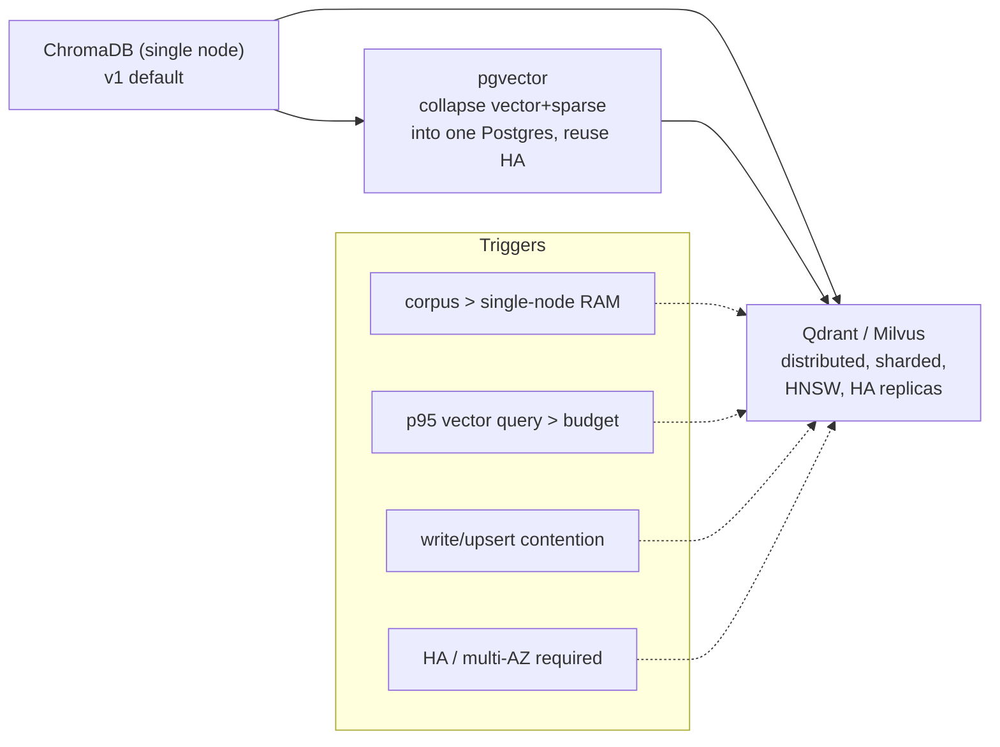

- **Short hop (pgvector):** if the corpus stays moderate but operational simplicity is paramount, fold vectors into Postgres (`pgvector`) — one datastore, existing replica/backup/HA reused, dense + sparse co-located.
- **Scale hop (Qdrant/Milvus):** for large corpora / high QPS / HA, move to a distributed store with sharding, HNSW tuning, and replicas. Metadata-filter model (`retrieval_namespace`, `org_id`, `doc_status`, `version`) maps directly, so the `retrieval_filters` contract is preserved.
Migration is a re-embed + backfill job in `workers`, run dual-write/shadow-read before cutover.

**7. LLM rate-limit & cost management.**
- **Model tiering:** `LLMProvider` tier param routes classify/verify/summarize/structured-slot work to `small` models and reserves `large` for `solution_synthesizer` only — the dominant cost lever.
- **Short-circuits reduce LLM calls entirely:** `ingress_guard` cache hits, greeting/cancel/human control-intents, and `retrieval_gate`-insufficient → ticket paths all avoid large-tier generation.
- **Answer + provider-side context caching**, request **batching** for embeddings, and **token budgets** (`max_tokens`, bounded conversation summary, capped candidate count into synthesis) keep per-turn cost bounded and predictable.
- **Backpressure & fairness:** provider rate limits are absorbed by the queue for async work and by per-org rate limits (`ingress_guard`) on the sync path; retries use exponential backoff. Payment/security categories carry lower retry budgets, further capping worst-case spend.
- **Cost observability:** `agent_runs` + `analytics_events` capture per-node token/latency/tier so cost regressions are attributable per category and per node.

### 15.2 Load / performance targets (v1)

| Dimension | Target |
|---|---|
| Concurrent active chat sessions (single deployment) | ~2,000 concurrent open streams, scale-out linear beyond via added pods |
| Cache-hit response (zero-LLM short-circuit) | p95 < 300 ms end-to-end |
| Full RAG turn (retrieve → synth → verify → gate → stream first token) | p95 time-to-first-token < 2.5 s; full answer p95 < 8 s |
| Retrieval (hybrid + rerank) latency | p95 < 500 ms at v1 corpus size |
| KB ingestion (avg PDF/Word doc) | processed & queued-for-approval < 5 min from upload accept |
| Availability (request tier) | 99.9% monthly (stateless tier + multi-replica DB) |
| Answer-cache hit rate on repetitive IT intents | ≥ 40% steady-state (drives cost/latency wins) |
| Parked human-handoff runs | unbounded (checkpointer rows, zero live compute) |

Scaling posture is **horizontal-first for stateless tiers, vertical-then-managed for stateful stores**, with every stateful dependency (Postgres, ChromaDB, Redis) fronted by an abstraction seam so it can be upgraded or replaced without agent-layer changes.

---

## 16. Future Enhancements

Prioritized roadmap. Each item names the primary modules/agents it touches so it can be scoped against the LOCKED architecture without renaming canonical components. Priority reflects value-to-effort and dependency ordering.

**P0 — Near-term (hardening & reach, low architectural risk)**
1. **SSO / SAML / OIDC federation.** Add enterprise identity federation in front of the existing JWT model (`auth` module, `core.security`). JWT stays the internal token; IdP integration maps external identities → `users`/`roles`/`org_id`. Table-stakes for Fortune-500 rollout.
2. **Slack / Microsoft Teams channel adapters.** Surface the chat graph as a bot inside collaboration tools via new adapters in `api`/`workers`, reusing `POST /chat` and the same `AgentState` graph. Meets users where IT requests already originate; reuses the full reliability spine.
3. **A/B testing of prompts & thresholds.** Extend the prompt/threshold `registries` with variant assignment and log outcomes to `analytics_events`; compare deliver-rate, grounding_score, escalation-rate, and feedback per variant. Turns prompt/threshold tuning into a measured, reversible experiment rather than a guess.
4. **Auto-KB quality scoring.** A scheduled `workers` job scores `kb_documents`/`kb_chunks` on freshness (`last_verified_at`), citation-usage frequency, and net `relevance_signals`/`feedback`; flags stale/low-value/contradictory articles for `sme_reviewer` review. Directly attacks the stale-KB risk (§17).

**P1 — Mid-term (capability expansion)**
5. **Multilingual support.** Locale-aware retrieval + synthesis using `user_context.locale`; multilingual embeddings and per-language KB namespaces via `category_registry.retrieval_namespace`. Expands reach for global orgs.
6. **Fine-tuned / distilled reranker.** Replace the general cross-encoder in `rag` with a domain-tuned reranker trained on accumulated `feedback` + `relevance_signals` + engineer-accepted candidates. Improves retrieval precision, which lifts grounding and reduces over-escalation.
7. **SLA prediction & smart routing.** Model that predicts resolution time / breach risk at `ticket_creator` using historical `tickets`/`ticket_events`, driving priority and `handoff_queue` selection. Improves human-tier efficiency and SLA adherence.
8. **Proactive / agentic remediation via tool execution.** Extend the `registries` `tool_bindings` seam so vetted, low-risk fixes (e.g., trigger a password-reset workflow, provision VPN access) can be executed by a new guarded tool-executor node — always behind explicit approval gates, RBAC, and audit. Moves from "tell the user the fix" to "safely perform the fix." Highest value, highest governance bar — deliberately gated behind mature audit + approval tooling.

**P2 — Longer-term (experience & intelligence)**
9. **Voice interface.** Speech-to-text ingress and text-to-speech egress adapters around the existing graph; no core changes beyond a new transport adapter and the `responder` egress.
10. **Predictive / proactive support.** Mine `analytics_events` + ticket clusters to detect emerging incidents (e.g., a spike in VPN failures) and proactively publish KB guidance or open a broadcast notification before individual tickets flood in.
11. **Per-org fine-tuning / self-improving synthesis.** Use the accumulated approved-KB + resolution corpus to tune or adapter-train the synthesis tier per org, behind the `LLMProvider` abstraction so it remains swappable.
12. **Richer analytics & executive dashboards.** Deflection rate, cost-per-resolution, KB coverage gaps, and category trend analytics surfaced in the `admin`/`analytics` frontend modules.

---

## 17. Risks and Mitigations

Impact and Likelihood are rated relative to a v1 production deployment inside a large org. Mitigations map to concrete, already-specified architecture components wherever possible.

| Risk | Impact | Likelihood | Mitigation |
|---|---|---|---|
| **Hallucination / confidently wrong fix delivered to user** | High — a wrong IT fix can lock accounts, break VPN/email, or cause data loss | Medium (inherent to LLMs) | Dual-gate reliability spine: `retrieval_gate` (evidence sufficiency) then independent `grounding_verifier` (NLI entailment, not self-graded) + `confidence_gate`. Hard hallucination guard: any contradicted claim / `citation_valid=false` / `answer_relevant=false` → **escalate**, overriding high self-confidence. `SolutionSynthesizer` must cite every claim and may `ABSTAIN` → straight to `ticket_creator`. Graph provably terminates in **deliver** or **handoff**, never an ungrounded auto-answer. |
| **Prompt injection / jailbreak & data exfiltration** | High — could leak other tenants' KB/PII or coerce unsafe actions | Medium | `ingress_guard` performs deterministic (no-LLM) injection/jailbreak screening + PII redaction before any LLM sees input; `safety_verdict=block` → safe canned reply. Retrieved KB content is treated as **data, not instructions**. Identity/ACL comes from JWT into `user_context`, **never from message body**. Multi-tenant `org_id`/`tenant_id` + ACL + `doc_status=published` filters enforced at retrieval time. Notifications/handoff are **gated send-only** to registry-defined queues, so injected content cannot redirect egress. All actions audited in `audit_logs`. |
| **Stale / conflicting KB entries** | High — outdated resolutions produce plausibly-cited wrong answers | High (KB naturally rots) | Every chunk carries `version` + `last_verified_at` provenance; `retrieval_gate` requires ≥1 **fresh, non-expired** supporting doc. `relevance_signals` quarantine down-voted docs and boost validated ones (consumed by reranker + gate). Approval workflow (`kb_approvals`, `sme_reviewer`) governs publish. Roadmap **auto-KB quality scoring** (§16) proactively flags staleness. Contradiction detection in `grounding_verifier` forces escalation rather than picking a side. |
| **Vector-store drift / embedding-model mismatch** | Medium — silent recall degradation if embeddings and index diverge | Medium | `EmbeddingProvider` exposes `model_id` + `dimension`; embeddings are versioned so a model change triggers a controlled **re-embed/backfill** job in `workers` rather than mixed-space corruption. `kb_chunks` metadata mirrors ChromaDB for reconciliation; ingestion is idempotent per `kb_ingestion_jobs`. Dual-write/shadow-read on any store or model migration (§15.1). |
| **LLM cost blow-up** | High — uncontrolled token spend at org scale | Medium | Model tiering (small for classify/verify/summarize, large only for synthesis); answer cache + control-intent short-circuits avoid LLM calls entirely; bounded `retry_count`/`clarification_rounds`; token budgets + capped candidate counts; batched embeddings; stricter thresholds + lower retry budgets for payment/security. Per-node token/latency in `agent_runs`/`analytics_events` for cost attribution and alerting. |
| **PII leakage (logs, tickets, KB, telemetry)** | High — regulatory + trust impact | Medium | `ingress_guard` redacts PII early → `redacted_query` used downstream; tickets store **redacted transcript**; PII kept out of URLs/query strings; provider handles injected via `config`, never persisted in serialized `AgentState`. Append-only `audit_logs` track access. RBAC gates who can read raw conversation vs redacted views. |
| **LLM provider lock-in / outage (Gemini)** | High — hard dependency on a single vendor | Medium | `LLMProvider`/`EmbeddingProvider`/`VerifierProvider` Protocols + injection via `config` keep the vendor swappable; a fallback provider/tier can be configured. Async work absorbs transient outages via queue + backoff; the sync path degrades to escalation (`ticket_creator` → `human_handoff`) rather than failing the user. |
| **Over-escalation (too many needless tickets)** | Medium — floods human queue, erodes deflection value | Medium | Category-specific `thresholds` + `retry_retrieval` and `clarify` paths let borderline cases self-recover before escalating; `InfoCollector` batches slot-filling to salvage under-specified queries; fine-tuned reranker (§16) raises retrieval precision; A/B testing of thresholds (§16) tunes the deliver/escalate boundary empirically via `analytics_events`. |
| **Under-escalation (unsafe auto-answer on weak evidence)** | High — the reliability failure mode we most want to avoid | Low (by design) | Deterministic gates default to caution: `deliver` requires both `final_confidence >= deliver_threshold` **and** `grounding_score >= grounding_min`; any hallucination-guard trip forces escalate. Payment/security carry stricter thresholds + lower retry budgets. Bounded counters force deterministic escalation when budgets are exhausted. |
| **Feedback-loop poisoning (bad data corrupts KB / rankings)** | High — a self-improving loop can self-degrade | Medium | Learning runs **out-of-band** in the `feedback_learner` subgraph, never inline on the chat turn. New/updated docs land in `kb_chunks_pending` (`doc_status=pending_review`), excluded from live retrieval until `approval_gate` (`kb_approvals`, `sme_reviewer`/`admin`) flips to `published`. `relevance_signals` are aggregated (not single-vote) and reversible (quarantine). Every transition is written to append-only `audit_logs` for rollback and forensics. |

---

## 18. Assumptions

The following assumptions frame this architecture. They are stated explicitly so downstream teams can validate them against the real deployment environment; a change to any of these may reopen a corresponding Design Decision (§14) or Risk (§17).

**Scale & workload**
1. Target is a single large enterprise (Fortune-500) generating on the order of thousands of IT support requests per day, with a high proportion of repetitive, previously-solved intents (validating the answer-cache and RAG-deflection strategy).
2. The eight seed categories (Login Issues, Password Reset, VPN Problems, Payment Issues, Software Installation, Application Errors, Email Problems, Hardware Requests) are **registry rows in `category_registry`**, not hard-coded; the org will add/retune categories over time.
3. v1 corpus size fits comfortably within single-node ChromaDB memory limits; growth beyond that triggers the documented migration path (§15.1) rather than a v1 blocker.

**Tenancy & deployment**
4. The platform is built **multi-tenant-capable** (hard `org_id`/`tenant_id` isolation enforced at retrieval and data-access layers) but the initial rollout is assumed to be a **single organization**, possibly with multiple internal tenants/business units.
5. Deployment is **containerized via Docker/`docker-compose`** for v1 (topology in `infra`), assumed to run in the org's private cloud or on-prem VPC boundary — data (KB, PII, conversations) does not leave the org's trust boundary except for outbound LLM/embedding API calls.
6. A managed or self-hosted PostgreSQL, a Redis instance, and a durable queue are available in the target environment; Postgres is the single source of truth and backs the LangGraph checkpointer.

**AI providers**
7. **Gemini API access** (LLM + embeddings) is available with sufficient quota and acceptable latency from the deployment region, and the org accepts sending redacted queries + retrieved KB context to it. The provider abstraction assumes this can later be swapped or supplemented without agent-layer changes.
8. A cross-encoder reranker and an NLI/entailment verifier are available (either via `LLMProvider.verify` or a dedicated model) to satisfy the independent-grounding requirement.

**Team & operations**
9. A single platform team owns the full stack (justifying the monorepo), and the org can staff the human tiers the workflow depends on: `support_engineer` for ticket resolution and `sme_reviewer`/`admin` for KB approval. The self-improving loop assumes these humans actually review and resolve.
10. Standard production operational capabilities exist: CI/CD, centralized logging/metrics/tracing consuming `agent_runs`/`analytics_events`/`audit_logs`, backups for Postgres and the vector store, and secret management for provider keys.

**Security & compliance**
11. The org enforces authentication upstream (v1 JWT, with SSO/SAML/OIDC federation on the near-term roadmap) and provides an identity source that maps to `users`/`roles`/`org_id`.
12. Standard enterprise data-handling/compliance obligations apply (PII must be redacted from logs/tickets/telemetry, audit trails must be append-only and retained); no assumption is made about specific regulatory regimes beyond the need for the audit, redaction, and RBAC controls already in the design.

**Functional scope**
13. v1 is **advisory/informational** — the platform retrieves and explains solutions and creates/routes tickets; it does **not** execute remediation actions on user systems. Agentic tool-execution remediation is explicitly a future enhancement (§16 P1) gated behind approval, RBAC, and audit.
14. Knowledge ingestion inputs are primarily PDF and Word documents plus engineer-authored resolutions; ingestion is asynchronous, so freshly uploaded knowledge is eventually (not instantly) retrievable and only after approval flips it to `published`.

---

## Appendix A — Canonical Foundation Spec (Design Source of Truth)

_The locked design contract every section was written against (agent roster, LangGraph shape, canonical table/module names, provider interfaces, cross-cutting decisions)._

# FOUNDATION SPEC — Enterprise Multi-Agent AI Helpdesk Platform
**Status:** LOCKED. Single source of truth for all downstream section-writers. Every table name, module name, agent name, endpoint prefix, and interface signature below is canonical and MUST be used verbatim. Do not rename, alias, or invent alternatives.

**Synthesis note:** This design grafts the three panel angles into one canonical graph — the **reliability-first** dual-gate + hallucination-guard spine, the **latency/cost-first** short-circuit cache + auto-answer path + single streaming egress node + model tiering, and the **extensibility-first** category/tool/threshold registries + versioned single-State contract. Routing is score-driven and category-agnostic; the eight seed categories are registry rows, never hard-coded in node logic.

---

## 1. CANONICAL MULTI-AGENT ROSTER + LANGGRAPH SHAPE

### 1.1 Agent roster (final names — use these exact `snake_case` node ids)
| # | Agent name | LangGraph node id | One-line role |
|---|-----------|-------------------|---------------|
| 1 | **IngressGuard** | `ingress_guard` | Deterministic (no-LLM) entry: normalize, PII-redact, injection/jailbreak screen, rate-limit, load memory, compute query-hash, check answer cache, detect control intents (greeting/cancel/explicit-human). |
| 2 | **IntentClassifier** | `intent_classifier` | Small-tier LLM classify into registry-driven category taxonomy + intent + required-slot schema + `intent_confidence` + `sensitivity_level`. |
| 3 | **QueryPlanner** | `query_planner` | Coreference-resolve to a standalone query; multi-query + HyDE expansion; derive retrieval filters and strategy. |
| 4 | **RagRetriever** | `rag_retriever` | Hybrid dense (ChromaDB) + sparse (Postgres FTS) retrieval with org/tenant + ACL + `doc_status=published` filters, RRF fusion, cross-encoder rerank, provenance. |
| 5 | **RetrievalGate** | `retrieval_gate` | Deterministic reliability gate #1: is evidence strong/fresh enough to attempt an answer. |
| 6 | **SolutionSynthesizer** | `solution_synthesizer` | Large-tier grounded, cited answer strictly from candidates; emits `claims[]`; may emit `ABSTAIN`; streaming. |
| 7 | **GroundingVerifier** | `grounding_verifier` | Reliability gate #2: independent NLI/entailment claim-vs-source faithfulness + citation validity + answer relevance. |
| 8 | **ConfidenceGate** | `confidence_gate` | Central deterministic router (no-LLM): fuses all signals → `deliver | clarify | retry_retrieval | escalate`; enforces retry/clarify budgets. |
| 9 | **InfoCollector** | `info_collector` | Registry-driven slot-filling clarification (batched questions, bounded loops); re-enters retrieval or forwards to ticket. |
| 10 | **TicketCreator** | `ticket_creator` | Assemble + persist structured, engineer-ready ticket in PostgreSQL; idempotent per thread. |
| 11 | **HumanHandoff** | `human_handoff` | Route to engineer queue, notify (gated send-only), set `awaiting_human`, `interrupt()` + checkpoint. |
| 12 | **Responder** | `responder` | Single egress for every path: stream final message, write answer cache, attach feedback affordance, emit analytics + audit. |
| 13 | **FeedbackLearner** | `feedback_learner` | Event-triggered learning subgraph: engineer-resolution / user-feedback / admin-doc → draft → approval → chunk+embed+upsert KB; update relevance signals; invalidate cache. |
| 14 | **MemoryManager** | `memory_manager` | Load/persist conversation memory; rolling summarization; durable user facts. Runs at ingress and post-response; also exposed as a tool binding. |

### 1.2 Graph shape

**Main (synchronous chat) subgraph — nodes:**
`ingress_guard, memory_manager, intent_classifier, query_planner, rag_retriever, retrieval_gate, solution_synthesizer, grounding_verifier, confidence_gate, info_collector, ticket_creator, human_handoff, responder`

**Learning (async, event-triggered) subgraph — nodes:**
`feedback_learner` (with internal `approval_gate` + `kb_upsert` + `relevance_signal_update` steps)

**Canonical edges (main subgraph):**
```
START -> ingress_guard
ingress_guard -[safety_verdict=block]-> responder            # safe canned reply
ingress_guard -[cache_hit OR control_intent in {greeting,cancel}]-> responder   # zero-LLM short-circuit
ingress_guard -[control_intent=human_request]-> ticket_creator
ingress_guard -[else]-> memory_manager(load) -> intent_classifier
intent_classifier -[smalltalk]-> responder
intent_classifier -[out_of_scope]-> ticket_creator
intent_classifier -[missing critical slots, resolvable]-> info_collector
intent_classifier -[else]-> query_planner
query_planner -> rag_retriever -> retrieval_gate
retrieval_gate -[sufficient]-> solution_synthesizer
retrieval_gate -[insufficient, fixable via slots]-> info_collector
retrieval_gate -[insufficient, not fixable]-> ticket_creator
solution_synthesizer -[abstained]-> ticket_creator
solution_synthesizer -[else]-> grounding_verifier -> confidence_gate
confidence_gate -[deliver]-> responder
confidence_gate -[clarify]-> info_collector
confidence_gate -[retry_retrieval AND retry_count<budget]-> query_planner
confidence_gate -[escalate]-> ticket_creator
info_collector -[slots filled, rounds<max]-> rag_retriever          # cheap re-attempt
info_collector -[need user input]-> responder -> INTERRUPT (resume next turn at ingress_guard)
info_collector -[rounds>=max]-> ticket_creator
ticket_creator -> human_handoff
human_handoff -> responder ; human_handoff -> INTERRUPT (checkpoint, awaiting_human)
responder -> memory_manager(persist) -> END
```

**Learning subgraph edges (event-triggered, out-of-band):**
```
ENGINEER_RESOLVED_EVENT -> feedback_learner -> approval_gate -[approved]-> kb_upsert -> END
USER_FEEDBACK_EVENT     -> feedback_learner -> relevance_signal_update -> END
ADMIN_DOC_UPLOAD_EVENT  -> feedback_learner -> approval_gate -[approved]-> kb_upsert -> END
```

### 1.3 Conditional routing (three decision points, all category-agnostic)
- **`retrieval_gate`** (deterministic, no LLM): `retrieval_sufficient` = `max_relevance_score >= threshold(category, sensitivity) AND >=1 fresh non-expired supporting doc`. Sufficient → synthesize; fixable gap → `info_collector`; else → `ticket_creator`.
- **`confidence_gate`** (deterministic policy router). `final_confidence = f(intent_confidence, retrieval strength, grounding_score, contradiction flags, sensitivity_level)`. Rules in order: (a) any contradicted claim OR `citation_valid=false` OR `answer_relevant=false` → **escalate** (hard hallucination guard, overrides high self-confidence); (b) `final_confidence >= deliver_threshold(category) AND grounding_score >= grounding_min` → **deliver**; (c) borderline AND `missing_slots` non-empty AND `clarification_rounds<max` → **clarify**; (d) retryable-thin-retrieval AND `retry_count<retry_budget` → **retry_retrieval**; (e) else → **escalate**. Payment/security categories carry stricter thresholds + lower retry budget.
- **`synthesizer ABSTAIN` short-circuit**: skip verification, go straight to `ticket_creator`.
- **Loop safety:** `retry_count` and `clarification_rounds` are bounded counters in State; exceeding either budget forces deterministic escalation. The graph always terminates in **deliver** or **handoff** — never an ungrounded auto-answer.

### 1.4 Shared State object — `AgentState`
Single versioned `TypedDict`, the ONLY inter-node coupling, checkpointed per-thread via the **Postgres LangGraph checkpointer**. Nodes read only keys they depend on, write only their declared outputs; optional keys default to `None` so new agents can be spliced in safely. Provider handles are injected via graph `config`, NOT stored in state (keeps state serializable). Reducers: `messages`/`audit_trail` use append reducers; counters overwrite.

```
# Envelope
schema_version:int; thread_id:str; trace_id:str; turn_id:int; status:str
# Identity/context (populated from JWT by API layer, never from message body)
user_context:{user_id, role, org_id, tenant_id, locale}; auth_claims:dict
# Input / memory
raw_user_message:str; normalized_query:str; redacted_query:str; query_hash:str
standalone_query:str; query_variants:list[str]; retrieval_filters:dict
messages:Annotated[list, add_messages]; conversation_summary:str
memory_facts:list[dict]; recent_turns:list[dict]; attachment_manifest:list[dict]
# Safety
safety_verdict:enum; injection_flag:bool; cache_hit:bool; cached_answer:str|None
control_intent:enum{greeting,cancel,human_request,none}
# Intent
candidate_categories:list[{key,score}]; category:str; intent:str
sensitivity_level:enum; required_slots:list[str]; filled_slots:dict
missing_slots:list[str]; intent_confidence:float; is_out_of_scope:bool; is_multi_intent:bool
# Retrieval
retrieval_namespace:str; candidates:list[RetrievedChunk{chunk_id,doc_id,version,text,score,source_uri,last_verified_at}]
max_relevance_score:float; score_gap:float; retrieval_coverage:float
retrieval_sufficient:bool; retrieval_gate_reason:str; citations:list[dict]
# Answer
draft_answer:str; claims:list[Claim{text,cited_chunk_ids}]; used_chunk_ids:list[str]
self_reported_confidence:float; abstained:bool
# Grounding
grounding_score:float; unsupported_claims:list; contradicted_claims:list
citation_valid:bool; answer_relevant:bool
# Gate
final_confidence:float; decision:enum{deliver,clarify,retry_retrieval,escalate}
decision_rationale:str; safety_flags:list[str]
# Ticket / handoff
ticket_id:str|None; ticket_status:enum; priority:enum; assigned_queue:str
escalation_reason:str; handoff_status:enum; engineer_resolution:dict|None; sla_due_at:datetime|None
# Learning / feedback
user_feedback:dict|None; kb_doc_id:str|None; kb_doc_status:str; feedback_handle:str
# Control / observability
retry_count:int; clarification_rounds:int; thresholds:dict; metrics:dict
audit_trail:Annotated[list, append]; error:str|None
```

---

## 2. CANONICAL PERSISTENCE

### 2.1 PostgreSQL entities (table names — canonical)
`organizations`, `users`, `roles`, `user_sessions`, `conversations`, `messages`, `conversation_summaries`, `memory_facts`, `tickets`, `ticket_events`, `ticket_attachments`, `kb_documents`, `kb_chunks`, `kb_ingestion_jobs`, `kb_approvals`, `category_registry`, `feedback`, `relevance_signals`, `notifications`, `audit_logs`, `files`, `agent_runs`, `graph_checkpoints`, `analytics_events`.

Notes: `kb_chunks` holds chunk metadata + provenance mirroring ChromaDB vectors (Postgres also backs sparse/FTS). `graph_checkpoints` is the LangGraph Postgres checkpointer store. `category_registry` is the data-driven extensibility seam (`category_key, display_name, required_intake_fields, retrieval_namespace, sla_tier, handoff_queue, thresholds, tool_bindings`).

### 2.2 ChromaDB collections (canonical)
- **`kb_chunks`** — single logical published-knowledge collection; per-category isolation via metadata **namespace** field (`retrieval_namespace` from `category_registry`) plus `org_id`, `category_key`, `doc_status`, `version`, `last_verified_at` metadata filters. Retrieval is category-scoped by filter, never by separate hard-coded collections.
- **`kb_chunks_pending`** — staging collection for `pending_review` articles/docs prior to approval (kept out of live retrieval).

---

## 3. CANONICAL BACKEND & FRONTEND MODULES

### 3.1 Backend modules/layers (under `backend/app/`)
`api` (FastAPI routers), `core` (config, security/JWT, dependencies, logging), `agents` (LangGraph graph assembly, nodes, `AgentState`), `providers` (LLM/Embedding/Verifier abstractions), `rag` (retriever, reranker, chunker, ingestion, document parsers), `registries` (category, tool, prompt, threshold), `services` (ticket, kb, feedback, memory, notification, audit, analytics, auth), `repositories` (SQLAlchemy data access), `models` (ORM entities), `schemas` (Pydantic DTOs), `db` (session, base, migrations), `workers` (async/event-triggered learning + notification tasks).

### 3.2 API endpoint prefixes (canonical, all under `/api/v1`)
`/auth`, `/chat`, `/conversations`, `/tickets`, `/kb`, `/feedback`, `/analytics`, `/notifications`, `/admin`, `/files`, `/audit`.

### 3.3 Frontend modules (under `frontend/src/modules/`)
`auth`, `chat`, `dashboard` (user), `admin`, `tickets`, `knowledge-base`, `analytics`, `notifications`, `feedback`. Shared infra: `shared/ui`, `shared/api` (React Query client), `shared/hooks`, `shared/store`.

---

## 4. CANONICAL TOP-LEVEL MONOREPO FOLDERS
`backend`, `frontend`, `infra`, `docs`, `scripts`.
(`infra` holds Docker/`docker-compose` topology, migrations config, and deployment assets.)

---

## 5. PROVIDER ABSTRACTION CONTRACTS (types only — NO bodies)

### 5.1 `LLMProvider` (keeps Gemini swappable; model-tier aware)
```python
class ChatMessage(TypedDict): role: str; content: str

class LLMProvider(Protocol):
    def generate(self, messages: list[ChatMessage], *, temperature: float = 0.0,
                 max_tokens: int | None = None, tier: str = "large") -> str: ...
    def stream(self, messages: list[ChatMessage], *, temperature: float = 0.0,
               tier: str = "large") -> Iterator[str]: ...
    def generate_structured(self, messages: list[ChatMessage], *, schema: type[BaseModel],
                            temperature: float = 0.0, tier: str = "small") -> BaseModel: ...
    def classify(self, text: str, *, labels: list[str],
                 context: str | None = None, tier: str = "small") -> dict[str, float]: ...
    def verify(self, claim: str, evidence: str, *, tier: str = "small") -> dict: ...  # entailment: {label, score}
    def summarize(self, text: str, *, max_tokens: int = 512, tier: str = "small") -> str: ...
```

### 5.2 `EmbeddingProvider`
```python
class EmbeddingProvider(Protocol):
    def embed(self, text: str) -> list[float]: ...
    def embed_batch(self, texts: list[str]) -> list[list[float]]: ...
    @property
    def dimension(self) -> int: ...
    @property
    def model_id(self) -> str: ...
```

### 5.3 `VerifierProvider` (independent grounding/NLI; may wrap `LLMProvider.verify` or a dedicated NLI model)
```python
class VerifierProvider(Protocol):
    def check_entailment(self, claim: str, evidence: str) -> dict: ...          # {label, score}
    def validate_citations(self, claims: list[dict], candidates: list[dict]) -> bool: ...
    def score_relevance(self, query: str, answer: str) -> float: ...
```
All three are injected via LangGraph `config`; nodes NEVER instantiate providers directly and NEVER store them in `AgentState`.

---

## 6. CROSS-CUTTING DECISIONS (binding on all sections)

**RAG design.** Hybrid retrieval: dense semantic search over ChromaDB `kb_chunks` + sparse Postgres full-text/BM25, fused by reciprocal-rank fusion, cross-encoder reranked, near-duplicate deduped. Hard multi-tenant boundary enforced at query time via metadata filters (`org_id`/`tenant_id` + ACL + `doc_status=published`). Category scoping is by `retrieval_namespace` metadata (registry-driven), not separate collections. Every chunk carries provenance (`doc_id, chunk_id, version, source_uri, last_verified_at`). Two sequential reliability gates (retrieval-sufficiency, then grounding/confidence) precede delivery; the synthesizer must cite every claim and can ABSTAIN.

**Conversation-memory design.** Short-term via LangGraph `add_messages` reducer + Postgres checkpointer (`graph_checkpoints`); rolling LLM summary (`conversation_summaries`) keeps token cost flat regardless of length; durable per-user facts in `memory_facts`. `MemoryManager` loads at `ingress_guard` and persists after `responder`; hot window may be cached in Redis. Answer cache is keyed on `query_hash` for zero-LLM short-circuits and is invalidated on any KB upsert/feedback demotion.

**Feedback-learning loop.** Runs as a separate event-triggered `feedback_learner` subgraph (never inline on the chat turn). Three converging triggers → one `draft → approval_gate → chunk → embed → upsert` pipeline: (1) engineer marks ticket resolved → draft canonical KB article; (2) user thumbs-up/down / reopen → update `relevance_signals` (boost validated docs, quarantine down-voted) consumed by reranker + `retrieval_gate`; (3) admin PDF/Word upload → same ingestion pipeline. New/pending docs land in `kb_chunks_pending` with `doc_status=pending_review`; SME/admin approval (`kb_approvals`) flips to `published` and upserts into live `kb_chunks` with new version + provenance + `last_verified_at`. Every transition writes append-only `audit_logs`.

**Human-handoff mechanism.** On `escalate`/ABSTAIN/clarify-budget-exhausted, `ticket_creator` persists a structured ticket (category, filled_slots, redacted transcript, rejected candidates as engineer hints, `final_confidence`, machine-readable `escalation_reason`, attachments, auto-classified priority). `human_handoff` summarizes context, sends a gated send-only notification to the registry-defined `handoff_queue`, sets thread `awaiting_human`, and calls LangGraph `interrupt()` so the Postgres checkpointer durably parks the run (no polling). Engineer works the ticket in the Admin Dashboard; on resolution the backend resumes the same `thread_id` via `Command(resume=...)` at `human_handoff` → `feedback_learner`. The system never fabricates a stopgap answer.

**RBAC roles (canonical).** `end_user`, `support_engineer`, `admin`, `sme_reviewer`. JWT-based; role claims populated by the API layer into `user_context` and never trusted from message content. All prohibited/irreversible actions (KB publish, ticket resolution, config) require `support_engineer`/`sme_reviewer`/`admin` per endpoint.

---
**END OF FOUNDATION SPEC — LOCKED.**

